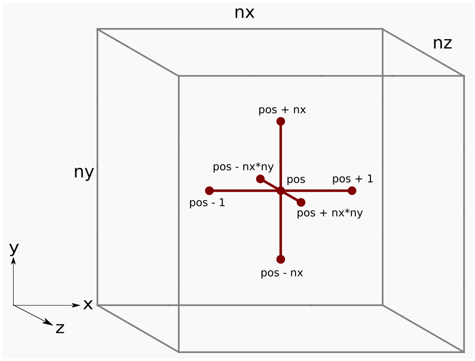
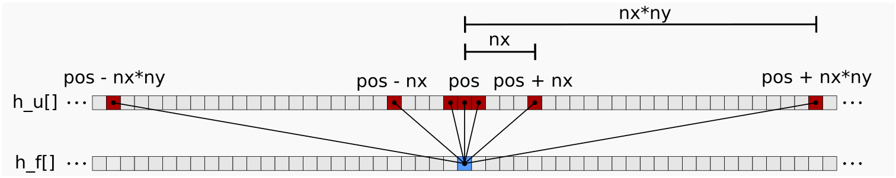

<!---
Copyright (c) 2022 Advanced Micro Devices, Inc. (AMD)

Permission is hereby granted, free of charge, to any person obtaining a copy
of this software and associated documentation files (the "Software"), to deal
in the Software without restriction, including without limitation the rights
to use, copy, modify, merge, publish, distribute, sublicense, and/or sell
copies of the Software, and to permit persons to whom the Software is
furnished to do so, subject to the following conditions:

The above copyright notice and this permission notice shall be included in all
copies or substantial portions of the Software.

THE SOFTWARE IS PROVIDED "AS IS", WITHOUT WARRANTY OF ANY KIND, EXPRESS OR
IMPLIED, INCLUDING BUT NOT LIMITED TO THE WARRANTIES OF MERCHANTABILITY,
FITNESS FOR A PARTICULAR PURPOSE AND NONINFRINGEMENT. IN NO EVENT SHALL THE
AUTHORS OR COPYRIGHT HOLDERS BE LIABLE FOR ANY CLAIM, DAMAGES OR OTHER
LIABILITY, WHETHER IN AN ACTION OF CONTRACT, TORT OR OTHERWISE, ARISING FROM,
OUT OF OR IN CONNECTION WITH THE SOFTWARE OR THE USE OR OTHER DEALINGS IN THE
SOFTWARE.
--->
# Finite difference method - Laplacian part 1
The finite difference method is a canonical example of a computational physics stencil discretization commonly used in applications ranging from geophysics (weather and oil \& gas) and electromagnetics (semiconductors and astrophysics) to gas dynamics (airflow and plasmas).
Stencil codes are identified by an underlying requirement of accessing a local neighborhood of grid points (stencil) in order to evaluate a value at a single grid point, meaning that the performance of the algorithm is strongly tied its memory access pattern.
GPUs haven proven to be well-suited for accelerating stencils codes due to the algorithm's regular structure, high degree of exposed parallelism, and efficient use of the GPU's high memory bandwidth.
In this blog post we will develop a GPU-accelerated stencil code using AMD's Heterogeneous Interface for Portability (HIP) API, which will give us explicit control over the memory access patterns. 
Over the course of this development, we will discuss the following concepts:
1. Discretize the Laplacian using the finite difference method
2. Present a straight-forward HIP implementation of the discretization
3. Guide readers on choosing optimization strategies for improving performance of a stencil code
4. Illustrate how to use `rocprof` to obtain performance metrics for kernels

## Laplacian

The Laplacian $\nabla^2$ is a differential operator that can describe a variety of physical phenomena using partial differential equations.
For example, it can be used to describe propagation of sound waves (wave equation), heat flow (heat equation), as well electrostatic and
gravitational potentials (Poisson's equation). It also has applications within computer vision and
mesh generation. See  [wikipedia](https://en.wikipedia.org/wiki/Laplace_operator) to learn more. 

As an example of a physical phenomena that can be described by the Laplacian, the animation below is a 2D numerical simulation of the heat equation that shows the transfer of heat from hot regions (raised letters) to cold regions (plane). 


| Initial condition | Simulation | 
|-------------------|------------|
|||

In Cartesian coordinates, the Laplacian takes the form of the divergence of a gradient of a scalar field $u(x,y,z)$:

$$\nabla \cdot \nabla u = \nabla^2 u = \frac{\partial^2u}{\partial x^2} + \frac{\partial^2u}{\partial y^2} + \frac{\partial^2u}{\partial z^2},$$

where $u$ is a suitably smooth function of the spatial coordinates $x$, $y$, and $z$.

## Discretization and host implementation

To discretize the Laplacian, we introduce a grid with $n_x \times n_y \times n_z$
equidistantly-spaced grid
points and apply second-order finite difference approximations in each grid direction. For example,
the $x$-derivative is approximated by:

$$\frac{\partial^2 u}{\partial x^2}  \approx \frac{u(x-h_x,y,z) - 2u(x,y,z) + u(x+h_x,y,z)}{h_x^2}$$

where $h_x$ is the grid spacing in the x-direction (the distance between adjacent grid points in the x-direction). Extending this to three dimensions involves applying this stencil in all spatial directions:

$$\nabla^2 u(x,y,z)  \approx \frac{u(x-h_x,y,z) - 2u(x,y,z) + u(x+h_x,y,z)}{h_x^2} $$
$$+ \frac{u(x,y-h_y,z) - 2u(x,y,z) + u(x,y+h_y,z)}{h_y^2} $$
$$+ \frac{u(x,y,z-h_z) - 2u(x,y,z) + u(x,y,z+h_z)}{h_z^2}$$

The following code example demonstrates how to implement the Laplacian stencil in host code:

```C++
template <typename T>
void laplacian_host(T *h_f, const T *h_u, T hx, T hy, T, hz, int nx, int ny,
int nz) {
#define u(i, j, k) h_u[(i) + (j) * nx  + (k) * nx * ny]
#define f(i, j, k) h_f[(i) + (j) * nx  + (k) * nx * ny]
    // Skip boundary points
    for (k = 1; k < nz - 1; ++k)
        for (j = 1; j < ny - 1; ++j)
            for (i = 1; i < nx - 1; ++i) {
                // Apply stencil approximation of Laplacian to all interior points
                u_xx = ( u(i + 1, j, k) - 2 * u(i, j, k) + u(i - 1, j, k) ) / (hx * hx);
                u_yy = ( u(i, j + 1, k) - 2 * u(i, j, k) + u(i, j - 1, k) ) / (hy * hy);
                u_zz = ( u(i, j, k + 1) - 2 * u(i, j, k) + u(i, j, k - 1) ) / (hz * hz);
                f(i, j, k) = u_xx + u_yy + u_zz;
            }
#undef u
#undef f
}
```

The host code uses C-preprocessor macros to more easily translate the math notation $u(x,y,z)$ into
code: `u(i, j, k)` - you will learn more about this translation soon. The function `laplacian_host` takes
the input, `h_u[]`, and output, `h_f[]`, and expects them to at least contain `nx * ny * nz` elements each (the number of grid points in each direction). To prevent memory access violations due to out of bounds errors, the loop bounds exclude the first and last elements in each grid direction.
The inner-most loop applies the Laplacian stencil to `h_u[]` and stores the result in `h_f[]`. To
distinguish host arrays from device arrays, we assign the prefixes `h_` (host)  and `d_` (device).
This distinction will become important when we visit the device code.


## Data layout
The 3D data is laid out so that grid points in the `i`-direction are contiguous in memory whereas 
grid points in the `k`-direction are strided by `nx * ny`. This mapping is exemplified by the macro:

```C
#define u(i, j, k) h_u[(i) + (j) * nx  + (k) * nx * ny]
```

The parentheses around `i`, `j`, and `k` ensure proper expansion of expressions like `u(i, j + 1, k)` and so forth.

The figure below shows the Laplacian stencil applied at a grid point `pos`


<p style="text-align:center">
Figure 1: Finite difference stencil in 3D space.
</p>

Grid points adjacent to each other in the <code class="codesnippet">j</code> and <code class="codesnippet">k</code>
directions are actually far apart in memory due to the strided data layout.
For example, consider when `nx = ny = nz = 5`:


<p style="text-align:center">
Figure 2: Strided memory space for the central difference stencil. Here we see which entries in the <code class="codesnippet">h_u[]</code> array (red) are needed to update the output array <code class="codesnippet">h_f[]</code>. Note that these entries are not contiguous.
</p>

One of the goals of this blog is to show how to efficiently treat this memory access pattern on AMD GPUs.

## HIP implementation
To begin, consider a large cube where `nx = ny = nz = 512`. 
We first allocate memory for both the input array `d_u` and the output array `d_f` using `double` precision:

```c++
// Parameters
using precision = double; 
size_t nx = 512, ny = 512, nz = 512; // Cube dimensions

// Grid point spacings
precision hx = 1.0 / (nx - 1), hy = 1.0 / (ny - 1), hz = 1.0 / (nz - 1); 

// Input and output arrays
precision *d_u, *d_f; 

// Allocate on device
size_t numbytes = nx * ny * nz * sizeof(precision);
hipMalloc((void**)&d_u, numbytes);
hipMalloc((void**)&d_f, numbytes);
```

The `d_u` input array is initialized using a quadratic test function that simplifies the task of
verifying correctness (not shown for brevity). 

The below code snippet presents our initial HIP implementation of the Laplacian:

```c++
template <typename T>
__global__ void laplacian_kernel(T * f, const T * u, int nx, int ny, int nz, T invhx2, T invhy2, T invhz2, T invhxyz2) {

    int i = threadIdx.x + blockIdx.x * blockDim.x;
    int j = threadIdx.y + blockIdx.y * blockDim.y;
    int k = threadIdx.z + blockIdx.z * blockDim.z;

    // Exit if this thread is on the boundary
    if (i == 0 || i >= nx - 1 ||
        j == 0 || j >= ny - 1 ||
        k == 0 || k >= nz - 1)
        return;

    const int slice = nx * ny;
    size_t pos = i + nx * j + slice * k;
    
    // Compute the result of the stencil operation
    f[pos] = u[pos] * invhxyz2
           + (u[pos - 1]     + u[pos + 1]) * invhx2
           + (u[pos - nx]    + u[pos + nx]) * invhy2
           + (u[pos - slice] + u[pos + slice]) * invhz2;
} 

template <typename T>
void laplacian(T *d_f, T *d_u, int nx, int ny, int nz, int BLK_X, int BLK_Y, int BLK_Z, T hx, T hy, T hz) {

    dim3 block(BLK_X, BLK_Y, BLK_Z);
    dim3 grid((nx - 1) / block.x + 1, (ny - 1) / block.y + 1, (nz - 1) / block.z + 1);
    T invhx2 = (T)1./hx/hx;
    T invhy2 = (T)1./hy/hy;
    T invhz2 = (T)1./hz/hz;
    T invhxyz2 = -2. * (invhx2 + invhy2 + invhz2);

    laplacian_kernel<<<grid, block>>>(d_f, d_u, nx, ny, nz, invhx2, invhy2, invhz2, invhxyz2);
} 
```

The `laplacian` host function is responsible for launching the device kernel, `laplacian_kernel`,
with a thread block size of `BLK_X = 256, BLK_Y = 1, BLK_Z = 1`. 
The current thread block size where `BLK_X * BLK_Y * BLK_Z = 256` is a recommended default choice
because it maps well to hardware work scheduler, but other choices may perform better. In general, choosing this parameter for performance may be highly dependent on the problem size, kernel implementation, and hardware characteristics of the device. 
We will discuss this topic in more detail in a future post. Although this kernel implementation
supports a 3D block size, the GPU has no concept of 2D and 3D. The possibility of defining 3D groups is provided
as a convenience function to the programmer.

The HIP implementation is applicable to any problem size that fits in the GPU memory. For problem sizes
that cannot be evenly divided by the thread block size, we introduce additional groups that work on
the remainder. These additional thread blocks can have low thread utilization if the remainder is small,
i.e., many of the threads map to a region outside the
computational domain where there is no work to do.  This low thread utilization can negatively impact performance. For the
purposes of this blog post we will focus on problem sizes that are evenly divisible by the thread block
size. The number of blocks to schedule is determined by the ceiling operation `(nx - 1) / block.x + 1, ...`. As previously explained, it rounds 
up the number of groups to guarantee that the entire computational domain is covered.

Note the exit condition in the kernel. We return (exit) when a thread is on or outside a boundary because we are computing the finite 
difference of interior points only. How the kernel exit strategy works in practice is that since a wavefront executes instructions in lockstep, any thread that is on our outside the boundary will be masked off for the remainder kernel. The threads that
are masked off will be idle during the execution of an instruction. Let us return to the performance
issue with block sizes that do not evenly divide the problem size. If we pick, say
`nx=258`, we would get two thread blocks in the x-direction, but only one of the threads in the
second thread block would have work to do. 

The main computation, 

```c++
    // Compute the result of the stencil operation
    f[pos] = u[pos] * invhxyz2
           + (u[pos - 1]     + u[pos + 1]) * invhx2
           + (u[pos - nx]    + u[pos + nx]) * invhy2
           + (u[pos - slice] + u[pos + slice]) * invhz2;
```

accesses the array `u` multiple times. For each access, the compiler will generate a global load
instruction that will access data from global memory unless this data is already present in cache. As we will
see, these global load instructions can have significant performance implications.

## Compute bound vs memory bound
In order to analyze the performance of our HIP kernel, it is helpful to understand if it is 
compute or memory bound. Kernels that are compute bound are limited by the throughput of compute units, whereas memory bound kernels are limited by memory bandwidth or memory access latency. To classify our kernel, we investigate its Arithmetic Intensity (AI) with this formula:

$$ \mathrm{AI} = \frac{\mathrm{FLOPs}}{\mathrm{BYTES}} $$

where $\mathrm{FLOPs}$ refers to the total number of floating-point operations, and $\mathrm{BYTES}$ denotes 
the main memory traffic. An algorithm is said to be memory bound if $\mathrm{AI}\le PF/BW$ where $PF$ denotes 
the peak flop rate and $BW$ denotes the peak memory bandwidth. Conversely, an algorithm is said to be compute 
bound if $\mathrm{AI}\ge PF/BW$. Note that we are ignoring integer arithmetic and focusing solely on 
floating-point arithmetic. This analysis of floating-point arithmetic and memory traffic is commonly used 
for creating a roofline model. For readers interested in learning more about the roofline model, we defer 
to this wikipedia [link](https://en.wikipedia.org/wiki/Roofline_model) and its accompanying references.

In the `laplacian_kernel` above, each thread performs 10 floating point operations across 7 `d_u` elements and stores the computation into 
a single `d_f` element. However, we will assume ideal conditions with an infinite cache meaning each thread fetches one `d_u` element, and this element is 
reused by other threads for the stencil computations.  The $\mathrm{FLOPs}$ and $\mathrm{BYTES}$ per thread equals `10` and `2 * sizeof(double) = 16`, 
respectively, so our AI is `0.63`. Stencil codes like this generally have small $\mathrm{FLOPs}$ to $\mathrm{BYTES}$ ratios, and it will be even 
smaller when we lift the infinite cache assumption.

For the remainder of this blog post, let us consider a single Graphics Compute Die (GCD) from an 
[MI250X GPU](https://www.amd.com/en/products/server-accelerators/instinct-mi250x) 
where $PF$= 24 TFLOPs/sec and $BW$= 1.6 TBytes/sec of high bandwidth memory (HBM) bandwidth. The $PF/BW$ ratio is 24 times greater 
than the approximated AI, clearly classifying our HIP kernel as memory bound as opposed to 
compute bound. Thus, our optimizations will focus on addressing memory bottlenecks.

## Performance
For performance evaluation, we can use *effective memory bandwidth* as our figure of merit (FOM).
Roughly speaking, the effective memory bandwidth is the average rate of data transfer considering the least amount of data that needs
to move through the entire memory subsystem: from high-latency off-chip HBM to low-latency registers. The effective memory bandwidth is defined as

```c++
effective_memory_bandwidth = (theoretical_fetch_size + theoretical_write_size) / average_kernel_execution_time;

```

To measure the average kernel execution time, we use the function `hipEventElapsedTime()`  (see the accompanying `laplacian.cpp` 
for full implementation details). The formula for calculating the theoretical fetch and write sizes 
(in bytes) of an `nx * ny * nz` cube are:

```c++
theoretical_fetch_size = ((nx * ny * nz - 8 - 4 * (nx - 2) - 4 * (ny - 2) - 4 * (nz - 2) ) * sizeof(double); 
theoretical_write_size = ((nx - 2) * (ny - 2) * (nz - 2)) * sizeof(double); 
```

Due to the shape of the stencil, the theoretical fetch size accounts for reading all grid points in `d_u` except for the 8 corners and 12 edges of the cube. In the theoretical write size, only the interior grid points in `d_f` are written back to memory. These
calculations overlook memory access granularity and, again, assume an infinite cache. Thus, they place a lower bound on the
actual data movement. 


Below are the performance numbers on a single MI250X GCD:
```
$ ./laplacian_dp_kernel1 
Kernel: 1
Precision: double
nx,ny,nz = 512, 512, 512
block sizes = 256, 1, 1
Laplacian kernel took: 2.64172 ms, effective memory bandwidth: 808.148 GB/s 
```
For an optimized kernel and sufficiently large workload capable of saturating the device, the effective memory bandwidth should be as close as possible to
the peak theoretical HBM bandwidth. Accomplishing this task requires meeting two objectives:
1. reducing excessive memory traffic to HBM to be close as possible to the theoretical limit,
2. Saturating the HBM bandwidth of the device.

Given that a MI250X has a theoretical bandwidth per GCD of `1638.4 GB/s`, the baseline kernel
achieves about 50 %[^1] of the peak theoretical limit. What is the bottleneck preventing further
performance? Is it due to 
excessive data movement or suboptimal memory bandwidth saturation? For instance, excessive data movement could
occur if there is poor data reuse when computing the stencil. Maybe some of the neighboring values are brought
into cache but evicted by other values, causing cache misses and additional trips to main
memory. Failure to saturate memory bandwidth occurs when there are not enough memory
requests in flight during the life time of the kernel. There could be many reasons for this problem in general. Maybe each wave requests very little data and there are not enough waves that can run concurrently on each CU due to resource limitations. Another possibility
is that some of the waves are stalled and ineligible for issuing memory instructions to because they are waiting on
data dependencies. To understand what the bottleneck is and address it, we need to collect performance counter data. 

To this end, we use the AMD ROCm™ profiler (`rocprof`) to capture three important metrics:

```
FETCH_SIZE : The total kilobytes fetched from the video memory. This is
             measured with all extra fetches and any cache or memory effects
             taken into account.
WRITE_SIZE : The total kilobytes written to the video memory. This is measured
             with all extra fetches and any cache or memory effects taken
             into account.
L2CacheHit : The percentage of fetch, write, atomic, and other instructions that
             hit the data in L2 cache. Value range: 0% (no hit) to 100% (optimal).
```

Note that the sum of `FETCH_SIZE` and `WRITE_SUM` may not truly represent all memory traffic. Nonetheless these metrics can 
certainly provide greater insight into the design of the HIP kernels.
Additional metrics can be queried from `rocprof` (see `rocprof --list-basic` and `rocprof --list-derived` for options). 
`rocprof` allows us to organize our requests within ascii text files.
For example, in the included work we use `rocprof_input.txt`:

```
pmc: FETCH_SIZE
pmc: WRITE_SIZE
pmc: L2CacheHit
kernel: laplacian_kernel
```

which will capture the performance counters (pmc) `FETCH_SIZE`, `WRITE_SIZE`, and `L2CacheHit` for the listed kernels.
We can run this against our executables using the command

```
$ rocprof -i rocprof_input.txt -o rocprof_output.csv laplacian_dp_kernel
``` 

which will generate a `rocprof_output.csv` file containing the requested metrics for each kernel launch.
For more information on `rocprof` we defer all interested readers to the 
[ROCm™ Profiler documentation](https://rocmdocs.amd.com/en/latest/ROCm_Tools/ROCm-Tools.html).

The closer `FETCH_SIZE` and `WRITE_SIZE` are to `theoretical_fetch_size` and `theoretical_write_size`, the better our HIP kernel is likely to perform.
An `L2CacheHit` closer to 100% is another indicator that our kernel is optimal. 
The table below compares the above three `rocprof` metrics:

|             | FETCH_SIZE (GB) | WRITE_SIZE (GB) | Fetch efficiency (%) | Write efficiency (%) | L2CacheHit (%) |
|:-----------:|:---------------:|:---------------:|:-------------:|:-------------:|:--------:|
| Theoretical | 1.074 | 1.061 |    -   |   -  |   -  |
| Kernel 1    | 2.014 | 1.064 |  53.3  | 99.7 | 65.0 |

The 65% `L2CacheHit` rate alone doesn't offer much insight. While the `WRITE_SIZE` metric matches its theoretical estimate, 
the `FETCH_SIZE` is nearly doubled. This observation tells us that about 50 % of the stencil is reused. 
If we can improve the stencil reuse to 100 %, the `FETCH_SIZE` would reduce by over 0.9 GB and in turn reduce the total memory traffic by 44 %. This reduction
could potentially translate into a 1.44x speedup of the kernel execution time, assuming HBM bandwidth
saturation remains the same. Therefore, a 
more realistic upper bound on effective memory bandwidth would be around ` 808.148 GB/s * 1.44 = 1165 GB/s`, which is about 71 %[^1] of the 
peak theoretical HBM bandwidth of `1638.4 GB/s` per GCD. 

There are several different approaches to optimizing finite difference kernels in general.
In the next post, we will explain and discuss a few optimizations that one can apply to reduce excess memory traffic and reach the new effect memory bandwidth target. 

## Conclusion
This concludes the first part of developing and optimizing a Laplacian kernel using HIP.
Before beginning any optimization work, it is important to collect performance
measurements to establish a baseline and identify the performance bottleneck. 
In this work, we have determined that the baseline kernel is memory bandwidth limited due to its
arithmetic intensity. We also found that the kernel loads significantly more data from the global memory space compared
to our estimates. These conditions tell us that reducing the excess memory load will have an impact on performance. 
In part two of this series we will introduce optimization techniques aimed at reducing global memory data movement
which are valuable not only for stencil kernels, but also for other bandwidth limited 
kernels that use a regular, non-contiguous memory access patterns.

[Accompanying code examples](https://github.com/amd/amd-lab-notes/tree/release/finite-difference/examples)

If you have any questions or comments, please reach out to us on GitHub [Discussions](https://github.com/amd/amd-lab-notes/discussions)

[^1]:Testing conducted using ROCm version 5.3.0-63. Benchmark results are not validated performance numbers, and are provided only to demonstrate relative performance improvements of code modifications. Actual performance results depend on multiple factors including system configuration and environment settings, reproducibility of the results is not guaranteed.
