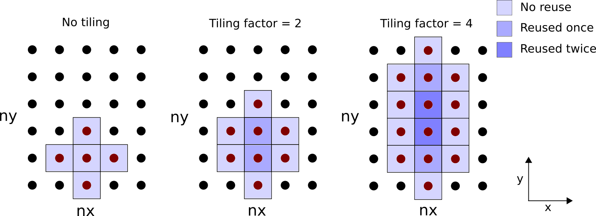
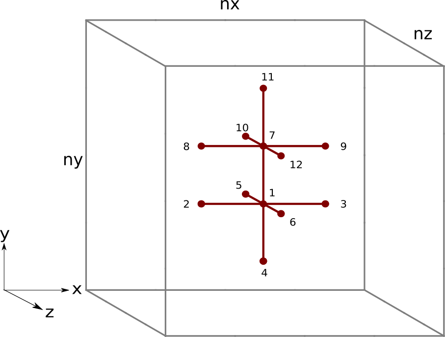
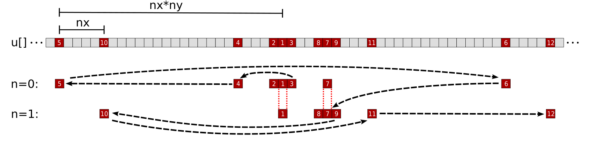
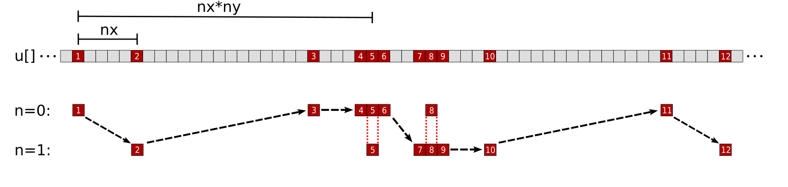

<!---
Copyright (c) 2022 Advanced Micro Devices, Inc. (AMD)

Permission is hereby granted, free of charge, to any person obtaining a copy
of this software and associated documentation files (the "Software"), to deal
in the Software without restriction, including without limitation the rights
to use, copy, modify, merge, publish, distribute, sublicense, and/or sell
copies of the Software, and to permit persons to whom the Software is
furnished to do so, subject to the following conditions:

The above copyright notice and this permission notice shall be included in all
copies or substantial portions of the Software.

THE SOFTWARE IS PROVIDED "AS IS", WITHOUT WARRANTY OF ANY KIND, EXPRESS OR
IMPLIED, INCLUDING BUT NOT LIMITED TO THE WARRANTIES OF MERCHANTABILITY,
FITNESS FOR A PARTICULAR PURPOSE AND NONINFRINGEMENT. IN NO EVENT SHALL THE
AUTHORS OR COPYRIGHT HOLDERS BE LIABLE FOR ANY CLAIM, DAMAGES OR OTHER
LIABILITY, WHETHER IN AN ACTION OF CONTRACT, TORT OR OTHERWISE, ARISING FROM,
OUT OF OR IN CONNECTION WITH THE SOFTWARE OR THE USE OR OTHER DEALINGS IN THE
SOFTWARE.
--->
# Finite difference method - Laplacian part 2

In the previous Laplacian post, we developed a HIP implementation of a finite-difference stencil code designed around a Laplace operator. 
The initial implementation was found to be memory bandwidth bound, meaning that its runtime was limited by the rate at which 
we could move data to and from global memory. Furthermore, the current memory access pattern requires multiple 
trips to global memory to load all data, so the execution time could be reduced if we cache more of the data. 
We established the figure of merit (FOM) as _effective memory bandwidth_ which divides the 
theoretical memory movement divided by the actual execution time. The FOM of our HIP implementation 
currently achieves 50%[^1] of the peak of a single MI250X GCD, but our analysis suggests 
that bringing the actual memory movement down to the theoretical amount may allow our 
FOM to reach up to 71%[^1] of the peak. In this post we will introduce two common 
optimizations that can be applied to the kernel to help achieve this:

1. Loop tiling to explicitly reduce memory loads
1. Re-order the memory access pattern to improve caching

## Review

In the previous post, we considered a HIP implementation of the central finite difference stencil for the Laplacian.
Recall that the Laplacian takes the form of a divergence of a gradient of a scalar field $u(x,y,z)$:

$$\nabla \cdot \nabla u = \nabla^2 u = \frac{\partial^2u}{\partial x^2} + \frac{\partial^2u}{\partial y^2} + \frac{\partial^2u}{\partial z^2},$$

The initial HIP implementation is shown below

```c++
template <typename T>
__global__ void laplacian_kernel(T * f, const T * u, int nx, int ny, int nz, T invhx2, T invhy2, T invhz2, T invhxyz2) {

    int i = threadIdx.x + blockIdx.x * blockDim.x;
    int j = threadIdx.y + blockIdx.y * blockDim.y;
    int k = threadIdx.z + blockIdx.z * blockDim.z;

    // Exit if this thread is on the boundary
    if (i == 0 || i >= nx - 1 ||
        j == 0 || j >= ny - 1 ||
        k == 0 || k >= nz - 1)
        return;

    const int slice = nx * ny;
    size_t pos = i + nx * j + slice * k;
    
    // Compute the result of the stencil operation
    f[pos] = u[pos] * invhxyz2
           + (u[pos - 1]     + u[pos + 1]) * invhx2
           + (u[pos - nx]    + u[pos + nx]) * invhy2
           + (u[pos - slice] + u[pos + slice]) * invhz2;
} 

template <typename T>
void laplacian(T *d_f, T *d_u, int nx, int ny, int nz, int BLK_X, int BLK_Y, int BLK_Z, T hx, T hy, T hz) {

    dim3 block(BLK_X, BLK_Y, BLK_Z);
    dim3 grid((nx - 1) / block.x + 1, (ny - 1) / block.y + 1, (nz - 1) / block.z + 1);
    T invhx2 = (T)1./hx/hx;
    T invhy2 = (T)1./hy/hy;
    T invhz2 = (T)1./hz/hz;
    T invhxyz2 = -2. * (invhx2 + invhy2 + invhz2);

    laplacian_kernel<<<grid, block>>>(d_f, d_u, nx, ny, nz, invhx2, invhy2, invhz2, invhxyz2);
} 
```

and the corresponding performance on a single MI250X GCD:

```
$ ./laplacian_dp_kernel1 
Kernel: 1
Precision: double
nx,ny,nz = 512, 512, 512
block sizes = 256, 1, 1
Laplacian kernel took: 2.64172 ms, effective memory bandwidth: 808.148 GB/s 
```

The reported `808.148 GB/s` meets 69.4% of the target we established in the previous post.
We will continue to use `rocprof` to help us gauge the effectiveness of each of the following optimizations.

In the previous post, we can infer that the `f` device array is efficiently stored because the `WRITE_SIZE` metric
matches the theoretical. However, the reported `FETCH_SIZE` is almost double the theoretical amount and 
therefore there can be an opportunity to improve performance if this data size could be reduced. 
Recall that seven elements from the `u` array are loaded to update each entry in the `f` array 
but each of those `u` elements could be reused up to six times by neighboring grid points. 
It is important to note that from a wavefront perspective, 
the load for each entry in `u` is a contiguous chunk of 64 entries. Our current thread block configuration 
(256 $\times$ 1 $\times$ 1) loads four waves of elements along the `x` direction, providing an opportunity
for threads in a single wave to cache and reuse `x` elements for `x - 1` and `x + 1` stencil computations. 
However, loading waves in the `y` and `z` directions must be implemented carefully to maximize 
spatial locality and reuse values from neighboring waves and thread blocks. 
Thus, we focus our attention on optimizing loads in one of these two directions through loop tiling.

## Loop tiling

As it stands, each thread computes a stencil 
around a single grid point. What happens if we let each thread compute stencils of multiple grid points? 
This will require more load instructions per thread but due to the 
contiguous nature of the threading,
these loads will be more likely to reuse cached values for `u`.
This optimization, known as loop tiling, will reduce 
the number of thread blocks launched and increase the number of stencils 
computed per thread.

Before we dive into the optimized Laplacian kernel, let us first consider a small example to further explain
the concept and benefit of loop tiling: Suppose we want to perform the strided computation 
`f[pos] = u[pos - 1] + u[pos] + u[pos + 1]`. Without tiling, each thread would need to 
perform three loads and one store instruction. It would be ideal if we could have each thread only load
one `u` element and reuse the other two `u` elements already loaded and stored in registers. In other words,
we should try to minimize the number of loads per store instruction per thread. If we tile by some factor, 
let's pick two, then each thread would perform two stores, but consider the number of loads:
```c++
f[pos]     = u[pos - 1]  + u[pos]     + u[pos + 1] 
f[pos + 1] = u[pos]      + u[pos + 1] + u[pos + 2]
```
Note that `u[pos]` and `u[pos + 1]` appear twice, which means we only need to load them once. This 
observation allows us to reuse the previously loaded value. To make this point clear, we can introduce two variables:
```c++
double u0 = u[pos];
double u1 = u[pos + 1]
f[pos]     = u[pos - 1] + u0  + u1
f[pos + 1] = u0         + u1  + u[pos + 2]
```
As a result, we have explicitly reduced the number of load instructions from 6 to 4 (i.e., reduction by 33%). We now
have approximately 2 loads per store. See the table below to see how loop tiling factors 
correlate with the load store ratio.

| Tile Factor | Loads | Stores | Ratio |
|:----------:|:-----:|:------:|:-----:|
|          1 |     3 |       1|  3.00 |
|          2 |     4 |       2|  2.00 |
|          4 |     6 |       4|  1.50 |
|          8 |    10 |       8|  1.25 |
|         16 |    18 |      16|  1.13 |

Keep in mind that the increasing the tile factor increases the register use in the kernel which will
reduce its occupancy. If the compiler runs out of registers, register spillage to global memory 
occurs which can negatively affect performance.

Circling back to the 3D Laplacian kernel, there are three potential directions for 
loop tiling. Let us tile in the `y`-direction for demonstration. 
Consider the figure below illustrating the reuse pattern:


<p style="text-align:center">
Figure 1: Illustration of loop tiling for each thread on an  <code class="codesnippet">xy</code> plane. The number of grid points loaded and reused depends on the tile width.
</p>

Let us denote the tile factor by `m`, which is a user defined macro variable determined at compile time.
The code modifications for this kernel can be quite complex so we shall cover the changes in two 
phases: setup and computation. First, we apply the following changes:

<table class="scrollable-table">
<tr>
<th>
Kernel 1 setup (before)
</th>
<th>
Kernel 2 setup (after)
</th>
</tr>
<tr>
<td style="vertical-align:top">
 
```c++
 


int j = threadIdx.y + blockIdx.y * blockDim.y;

...

// Exit if this thread is on the boundary
if (i == 0 || i >= nx - 1 ||
    j == 0 || j >= ny - 1 ||
    k == 0 || k >= nz - 1)
    return;

...

dim3 grid((nx - 1) / block.x + 1, 
          (ny - 1) / block.y + 1, 
          (nz - 1) / block.z + 1);

 ```

</td>
<td style="vertical-align:top">

```c++
#define m 1

...

int j = m*(threadIdx.y + blockIdx.y * blockDim.y);

...

// Exit if this thread is on the xz boundary
if (i == 0 || i >= nx - 1 ||
    k == 0 || k >= nz - 1)
    return;

...
 
 
dim3 grid((nx - 1) / block.x + 1, 
          (ny - 1) / (block.y * m) + 1, 
          (nz - 1) / block.z + 1);
 ```

</td>
</tr>
</table>

Kernel 2 introduces the macro variable `m` which is used to divide the grid dimension in the 
`y` direction. Setting `m=1` currently has no tiling effect - experimenting with other values 
requires recompilation of the code. We removed the requirement that threads exit at 
the `y` boundary for the case where stencils overlap the boundary.

In our next set of code modifications, we focus on rewriting the `f[pos] = ...` computation for 
a tile factor `m`. Because we are tiling in the `y` direction, each thread strides `pos` 
by `nx`. These modifications are tricky so we will break it down into four steps:

1. Add a for loop to the main computational kernel 
2. Introduce an array of size `m` to accumulate the running sum of the stencil points
3. Split the `u` element loads and `f` element stores into separate loops
4. Introduce a variable to hold a `u` element for reuse

Below are code snippets before and after the application of the four steps. We begin by wrapping our 
stencil evaluation in a for loop:

<table class="scrollable-table">
<tr>
<th>
Kernel 1 computation - Step 0 (before)
</th>
<th>
Step 1 (after)
</th>
</tr>
<tr>
<td style="vertical-align:top">

```c++
 
 
f[pos] = u[pos] * invhxyz2
       + (u[pos - 1]     + u[pos + 1]) * invhx2
       + (u[pos - nx]    + u[pos + nx]) * invhy2
       + (u[pos - slice] + u[pos + slice]) * invhz2;
 ```

</td>
<td style="vertical-align:top">

```c++
for (int n = 0; n < m; n++)
  if (j + n > 0 && j + n < ny - 1)
    f[pos + n*nx] = u[pos + n*nx] * invhxyz2
       + (u[pos - 1 + n*nx]     + u[pos + 1 + n*nx]) * invhx2
       + (u[pos - nx + n*nx]    + u[pos + nx + n*nx]) * invhy2
       + (u[pos - slice + n*nx] + u[pos + slice + n*nx]) * invhz2;
 ```

</td>
</tr>
</table>

Introducing a for loop over a value `m` known at compile time has similar effects to loop unrolling 
where the compiler will minimize the overhead of looping. Keep in mind `m` must not be too large
or the compiler will spill registers to global memory. 
    
At this point, the kernel is technically tiled, however, a few more code modifications are 
needed to minimize the load to store ratio. Next we create an accumulation array:

<table class="scrollable-table">
<tr>
<th>
Step 1 (before)
</th>
<th>
Step 2 (after)
</th>
</tr>
<tr>
<td style="vertical-align:top">

```c++
 
for (int n = 0; n < m; n++)
  if (j + n > 0 && j + n < ny - 1)
    f[pos + n*nx] = u[pos + n*nx] * invhxyz2
       + (u[pos - 1 + n*nx]     + u[pos + 1 + n*nx]) * invhx2
       + (u[pos - nx + n*nx]    + u[pos + nx + n*nx]) * invhy2
       + (u[pos - slice + n*nx] + u[pos + slice + n*nx]) * invhz2;
 
 
 ```

</td>
<td style="vertical-align:top">

```c++
T Lu[m] = {0};
for (int n = 0; n < m; n++)
  if (j + n > 0 && j + n < ny - 1) {
    Lu[n] = u[pos + n*nx] * invhxyz2;
    Lu[n] += (u[pos - 1 + n*nx]     + u[pos + 1 + n*nx]) * invhx2;
    Lu[n] += (u[pos - nx + n*nx]    + u[pos + nx + n*nx]) * invhy2;
    Lu[n] += (u[pos - slice + n*nx] + u[pos + slice + n*nx]) * invhz2;
    f[pos + n*nx] = Lu[n];
  }
 ```

</td>
</tr>
</table>

The accumulation array `Lu` temporarily holds the sum of the computations. Note that we kept the original order of the stencil 
computations - first load the `x` direction stencils, then the `y` direction stencils, and finally the `z` direction stencils. 
We will eventually revisit this ordering, but our next step is to split the load and store steps:
    
<table class="scrollable-table">
<tr>
<th>
Step 2 (before)
</th>
<th>
Step 3 (after)
</th>
</tr>
<tr>
<td style="vertical-align:top">

```c++
T Lu[m] = {0};
for (int n = 0; n < m; n++)
  if (j + n > 0 && j + n < ny - 1) {
    Lu[n] = u[pos + n*nx] * invhxyz2;
    Lu[n] += (u[pos - 1 + n*nx]     + u[pos + 1 + n*nx]) * invhx2;
    Lu[n] += (u[pos - nx + n*nx]    + u[pos + nx + n*nx]) * invhy2;
    Lu[n] += (u[pos - slice + n*nx] + u[pos + slice + n*nx]) * invhz2;
    f[pos + n*nx] = Lu[n];
  }
  
 
 ```

</td>
<td style="vertical-align:top">

```c++
T Lu[m] = {0};
for (int n = 0; n < m; n++)
  if (j + n > 0 && j + n < ny - 1) {
    Lu[n] = u[pos + n*nx] * invhxyz2;
    Lu[n] += (u[pos - 1 + n*nx]     + u[pos + 1 + n*nx]) * invhx2;
    Lu[n] += (u[pos - nx + n*nx]    + u[pos + nx + n*nx]) * invhy2;
    Lu[n] += (u[pos - slice + n*nx] + u[pos + slice + n*nx]) * invhz2;
  }
for (int n = 0; n < m; n++)
  if (j + n > 0 && j + n < ny - 1)
    f[pos + n*nx] = Lu[n];
 ```

</td>
</tr>
</table>
 
Splitting the loads and stores into separate for loops enables all `Lu` elements to simultaneously 
accumulate the stencil computations before writing to `f`. The fourth and final change is to 
explicitly remove load instructions by reusing loaded `u` elements across different stencils. 
Each iteration of `n` still loads the `x` direction and `z` direction stencils for `Lu[n]` 
but could now potentially reuse the `u` element to compute `y` direction stencils belonging 
to `Lu[n-1]` and/or `Lu[n+1]`: 
    
<table class="scrollable-table">
<tr>
<th>
Step 3 (before)
</th>
<th>
Kernel 2 computation - Step 4 (after)
</th>
</tr>
<tr>
<td style="vertical-align:top">

```c++
 
T Lu[m] = {0};
for (int n = 0; n < m; n++)
  if (j + n > 0 && j + n < ny - 1) {
    Lu[n] = u[pos + n*nx] * invhxyz2;
    Lu[n] += (u[pos - 1 + n*nx]     + u[pos + 1 + n*nx]) * invhx2;
    Lu[n] += (u[pos - nx + n*nx]    + u[pos + nx + n*nx]) * invhy2;
    Lu[n] += (u[pos - slice + n*nx] + u[pos + slice + n*nx]) * invhz2;
  }
for (int n = 0; n < m; n++)
  if (j + n > 0 && j + n < ny - 1)
    f[pos + n*nx] = Lu[n];
  
 
 
 ```

</td>
<td style="vertical-align:top">

```c++
T center;
T Lu[m] = {0};
for (int n = 0; n < m; n++) {
  center = u[pos + n*nx];
  Lu[n] = center * invhxyz2 
        + (u[pos - 1 + n*nx]     + u[pos + 1 + n*nx]) * invhx2;
  if (n == 0) Lu[n] += u[pos - nx + n*nx] * invhy2;
  if (n > 0) Lu[n-1] += center * invhy2;
  if (n < m - 1) Lu[n+1] += center * invhy2;
  if (n == m - 1) Lu[n] += u[pos + nx + n*nx] * invhy2;
  Lu[n] += (u[pos - slice + n*nx] + u[pos + slice + n*nx]) * invhz2;
}
for (int n = 0; n < m; n++)
  if (j + n > 0 && j + n < ny - 1)
    f[pos + n*nx] = Lu[n];
 ```

</td>
</tr>
</table>

Below is the full kernel 2 implementation capturing all the above code modifications: 

```c++
// Tiling factor
#define m 1
template <typename T>
__global__ void laplacian_kernel(T * f, const T * u, int nx, int ny, int nz, T invhx2, T invhy2, T invhz2, T invhxyz2) {
    
    int i = threadIdx.x + blockIdx.x * blockDim.x;
    int j = m*(threadIdx.y + blockIdx.y * blockDim.y);
    int k = threadIdx.z + blockIdx.z * blockDim.z;
    
    // Exit if this thread is on the xz boundary
    if (i == 0 || i >= nx - 1 ||
        k == 0 || k >= nz - 1)
        return;
    
    const int slice = nx * ny;
    size_t pos = i + nx * j + slice * k;

    // Each thread accumulates m stencils in the y direction
    T Lu[m] = {0};

    // Scalar for reusable data
    T center;

    // Loop tiling
    for (int n = 0; n < m; n++) {
        center = u[pos + n*nx]; // store for reuse
  
        // x direction
        Lu[n] += center *invhxyz2
              + (u[pos - 1 + n*nx] + u[pos + 1 + n*nx]) * invhx2;
  
        // y - 1, first n
        if (n == 0) Lu[n] += u[pos - nx + n*nx] * invhy2;
  
        // reuse: y + 1 for prev n
        if (n > 0) Lu[n-1] += center * invhy2;
  
        // reuse: y - 1 for next n
        if (n < m - 1) Lu[n+1] += center * invhy2;
  
        // y + 1, last n
        if (n == m - 1) Lu[n] += u[pos + nx + n*nx] * invhy2;
  
        // z - 1 and z + 1
        Lu[n] += (u[pos - slice + n*nx] + u[pos + slice + n*nx]) * invhz2;
    }

    // Store only if thread is inside y boundary
    for (int n = 0; n < m; n++)
      if (j + n > 0 && j + n < ny - 1)
        f[pos + n*nx] = Lu[n];
 }

template <typename T>
void laplacian(T *d_f, T *d_u, int nx, int ny, int nz, int BLK_X, int BLK_Y, int BLK_Z, T hx, T hy, T hz) {

    dim3 block(BLK_X, BLK_Y, BLK_Z);
    dim3 grid((nx - 1) / block.x + 1, (ny - 1) / (block.y * m) + 1, (nz - 1) / block.z + 1);
    T invhx2 = (T)1./hx/hx;
    T invhy2 = (T)1./hy/hy;
    T invhz2 = (T)1./hz/hz;
    T invhxyz2 = -2. * (invhx2 + invhy2 + invhz2);

    laplacian_kernel<<<grid, block>>>(d_f, d_u, nx, ny, nz, invhx2, invhy2, invhz2, invhxyz2);
} 
 ```

Note that this kernel is currently written so that `ny` must be divisible by `block.y * m`.
Let us experiment with various values of `m` compatible with our chosen problem size
and see whether loop tiling has any benefits.

|                                | Speedup |  % of target |
|--------------------------------|:-------:|:------------:|
| Kernel 1 - Baseline            |   1.00  |      69.4%   |
| Kernel 2 - Loop tiling m=1     |   1.00  |      69.4%   |
| Kernel 2 - Loop tiling m=2     |   0.98  |      68.3%   |
| Kernel 2 - Loop tiling m=4     |   0.94  |      65.5%   |
| Kernel 2 - Loop tiling m=8     |   0.92  |      64.0%   |
| Kernel 2 - Loop tiling m=16    |   0.29  |      20.1%   |

It is strange that none of the examined `m` provide any significant speedup. 
In fact, increasing the tile factor appears to exacerbate the performance. 
Let's examine the `FETCH_SIZE` and `L2CacheHit` metrics for further insight:

|                                | FETCH_SIZE (GB) | Fetch efficiency (%) | L2CacheHit (%) |
|--------------------------------|:---------------:|:--------------------:|:--------------:|
| Theoretical                    |           1.074 |                   -  |    -  |
| Kernel 1 - Baseline            |           2.014 |                 53.3 |  65.0 |
| Kernel 2 - Loop tiling m=1     |           2.014 |                 53.3 |  65.0 |
| Kernel 2 - Loop tiling m=2     |           1.848 |                 58.1 |  60.5 |
| Kernel 2 - Loop tiling m=4     |           1.880 |                 57.1 |  57.0 |
| Kernel 2 - Loop tiling m=8     |           1.820 |                 59.0 |  56.0 |
| Kernel 2 - Loop tiling m=16    |           5.637 |                 19.1 |  40.9 |

The fetch efficiency only marginally increased whereas the L2 cache hit drops significantly. 
We suspect the reason for this is that the accumulation steps follow the same access pattern 
as the initial kernel. That is, we first compute the `x` direction stencils, followed by 
the potentially reusable `y - 1` and `y + 1` stencils, and end with the `z - 1` and `z + 1` stencils. 
From a memory address perspective, the read access pattern jumps both forward and backward which
could have implications, as explained and addressed next.

## Reorder read access patterns

After the optimization, there is little to no speedup. While increasing the tile factor reduces 
the loads per store ratio, it may not necessarily translate into a reduction in global data movement.
For `FETCH_SIZE` to decrease, the data movement between L2 and global memory must decrease. As the load
per store ratio increases, the number of read requests sent to L1 must decrease and L2 as well (assuming
that the L1 cache hit ratio stays the same). Since we observe that `FETCH_SIZE` stays the same and
that `L2CacheHit` decreases, the optimization has reduced the pressure on the L2 cache (fewer 
requests sent to it) but failed to improve the reuse of the data loaded from global memory into the
L2 cache. To understand why the previous kernel achieves suboptimal L2 data reuse, let us visualize
the 3D stencils and their read access patterns if `m = 2`:


<p style="text-align:center">
Figure 2: Finite difference stencil in 3D space with a tile factor of <code class="codesnippet">m = 2</code>. The black numbers represent the order each thread in Kernel 2 accesses elements of <code class="codesnippet">u</code>.
</p>

<p style="text-align:center">
Figure 3: Kernel 2 memory access pattern of a single thread for the array <code class="codesnippet">u</code> with a tile factor of <code class="codesnippet">m = 2</code>. The numbers and black arrows correspond to the order the thread accesses elements of <code class="codesnippet">u</code>. The <code class="codesnippet">n = 0</code> and <code class="codesnippet">n = 1</code> rows represent <code class="codesnippet">u</code> elements needed for the stencil computation of grid points <code class="codesnippet">pos</code> and <code class="codesnippet">pos + nx</code>, respectively. The 1st accessed element (<code class="codesnippet">u[pos]</code>) is loaded during the <code class="codesnippet">n = 0</code> iteration and reused for the <code class="codesnippet">y - 1</code> element of the <code class="codesnippet">n = 1</code> iteration. Likewise the 7th accessed element (<code class="codesnippet">u[pos + nx]</code>) is loaded during the <code class="codesnippet">n = 1</code> iteration and reused for the <code class="codesnippet">y + 1</code> element of the <code class="codesnippet">n = 0</code> iteration.
</p>
    
We immediately see a problem. The thread often needs to jump "backwards" in the memory space of the `u` array.
After accessing each grid point's `z + 1` element, the thread needs to jump "backwards" to access
the `x` direction elements for the next iteration of `n`. Frequently accessing `u` elements by going both forward
and backward in the memory address may prematurely evict reusable data from cache. We prefer to instead reorder the
instructions in the kernel to only use a single direction i.e., accessing memory by ascending address:


<p style="text-align:center">
Figure 4: Finite difference stencil in 3D space with a tile factor of <code class="codesnippet">m = 2</code>. The black numbers represent the order each thread the proposed kernel accesses elements of <code class="codesnippet">u</code>.
</p>    

<p style="text-align:center">
Figure 5: Proposed memory access pattern of a single thread for the array <code class="codesnippet">u</code> with a tile factor of <code class="codesnippet">m = 2</code>. The numbers and black arrows correspond to the order the thread accesses elements of <code class="codesnippet">u</code>. The <code class="codesnippet">n = 0</code> and <code class="codesnippet">n = 1</code> rows represent <code class="codesnippet">u</code> elements needed for the stencil computation of grid points <code class="codesnippet">pos</code> and <code class="codesnippet">pos + nx</code>, respectively. The 5th accessed element (<code class="codesnippet">u[pos]</code>) is loaded during the <code class="codesnippet">n = 0</code> iteration and reused for the <code class="codesnippet">y - 1</code> element of the <code class="codesnippet">n = 1</code> iteration. Likewise the 8th accessed element (<code class="codesnippet">u[pos + nx]</code>) is loaded during the <code class="codesnippet">n = 1</code> iteration and reused for the <code class="codesnippet">y + 1</code> element of the <code class="codesnippet">n = 0</code> iteration.
</p>

Under this different approach, we first access all `z - 1` elements, followed by the `y - 1` element of iteration `n = 0`, all `x` 
direction elements, the `y + 1` element of iteration `n = m - 1`, and end with all `z + 1` elements. Each thread now accesses all needed 
`u` elements by ascending memory address. A significant rewrite of the kernel is necessary, so we first present the full implementation:

```c++
// Tiling factor
#define m 1
template <typename T>
__global__ void laplacian_kernel(T * f, const T * u, int nx, int ny, int nz, T invhx2, T invhy2, T invhz2, T invhxyz2) {
    
    int i = threadIdx.x + blockIdx.x * blockDim.x;
    int j = m*(threadIdx.y + blockIdx.y * blockDim.y);
    int k = threadIdx.z + blockIdx.z * blockDim.z;
    
    // Exit if this thread is on the xz boundary
    if (i == 0 || i >= nx - 1 ||
        k == 0 || k >= nz - 1)
        return;
    
    const int slice = nx * ny;
    size_t pos = i + nx * j + slice * k;
    
    // Each thread accumulates m stencils in the y direction
    T Lu[m] = {0};
    
    // Scalar for reusable data
    T center;
    
    // z - 1, loop tiling
    for (int n = 0; n < m; n++)
        Lu[n] += u[pos - slice + n*nx] * invhz2;
    
    // y - 1
    Lu[0]   += j > 0 ? u[pos - 1*nx] * invhy2 : 0; // bound check
    
    // x direction, loop tiling
    for (int n = 0; n < m; n++) {
        // x - 1
        Lu[n] += u[pos - 1 + n*nx] * invhx2;

        // x
        center = u[pos + n*nx]; // store for reuse
        Lu[n] += center * invhxyz2;

        // x + 1
        Lu[n] += u[pos + 1 + n*nx] * invhx2;
        
        // reuse: y + 1 for prev n
        if (n > 0) Lu[n-1] += center * invhy2;

        // reuse: y - 1 for next n
        if (n < m - 1) Lu[n+1] += center * invhy2;
    }
    
    // y + 1
    Lu[m-1]  += j < ny - m ? u[pos + m*nx] * invhy2 : 0; // bound check
    
    // z + 1, loop tiling
    for (int n = 0; n < m; n++)
      Lu[n] += u[pos + slice + n*nx] * invhz2;

    // Store only if thread is inside y boundary
    for (int n = 0; n < m; n++)
      if (n + j > 0 && n + j < ny - 1)
        f[pos + n*nx] = Lu[n];
} 

template <typename T>
void laplacian(T *d_f, T *d_u, int nx, int ny, int nz, int BLK_X, int BLK_Y, int BLK_Z, T hx, T hy, T hz) {

    dim3 block(BLK_X, BLK_Y, BLK_Z);
    dim3 grid((nx - 1) / block.x + 1, (ny - 1) / (block.y * m) + 1, (nz - 1) / block.z + 1);
    T invhx2 = (T)1./hx/hx;
    T invhy2 = (T)1./hy/hy;
    T invhz2 = (T)1./hz/hz;
    T invhxyz2 = -2. * (invhx2 + invhy2 + invhz2);

    laplacian_kernel<<<grid, block>>>(d_f, d_u, nx, ny, nz, invhx2, invhy2, invhz2, invhxyz2);
} 
```

We now go into the details of the computational steps within this kernel. First, we access all `z - 1` grid points followed by a single `y - 1`:

```c++
    // z - 1, loop tiling
    for (int n = 0; n < m; n++)
        Lu[n] += u[pos - slice + n*nx] * invhz2;
    
    // y - 1
    Lu[0]   += j > 0 ? u[pos - 1*nx] * invhy2 : 0; // bound check
```

Note that the conditional operator is introduced so that it computes the `y - 1` stencil for 
the `n = 0` grid point only if it does not lie on the `y` boundary. 
Neither the `z - 1` nor `y - 1` elements are reused at the thread level.

Next, the thread computes the `x`direction stencils: 

```c++
    // x direction, loop tiling
    for (int n = 0; n < m; n++) {
        // x - 1
        Lu[n] += u[pos - 1 + n*nx] * invhx2;

        // x
        center = u[pos + n*nx]; // store for reuse
        Lu[n] += center * invhxyz2;

        // x + 1
        Lu[n] += u[pos + 1 + n*nx] * invhx2;
        
        // reuse: y + 1 for prev n
        if (n > 0) Lu[n-1] += center * invhy2;

        // reuse: y - 1 for next n
        if (n < m - 1) Lu[n+1] += center * invhy2;
    }
```

Again, neither the `x - 1` nor `x + 1` points are reused at the thread level, but the 
center element `u[pos + n*nx]` could be reused up to two times as in the previous kernel.

Afterwards, we load the final `y + 1` point as well as all the `z + 1` points:

```c++
    // y + 1
    Lu[m-1]  += j < ny - m ? u[pos + m*nx] * invhy2 : 0; // bound check
    
    // z + 1, loop tiling
    for (int n = 0; n < m; n++)
      Lu[n] += u[pos + slice + n*nx] * invhz2;
```

Another conditional operator is used so that it computes the `y + 1` stencil of the 
`n = m - 1` grid point so long as it does not lie on the `y` boundary.

Lastly, all threads inside the `y` boundary are written back to memory:

```c++
    // Store only if thread is inside y boundary
    for (int n = 0; n < m; n++)
      if (n + j > 0 && n + j < ny - 1)
        f[pos + n*nx] = Lu[n];
```

Let us now experiment with the same tile factors and see if this reordering makes any difference:

|                                | Speedup |  % of target |
|--------------------------------|:-------:|:------------:|
| Kernel 1 - Baseline            |   1.00  |      69.4%   |
| Kernel 2 - Loop tiling m=1     |   1.00  |      69.4%   |
| Kernel 2 - Loop tiling m=2     |   0.98  |      68.3%   |
| Kernel 2 - Loop tiling m=4     |   0.94  |      65.5%   |
| Kernel 2 - Loop tiling m=8     |   0.92  |      64.0%   |
| Kernel 2 - Loop tiling m=16    |   0.29  |      20.1%   |
| Kernel 3 - Reordered loads m=1 |   1.20  |      82.9%   |
| Kernel 3 - Reordered loads m=2 |   1.28  |      88.9%   |
| Kernel 3 - Reordered loads m=4 |   1.34  |      93.1%   |
| Kernel 3 - Reordered loads m=8 |   1.37  |      94.8%   |
| Kernel 3 - Reordered loads m=16|   0.42  |      29.4%   |
    
Even if `m=1`, the reordered access pattern for `u` elements already provides a significant
boost in performance. The incremental improvements in speedup for each `m` is what we were 
expecting to see. Let us examine the `rocprof` metrics for this new kernel:

|                                | FETCH_SIZE (GB) | Fetch efficiency (%) | L2CacheHit (%) |
|--------------------------------|:---------------:|:--------------------:|:--------------:|
| Theoretical                    |           1.074 |                   -  |    -  ||
| Kernel 1 - Baseline            |           2.014 |                 53.3 |  65.0 |
| Kernel 2 - Loop tiling m=1     |           2.014 |                 53.3 |  65.0 |
| Kernel 2 - Loop tiling m=2     |           1.848 |                 58.1 |  60.5 |
| Kernel 2 - Loop tiling m=4     |           1.880 |                 57.1 |  57.0 |
| Kernel 2 - Loop tiling m=8     |           1.820 |                 59.0 |  56.0 |
| Kernel 2 - Loop tiling m=16    |           5.637 |                 19.1 |  40.9 |
| Kernel 3 - Reordered loads m=1 |           1.347 |                 79.7 |  72.0 |
| Kernel 3 - Reordered loads m=2 |           1.166 |                 92.1 |  70.6 |
| Kernel 3 - Reordered loads m=4 |           1.107 |                 97.0 |  68.8 |
| Kernel 3 - Reordered loads m=8 |           1.080 |                 99.4 |  67.7 |
| Kernel 3 - Reordered loads m=16|           3.915 |                 27.4 |  44.5 |

The `FETCH_SIZE` metric decreased significant, bringing us remarkably close to the theoretical limit. The `L2CacheHit` rate not only increased
but now exceeds what we were originally getting from the baseline kernel. However, we note that there is a significant drop in the cache 
hit rate coupled with a significant increase in the fetch sizes when `m=16`. For the chosen problem, kernel 3 with `m=8` is our best kernel yet, 
achieving almost 95% of the target effective memory bandwidth and over 99% fetch efficiency. 

## Summary

With both optimizations combined, the `FETCH_SIZE` is reduced by up to 2x.
This suggests that our HIP kernel can load data efficiently for a specific grid size. 
To accomplish this, we first reduced the number of loads per store instruction by explicitly evaluating multiple 
stencils via loop tiling. However, our initial implementation did not improve performance. 
To address this, we reordered the memory access pattern to improve the L2 cache hit ratio. 
The question now is whether we are "done" optimizing our initial HIP implementation of the finite difference method for the Laplacian. 
We must address a few lingering issues first:
 
 1. Is there room for further performance improvement? We have already optimized the memory movement
 between L2 cache and global memory, so we must look at other areas for performance gains e.g., latency hiding.
 1. Why does the performance of `m=16` degrade significantly? This happens with or without the reordering of memory access. Perhaps
 resolving the underlying issues may help us get closer to the target?
 1. How do other architectures and problem sizes impact the choice of tile factors? All of our optimizations thus far are 
 tailored towards a single MI250X GCD on a problem size of `nx,ny,nz = 512, 512, 512`.

The next post in this series will answer some of these remaining open questions.

[Accompanying code examples](https://github.com/amd/amd-lab-notes/tree/release/finite-difference/examples)

If you have any questions or comments, please reach out to us on GitHub [Discussions](https://github.com/amd/amd-lab-notes/discussions)

[^1]:Testing conducted using ROCm version 5.3.0-63. Benchmark results are not validated performance numbers, and are provided only to demonstrate relative performance improvements of code modifications. Actual performance results depend on multiple factors including system configuration and environment settings, reproducibility of the results is not guaranteed.
