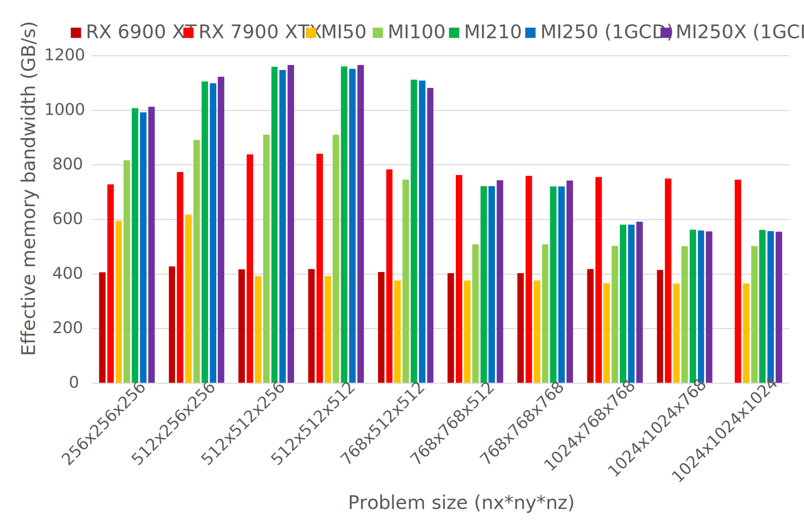
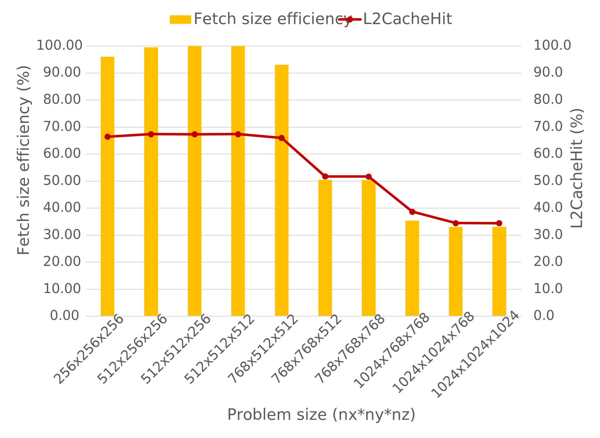
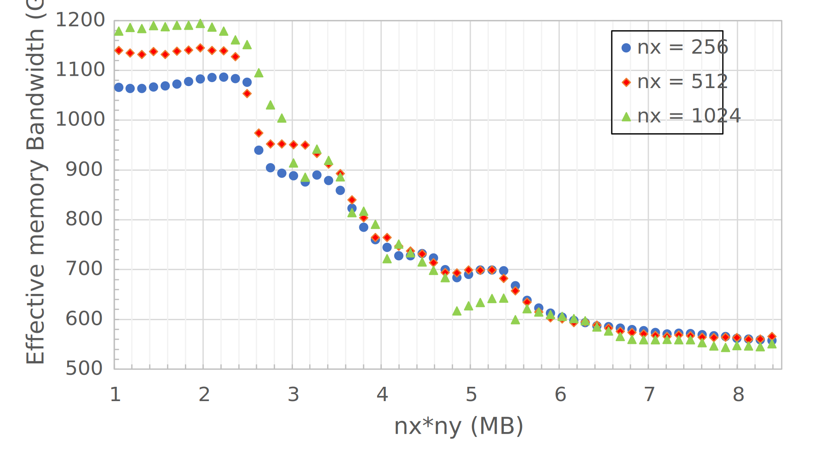
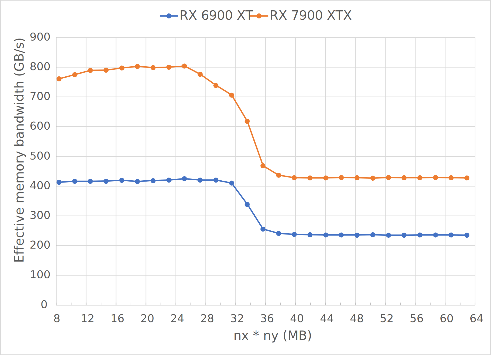

<!---
Copyright (c) 2022 Advanced Micro Devices, Inc. (AMD)

Permission is hereby granted, free of charge, to any person obtaining a copy
of this software and associated documentation files (the "Software"), to deal
in the Software without restriction, including without limitation the rights
to use, copy, modify, merge, publish, distribute, sublicense, and/or sell
copies of the Software, and to permit persons to whom the Software is
furnished to do so, subject to the following conditions:

The above copyright notice and this permission notice shall be included in all
copies or substantial portions of the Software.

THE SOFTWARE IS PROVIDED "AS IS", WITHOUT WARRANTY OF ANY KIND, EXPRESS OR
IMPLIED, INCLUDING BUT NOT LIMITED TO THE WARRANTIES OF MERCHANTABILITY,
FITNESS FOR A PARTICULAR PURPOSE AND NONINFRINGEMENT. IN NO EVENT SHALL THE
AUTHORS OR COPYRIGHT HOLDERS BE LIABLE FOR ANY CLAIM, DAMAGES OR OTHER
LIABILITY, WHETHER IN AN ACTION OF CONTRACT, TORT OR OTHERWISE, ARISING FROM,
OUT OF OR IN CONNECTION WITH THE SOFTWARE OR THE USE OR OTHER DEALINGS IN THE
SOFTWARE.
--->
# Finite Difference Method - Laplacian Part 4

In the previous three posts, we presented a HIP implementation of the finite difference 
method for the Laplace operator and applied four different optimizations.
Over the course of these code modifications, we observed incremental performance 
improvements due to the reduction in total fetches to global memory. We then applied further 
optimizations to hit the projected performance target on a `512` $\times$ `512` $\times$ `512` 
grid of points on a single GCD of a MI250X GPU. Shown below is the final HIP kernel 
which we refer to as Kernel 5: 

```c++
// Tiling factor
#define m 8
// Launch bounds
#define LB 256
template <typename T>
__launch_bounds__(LB)
__global__ void laplacian_kernel(T * f, const T * u, int nx, int ny, int nz, T invhx2, T invhy2, T invhz2, T invhxyz2) {

    int i = threadIdx.x + blockIdx.x * blockDim.x;
    int j = m*(threadIdx.y + blockIdx.y * blockDim.y);
    int k = threadIdx.z + blockIdx.z * blockDim.z;

    // Exit if this thread is on the xz boundary
    if (i == 0 || i >= nx - 1 ||
        k == 0 || k >= nz - 1)
        return;

    const int slice = nx * ny;
    size_t pos = i + nx * j + slice * k;

    // Each thread accumulates m stencils in the y direction
    T Lu[m] = {0};

    // Scalar for reusable data
    T center;

    // z - 1, loop tiling
    for (int n = 0; n < m; n++)
        Lu[n] += u[pos - slice + n*nx] * invhz2;

    // y - 1
    Lu[0]   += j > 0 ? u[pos - 1*nx] * invhy2 : 0; // bound check

    // x direction, loop tiling
    for (int n = 0; n < m; n++) {
        // x - 1
        Lu[n] += u[pos - 1 + n*nx] * invhx2;

        // x
        center = u[pos + n*nx]; // store for reuse
        Lu[n] += center * invhxyz2;

        // x + 1
        Lu[n] += u[pos + 1 + n*nx] * invhx2;

        // reuse: y + 1 for prev n
        if (n > 0) Lu[n-1] += center * invhy2;

        // reuse: y - 1 for next n
        if (n < m - 1) Lu[n+1] += center * invhy2;
    }

    // y + 1
    Lu[m-1]  += j < ny - m ? u[pos + m*nx] * invhy2 : 0; // bound check

    // z + 1, loop tiling
    for (int n = 0; n < m; n++)
      Lu[n] += u[pos + slice + n*nx] * invhz2;

    // Store only if thread is inside y boundary
    for (int n = 0; n < m; n++)
      if (n + j > 0 && n + j < ny - 1)
        __builtin_nontemporal_store(Lu[n],&f[pos + n*nx]);
}

}
```

The objective of Part 4 is to explore the achieved performance of this code across various AMD GPUs and problem sizes. As part of this investigation, we will conclude the Laplacian series with lessons learned from our experience and provide of possible code optimizations users can apply to similar problems. The rest of this post is outlined as follows:

1. Run Kernel 5 across a broad spectrum of problem sizes across several AMD GPUs
2. Examine L2 cache hit performance and identify the root cause behind its degradation
3. Present techniques to circumvent L2 cache size limitations
4. Review all code optimizations undertaken in this Laplacian series.

## Performance across different hardware and sizes

In addition to the [MI250X](https://www.amd.com/en/products/server-accelerators/instinct-mi250x) GPU, the following AMD GPUs
are considered:

1. [RX 6900 XT](https://www.amd.com/en/products/graphics/amd-radeon-rx-6900-xt)
2. [RX 7900 XTX](https://www.amd.com/en/products/graphics/amd-radeon-rx-7900xtx)
3. [MI50](https://www.amd.com/en/products/professional-graphics/instinct-mi50)
4. [MI100](https://www.amd.com/en/products/server-accelerators/instinct-mi100)
5. [MI210](https://www.amd.com/en/products/server-accelerators/amd-instinct-mi210)
6. [MI250](https://www.amd.com/en/products/server-accelerators/instinct-mi250)

We will perform a scaling study for Kernel 5 starting with a problem size `nx,ny,nz = 256, 256, 256` across
all of the above GPUs. Each dimension is increased in multiples of 256 until we reach a global problem size of
`nx,ny,nz = 1024, 1024, 1024`. Recall that the Figure of Merit (FOM) is defined as 
the _effective memory bandwidth_:

```c++
theoretical_fetch_size = ((nx * ny * nz - 8 - 4 * (nx - 2) - 4 * (ny - 2) - 4 * (nz - 2) ) * sizeof(double); 
theoretical_write_size = ((nx - 2) * (ny - 2) * (nz - 2)) * sizeof(double); 
effective_memory_bandwidth = (theoretical_fetch_size + theoretical_write_size) / average_kernel_execution_time;
```

This is the average rate of data transfer considering the least amount of data that 
needs to move through the entire memory subsystem. The objective here is to obtain a FOM as close to the achievable device HBM bandwidth as possible.
Through prior experimentation of rerunning Kernel 5 across various thread block sizes, 
launch bounds, and tiling factors, we found the following parameters provided the highest 
FOM for each individual GPU on a `512` $\times$ `512` $\times$ `512` grid of points:

| GPU         | Thread block | Launch bounds | Tiling factor |
|:-----------:|:------------:|:-------------:|:-------------:|
| RX 6900 XT  |  256 x 1 x 1 |           256 |            16 |
| RX 7900 XTX |  256 x 1 x 1 |           256 |             8 |
| MI50        |  256 x 1 x 1 |           256 |             4 |
| MI100       |  128 x 1 x 1 |           128 |             4 |
| MI210       |  256 x 1 x 1 |           256 |             8 |
| MI250       |  256 x 1 x 1 |           256 |             8 |
| MI250X      |  256 x 1 x 1 |           256 |             8 |

From here on out, experiments on both the MI250 and MI250X GPUs shall be conducted on a single GCD. 
The figure below depicts the FOM[^1] across the various AMD GPUs and problem sizes.


<p style="text-align:center">
Figure 1: Performance of Kernel 5 across various AMD GPUs and problem sizes
</p>

Note that the RX 6900 XT GPU does not have enough memory to execute the 
largest example `nx,ny,nz = 1024, 1924, 1024` so it is not shown in the figure above.
Performance across all sizes on the RX 6900 XT and RX 7900 XTX GPUs appear relatively consistent, 
whereas all Instinct™ GPUs exhibit degraded performance when the problem size crosses 
a certain threshold. In the next sections we will investigate the source of the 
performance degredation on Instinct™ GPUs.

## Root cause of performance degradation

Let us refocus our attention back on the MI250X GPU. To understand the cause of the performance
drop, we need to collect `rocprof` stats. We will first collect the `FETCH_SIZE` and compare it
against the `theoretical_fetch_size` for each combination of `nx,ny,nz`. Ideally, the `FETCH_SIZE` 
should be equivalent to the theoretical amount as the elements loaded by each thread could be reused 
up to six times by neighboring threads. It should be noted that the MI100, MI210, MI250, and MI250X 
GPUs all have 8 MB of L2 cache shared among the compute units (CUs) per GCD, so the `L2CacheHit` we collect 
will be useful in determining how well cached data is reused. The figure below 
illustrates our findings across the same spectrum of problem sizes:


<p style="text-align:center">
Figure 2: Fetch efficiency and L2 cache hit rates of Kernel 5 on a single MI250X GCD across various problem sizes
</p>

There is a clear correlation between the FOM, fetch efficiency, and L2 cache hite rate. Recall from the
Laplacian Part 1 post that the baseline HIP kernel exhibited a 50% fetch efficiency while maintaining a
relatively high L2 cache hit rate of 65%. This led us to believe that there was a problem with the
kernel design. In this last experiment, both the fetch effiency and L2 cache hit rate 
leveled around 33%, suggesting that the limiting factor for performance is the size of the L2 cache.

Another interesting observation from the above figure is that the dips in performance occur
only when either `nx` or `ny` increases - increases in `nz` plays virtually no role in the performance.
As seen from the thread block configuration and grid indexing in Kernel 5 above, 
all elements from a single xy-plane will be fetched from global memory before fetching elements 
from the next xy-plane. Stencil computations per thread have z-direction strides of 
`-nx*ny`, `0`, and `nx*ny` so three xy-planes of data are needed. If the three xy-planes are 
too large to simultaneously fit int the L2 cache, then each thread will cycle the 
cache to fetch extra xy planes from global memory - for example, when only a single xy-plane fits (or partially fits) 
the L2 cache, the thread needs to cycle through two extra xy planes from global memory hence fetch efficiency dropping to
as low as 33%.

Let us conduct a second experiment to further illustrate this point. We shall examine 
various values of `nx` and `ny` to identify the optimal z-direction stride before 
performance begins to degrade. From a starting z-stride of ~1 MB (equivalent to `nx,ny = 512,256`) 
with `nx` fixed to three different sizes, we incrementally increase `ny` until the xy-plane exceeds 
8 MB (`nx*ny*sizeof(double)`). See the figure below:


<p style="text-align:center">
Figure 3: Performance impact from an increasing <code class="codesnippet">nx*ny</code> stride for various fixed values of <code class="codesnippet">nx</code> on a single MI250X GCD
</p>

Regardless of the size of `nx`, performance degrades when a single 
xy-plane exceeds ~2.5 MB in memory. It turns out 2.5 MB is small enough to fit three 
consecutive `xy` planes in an 8 MB L2 cache, which explains why the FOMs are higher in value. 
However, the larger the stride the more elements start dropping out of of cache thereby lowering the 
L2CacheHit rate and subsequently the FOM. Performance levels out after `nx*ny` exceeds 8 MB 
because at this point only one plane fits (or partially fits) the cache - this is 
where the `FETCH_SIZE` is three times larger than the theoretical estimate. 

### Note about Radeon™ GPU performance

One may wonder why neither the RX 6900 XT nor the RX 7900 XTX GPUs appear to be affected by the scaling study shown
in Figure 1. Unlike the Instinct™ GPUs where the L2 cache is the last cache shared by all CUs, aka the "Last Level Cache" (LLC), the Radeon™ GPUs have an additional shared cache level: the L3 cache
aka the "Infinity Cache". The L3 cache sizes for the two Radeon™ GPUs are 128 MB and 96 MB, respectively, both of which
are large enough to fit multiple xy-planes of size `nx,ny = 1024,1024`.
From here on, we use LLC to refer to the L3 cache for Radeon™ GPUs and L2 for the Instinct™ GPUs.

Let us quickly perform a new scaling study to verify that the LLC of the two Radeon™ GPUs is indeed the limiting
factor of performance for larger sizes. To ensure that we do not run out of memory, let us begin with `nx,ny,nz = 1024,1024,32`
and slowly increment the value of `ny`:


<p style="text-align:center">
Figure 4: Performance impact from an increasing <code class="codesnippet">nx*ny</code> stride on the RX 6900 XT and RX 7900 XTX GPUs
</p>

In the above figure, the effective memory bandwidth still deteriorates when the xy-planes crosses certain thresholds. The RX 6900 XT 
performance deteriorates when the xy-plane exceeds 32 MB whereas the RX 7900 XTX performance deteriorates when the xy-plane exceeds 25 MB. 
The LLC of the RX 7900 XTX is slightly smaller than that of the RX 6900 XT hence why performance begins to degrade at a smaller xy-plane size.
Regardless of the AMD GPU utilized, performance will degrade if `nx * ny` is too large.

## Addressing the cache size limitation

So how do we address the issue of the cache sizes for these larger problems? 
This is especially important on hardware like the MI50 where the LLC is only 4 MB of L2 cache. 
Even if `nz` is small, large values of `nx` and `ny`, the L2 cache could become a memory 
traffic bottleneck. Let us consider when `nx,ny,nz = 1024,1024,1024` for the next several 
experiments on an MI250X GCD. Below are two possible strategies for
addressing L2 cache bottleneck:

### Option 1: grid block configurations

As said previously, the current thread block and grid indexing configurations fetch elements 
in the x-direction followed by the y-direction and z-direction. For a large problem like 
`nx,ny,nz = 1024,1024,1024`, this methodology fills the L2 cache entirely before any z-direction 
stencils can be fetched. Let us first modify the baseline thread block configuration 
256 $\times$ 1 $\times$ 1 by changing to 128 $\times$ 1 $\times$ 8. This 
requires us to reset the launch bounds back to its default value of 1024, but let us 
see if this simple change has any performance impact:

|                            | FOM (GB/s) | Fetch efficiency (%) | L2 Cache Hit |
|----------------------------|:----------:|:--------------------:|:------------:|
| Kernel 5 - baseline        |    555.389 |                 33.1 |         34.4 |
| Kernel 5 - 128x1x8         |    934.111 |                 79.8 |         60.6 |

There is a significant improvement - the FOM improved by 68%, the fetch
efficiency increased to nearly 80%, and the L2 cache hit improved to over 60%. Modifying the thread 
block configuration to include elements in the z-direction enabled the HIP kernel to 
significant improve its performance on these larger problem sizes. However, the fetch 
efficiency still has about 20% left on the table.

A different modification to try is to still use the original 256 $\times$ 1 $\times$ 1 but 
configure both the grid launch of the HIP kernel and the indexing within the kernel itself. 
This requires code modifications on both the host side and device side. For the host side, 
we modify the grid launch configuration:

<table>
<tr>
<th>
Kernel 5 (Before)
</th>
<th>
Kernel 6 (After)
</th>
</tr>
<tr>
<td>
    
```c++
dim3 grid(
    (nx - 1) / block.x + 1, 
    (ny - 1) / (block.y * m) + 1, 
    (nz - 1) / block.z + 1);
```

</td>
<td>

```c++
dim3 grid(
    (ny - 1) / (block.y * m) + 1, 
    (nz - 1) / block.z + 1, 
    (nx - 1) / block.x + 1);
```

</td>
</tr>
</table>

The second change involves configuring the indexing inside the HIP kernel:

<table>
<tr>
<th>
Kernel 5 (Before)
</th>
<th>
Kernel 6 (After)
</th>
</tr>
<tr>
<td>
    
```c++
int i = threadIdx.x + blockIdx.x * blockDim.x;
int j = m*(threadIdx.y + blockIdx.y * blockDim.y);
int k = threadIdx.z + blockIdx.z * blockDim.z;
```

</td>
<td>

```c++
int i = threadIdx.x + blockIdx.z * blockDim.x;
int j = m*(threadIdx.y + blockIdx.x * blockDim.y);
int k = threadIdx.z + blockIdx.y * blockDim.z;
```

</td>
</tr>
</table>

Previously, the `blockIdx.x` and `blockIdx.y` indices stride `pos` in the x and y directions, respectively,
which loads xy-planes of size `nx * ny` into cache. Now, they stride `pos` in the y and z directions, 
respectively, which loads xy-planes of size `blockDim.x * ny` into cache. The shuffling of the 
index ordering enables smaller sections of multiple xy-planes to fill the L2 cache
thereby increasing the likelihood that some stencil computations can effectively reuse 
all data already fetched by other thread blocks. Below are the performance numbers:

|                            | FOM (GB/s) | Fetch efficiency (%) | L2 Cache Hit |
|----------------------------|:----------:|:--------------------:|:------------:|
| Kernel 5 - baseline        |    555.389 |                 33.1 |         34.4 |
| Kernel 5 - 128x1x8         |    934.111 |                 79.8 |         60.6 |
| Kernel 6 - Grid indexing   |    1070.04 |                 95.4 |         66.2 |

This modified grid indexing actually performs better than the previous modification of the
thread block sizes. Fetch efficiency is very close to the theoretical limits and the L2 
cache hit rate improved slightly. However, this workaround isn't perfect either - this last 
example was run with `blockDim.x = 256` so each sub xy-planes occupies roughly 2 MB of 
memory, thereby still allowing three different sub xy-planes to fit into the L2 cache. 
Larger `nx * ny` planes will inevitably face the same issues as before.

### Option 2: splitting into subdomains

Another way to more robustly circumvent the issue is to split the overall problem size into smaller domains
such that three xy-planes can fit into the L2 cache and serialize the kernel launches. 
The current xy-plane size `nx,ny = 1024,1024` is 4 times greater than the previously considered
xy-plane size `nx,ny = 512,512` known to fit into the L2 cache three times, so let's consider breaking
this problem into 4 sub domains.

Let us start by going back to Kernel 5. First we modify the host side code:

<table>
<tr>
<th>
Kernel 5 (Before)
</th>
<th>
Kernel 7 (After)
</th>
</tr>
<tr>
<td>
    
```c++
 
dim3 grid(
    (nx - 1) / block.x + 1, 
    (ny - 1) / (block.y * m) + 1 , 
    (nz - 1) / block.z + 1);

...

    
laplacian_kernel<<<grid, block>>>(d_f, d_u, nx, ny, nz, 
    invhx2, invhy2, invhz2, invhxyz2);
```

</td>
<td>

```c++
int bny = (ny - 1) / 4 + 1;
dim3 grid(
    (nx - 1) / block.x + 1, 
    (bny - 1) / (block.y * m) + 1 , 
    (nz - 1) / block.z + 1);

...

for (int i = 0; i < 4; i++)
  laplacian_kernel<<<grid, block>>>(d_f, d_u, nx, ny, nz, 
      invhx2, invhy2, invhz2, invhxyz2, bny*i);
```

</td>
</tr>
</table>

Three changes were made to the code. First we modifyed the `grid.y` value by using `bny = (ny - 1) / 4 + 1` instead of `ny`
to indicate that we're only iterating through one quarter of the domain in the y direction. Next we add a for loop to launch four
HIP kernels to compute the stencils across each of the four sub domains. Finally we modify the kernel arguments by adding a y-direction 
offset. The device kernel needs to be modified as follows:

<table>
<tr>
<th>
Kernel 5 (Before)
</th>
<th>
Kernel 7 (After)
</th>
</tr>
<tr>
<td>
    
```c++
__global__ void laplacian_kernel(T * f, 
    const T * u, int nx, int ny, int nz, 
    T invhx2, T invhy2, T invhz2, T invhxyz2) {

...

int j = m*(threadIdx.y + blockIdx.y * blockDim.y);
```

</td>
<td>

```c++
__global__ void laplacian_kernel(T * f, 
    const T * u, int nx, int ny, int nz, 
    T invhx2, T invhy2, T invhz2, T invhxyz2, int sy) {

...

int j = sy + m*(threadIdx.y + blockIdx.y * blockDim.y);
```

</td>
</tr>
</table>

Everything else within the kernel can remain the same. We examine the performance below:

|                            | FOM (GB/s) | Fetch efficiency (%) | L2 Cache Hit |
|----------------------------|:----------:|:--------------------:|:------------:|
| Kernel 5 - baseline        |    555.389 |                 33.1 |         34.4 |
| Kernel 5 - 128x1x8         |    934.111 |                 79.8 |         60.6 |
| Kernel 6 - Grid indexing   |    1070.04 |                 95.4 |         66.2 |
| Kernel 7 - Subdomain split |    1175.54 |                 99.6 |         67.7 |

The FOM is even higher than before. Fetch efficiency is also nearly 100%, indicating that we have optimized memory movement.
Unlike the previous workaround, this methodology is robust to handle xy-planes of any size - the larger the xy-plane the more subdomains the user
can split the problem into. This approach is particularly useful if your kernel will run on both Radeon™ and Instinct™ GPUs where the differing LLC
sizes can drastically affect the "cutoff" point in performance. Although we have chosen to split the problem size in the y-direction, one could 
also easily apply this optimization to the x-direction.

## Summary and Recap

In this part, we first examined the performance of Kernel 5 across various AMD GPUs and problem sizes and noted that there appeared to be sharp drop off
in performance when the grid crosses a certain size threshold. It was determine through experimentation that the size of the LLC was the limiting factor
of performance for problems with large xy-planes. Two different workarounds were presented to circumvent the issue regarding the cache size, both of which
required modifications to only a few lines of code. 

Throughout the course of the finite difference method Laplacian series, we started with a simple implementation of the HIP kernel and incrementally
applied several different optimizations to dramatically improve the performance of the kernel. We shall now quickly recap all the different optimizations undertaken
in this work:

1. **Loop tiling** ([Part 2](./Laplacian_Part2.md#loop-tiling)): If a kernel is known to load multiple reusable values, consider adding loop tiling aka loop unrolling. Several steps are required to refactor the code, but this ultimately reduces the number of thread blocks launched and increase the number of stencils computed per thread. The `FETCH_SIZE` could be greatly reduced with this approach.
2. **Reordered access patterns**  ([Part 2](./Laplacian_Part2.md#reorder-read-access-patterns)): Frequently accessing elements of a device by going both forward and backward in the memory address may prematurely evict reusable data from cache. The kernel should reorder all load instructions in the kernel to access data in a single direction i.e., accessing memory by ascending address. This optimization is needed in order to properly leverage the loop tiling optimization.
3. **Launch bounds**  ([Part 3](./Laplacian_Part3.md#launch-bounds)): If the register usage of a kernel is extremely high, applying launch bounds may enable the compiler to make more appropriate decision in register allocation, thus improving the register pressure. The default is 1024 threads, but we strongly recommend setting this to the number of threads your kernel will be using.
4. **Nontemporal loads** ([Part 3](./Laplacian_Part3.md#nontemporal-memory-access)): Elements of the output array `f` are not shared by any other threads or kernels, so the builtin intrinsics allow the finite difference stencil computation to be written back to device memory with an increased priority for eviction from cache, thus freeing up more cache for the input array `u`. 
5. **Grid block configuration** ([Part 4](./Laplacian_Part4.md#option-1-grid-block-configurations)): A quick way to circumvent problems that spill over the L2 cache can be to configure the thread block or grid indexing configuration. This lets smaller segments of the xy-plane fill the cache first allowing some threads to perform computations without having to fetch from global memory multiple times.
6. **Splitting into subdomains** ([Part 4](./Laplacian_Part4.md#option-2-splitting-into-subdomains)): If the entire problem is bottlenecked by the LLC size, consider splitting the problem into several subdomains and launching the HIP kernels to process each subdomain sequentially. This method is robust and can be tailored as needed for any LLC or problem size. 

The finite difference stencil for the Laplacian on a structured grid is relatively straightforward to implement in HIP. 
In a future lab notes post, we will consider other partial differential equations like that of the acoustic wave equation which will require higher order stencils 
than the ones shown here. This most likely requires optimization strategies not outlined in these last four posts. Nonetheless, we believe all the optimization strategies outlined
in this Laplacian series should be leveraged to get the best performance out of stencil kernels.

[Accompanying code examples](https://github.com/amd/amd-lab-notes/tree/release/finite-difference/examples)

If you have any questions or comments, please reach out to us on GitHub [Discussions](https://github.com/amd/amd-lab-notes/discussions)

[^1]:Testing conducted using ROCm version 5.3.0-63. Benchmark results are not validated performance numbers, and are provided only to demonstrate relative performance improvements of code modifications. Actual performance results depend on multiple factors including system configuration and environment settings, reproducibility of the results is not guaranteed.
