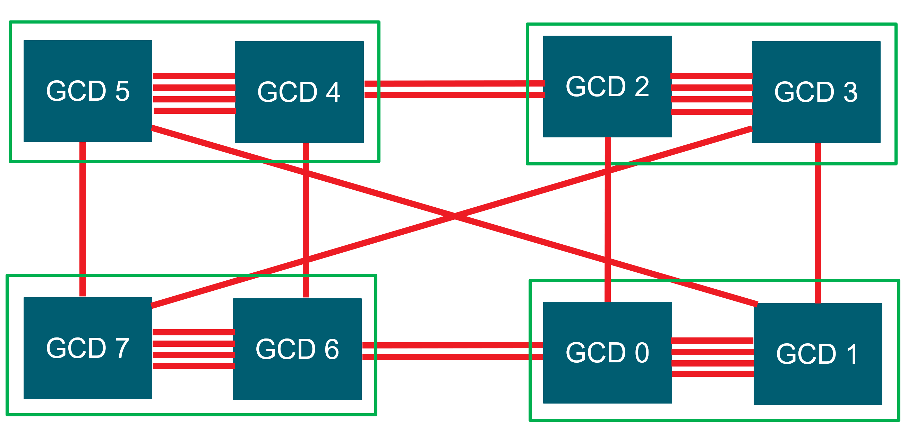

# GPU-aware MPI with ROCm

MPI is the de facto standard for inter-process communication in High-Performance Computing. MPI processes compute on their local data while extensively communicating with each other. This enables MPI programs to be executed on systems with a distributed memory space e.g. clusters. There are different types of communications supported in MPI including point-to-point and collective communications. Point-to-point communication is the basic communication mechanism in which both the sending process and the receiving process take part in the communication. The sender has a buffer that holds the message and an envelope containing information that will be used by the receiver side (e.g., message tag,  the sender rank number, etc.). The receiver uses the information in the envelope to select the specified message and stores it in its receiver buffer. In collective communication, messages can be exchanged among a group of processes rather than just two of them. Collective communication provides opportunities for processes to perform one-to-many and many-to-many communications in a convenient, portable and optimized way. Some examples of collective communications include broadcast, allgather, alltoall, and allreduce.

## GPU-aware MPI

Nowadays, many MPI applications support execution on GPU clusters. In these applications, the compute-intensive portion of the code is offloaded and accelerated on the GPU, also known as device. When it comes to MPI communication, the MPI processes need to communicate data that resides in GPU buffers. GPU-Aware MPI provides the opportunity to pass GPU buffers to MPI calls. This removes the burden of staging the GPU buffers through host memory for the programmers and enables them to develop a more readable and concise application. Moreover, it can make the application run more efficiently by taking advantage of acceleration technologies such as ROCm RDMA (Remote Direct Memory Access). ROCm RDMA enables third-party devices, such as the Mellanox Infiniband HCA (Host Channel Adapter), to have a direct peer-to-peer data path with GPU memory without host intervension. Most well-known MPI implementations including OpenMPI, MVAPICH2, and Cray MPICH support GPU-Aware communication. 

The following code shows a simple GPU-Aware point-to-point communication example:

```C++
#include <stdio.h>
#include <hip/hip_runtime.h>
#include <mpi.h>

int main(int argc, char **argv) {
  int i,rank,size,bufsize;
  int *h_buf;
  int *d_buf;
  MPI_Status status;

  bufsize=100;

  MPI_Init(&argc,&argv);
  MPI_Comm_rank(MPI_COMM_WORLD, &rank);
  MPI_Comm_size(MPI_COMM_WORLD, &size);

  //allocate buffers
  h_buf=(int*) malloc(sizeof(int)*bufsize);
  hipMalloc(&d_buf, bufsize*sizeof(int));

  //initialize buffers
  if(rank==0) {
    for(i=0;i<bufsize;i++)
      h_buf[i]=i;
  }

  if(rank==1) {
    for(i=0;i<bufsize;i++)
      h_buf[i]=-1;
  }

  hipMemcpy(d_buf, h_buf, bufsize*sizeof(int), hipMemcpyHostToDevice);

  //communication
  if(rank==0)
    MPI_Send(d_buf, bufsize, MPI_INT, 1, 123, MPI_COMM_WORLD);

  if(rank==1)
    MPI_Recv(d_buf, bufsize, MPI_INT, 0, 123, MPI_COMM_WORLD, &status);

  //validate results
  if(rank==1) {
    hipMemcpy(h_buf, d_buf, bufsize*sizeof(int), hipMemcpyDeviceToHost);
    for(i=0;i<bufsize;i++) {
      if(h_buf[i] != i)
        printf("Error: buffer[%d]=%d but expected %d\n", i, h_buf[i], i);
      }
    fflush(stdout);
  }

  //free buffers
  free(h_buf);
  hipFree(d_buf);
	
  MPI_Finalize();
}
```

As can be seen in the code, we are passing the GPU buffer (`d_buf`) to `MPI_Send` and `MPI_Recv` calls. This buffer is allocated on GPU with hipMalloc. 

To compile and run this code, you need ROCm as well as a GPU-Aware MPI implementation available on your system. You can find ROCm installation instructions from [AMD ROCm™ installation](https://gpuopen.com/learn/amd-lab-notes/amd-lab-notes-rocm-installation-README/). Instructions to build and run the above code (gpu-aware.cpp) with different MPI implementations are discussed later in this document.

## GPU-aware communication with OpenMPI

As mentioned earlier, most well-known MPI implementations have support for GPU-Aware communication. In this section, we provide instructions to build GPU-Aware OpenMPI with ROCm support. 

For building GPU-Aware OpenMPI with ROCm support, first, you need to install Unified Communication X ([UCX](https://openucx.org/)). UCX is a communication framework for high-bandwidth and low-latency networks. Use the following commands to build UCX (version 1.14):

```bash
git clone https://github.com/openucx/ucx.git
cd ucx
git checkout v1.14.x
./autogen.sh
./configure --prefix=$HOME/.local --with-rocm=/opt/rocm --without-knem --without-cuda --enable-gtest --enable-examples
make -j
make install
```

After successful installation, UCX will be available in `$HOME/.local` directory. Now, we can install GPU-Aware OpenMPI with ROCm support with the following commands:

```bash
git clone --recursive -b v5.0.x git@github.com:open-mpi/ompi.git
cd ompi/
./autogen.pl
./configure --prefix=$HOME/.local --with-ucx=$HOME/.local
make -j
make install
```

With OpenMPI 5.0 onward, we can also add `--with-rocm=/opt/rocm` to the configure command to take advantage of some ROCm features in Open MPI, benefiting e.g. derived datatypes, MPI I/O, etc. After successful installation, OpenMPI with ROCm support will be available in `$HOME/.local`. Now, we can set PATH and LD_LIBRARY_PATH as follows:

```bash
export PATH=$HOME/.local/bin:$PATH
export LD_LIBRARY_PATH=$HOME/.local/lib:$LD_LIBRARY_PATH
```

To compile a GPU-Aware MPI program, such as gpu-aware.cpp, with OpenMPI, set OMPI_CC environment variable to change the mpicc wrapper compiler to use hipcc. Then you can compile and run the code with mpicc and mpirun, respectively:

```bash
export OMPI_CC=hipcc
mpicc -o ./gpu-aware ./gpu-aware.cpp
mpirun -n 2 ./gpu-aware
```

## GPU-aware communication with Cray MPICH

In this section, we discuss how to build and run GPU-Aware MPI programs with Cray MPICH. First, make sure you have ROCm, Cray MPICH, and craype-accel-amd-gfx90a/craype-accel-amd-gfx908 modules loaded on your system. You have two options for compiling the code: 

1. Compile the code with Cray compiler wrappers and link ROCm:

```bash
cc -o ./gpu-aware ./gpu-aware.cpp -I/opt/rocm/include/ -L/opt/rocm/lib  -lamdhip64 -lhsa-runtime64
```

2. Compile the code with hipcc and link Cray MPICH:

```bash
hipcc -o ./gpu-aware ./gpu-aware.cpp -I/opt/cray/pe/mpich/8.1.18/ofi/cray/10.0/include/ -L/opt/cray/pe/mpich/8.1.18/ofi/cray/10.0/lib -lmpi
```

After successful compilation, you can run the code with:

```bash
export MPICH_GPU_SUPPORT_ENABLED=1
srun -n 2 ./gpu-aware
```

Please note that `MPICH_GPU_SUPPORT_ENABLED` is set to 1 to enable GPU-Aware communication.

## Performance measurement with the OSU microbenchmarks

The OSU microbenchmarks ([OMB](https://mvapich.cse.ohio-state.edu/benchmarks/)) provide a series of MPI benchmarks to measure the performance of various MPI operations including point-to-point, collective, host-based, and device-based communications. In this section, we discuss how to measure device-to-device communication bandwidth with the OSU microbenchmarks. We use the OpenMPI installation discussed earlier for the experiments in this section.

You can use the following commands to build the OSU microbenchmarks with ROCm support:

```bash
wget https://mvapich.cse.ohio-state.edu/download/mvapich/osu-micro-benchmarks-7.0.1.tar.gz
tar -xvf osu-micro-benchmarks-7.0.1.tar.gz
cd osu-micro-benchmarks-7.0.1
./configure --prefix=$HOME/.local/ CC=$HOME/.local/bin/mpicc CXX=$HOME/.local/bin/mpicxx --enable-rocm --with-rocm=/opt/rocm
make -j
make install
```

After successful installation, OMB will be available at `$HOME/.local/`. You can run the bandwidth test with the following command:

```bash
mpirun -n 2 $HOME/.local/libexec/osu-micro-benchmarks/mpi/pt2pt/osu_bw  D D
```

In the bandwidth test, the sender process sends a fixed number of back-to-back messages to the receiver. After receiving all these messages, the receiver process sends a reply. This procedure is repeated for several iterations. The bandwidth is calculated based on the elapsed time and the number of bytes transferred. `D D` at the end of the above command specifies that we want the send and receive buffers to be allocated on the device.

If you didn't get the expected bandwidth with the above command, it is possible that OpenMPI is not using UCX by default. To enforce OpenMPI to use UCX, you can add these parameters to the mpirun command:

```bash
mpirun --mca pml ucx --mca pml_ucx_tls ib,sm,tcp,self,cuda,rocm -np 2 $HOME/.local/libexec/osu-micro-benchmarks/mpi/pt2pt/osu_bw D D
```

You can also run collective communication tests with the following command:

```bash
mpirun -n 4 $HOME/.local/libexec/osu-micro-benchmarks/mpi/collective/osu_allreduce -d rocm
```

The above command runs MPI_Allreduce latency test with four processes. In this test, the benchmark measures the average latency of the MPI_Allreduce collective operation across four processes, for various message lengths, over a large number of iterations. `-d rocm` specifies that the processes should allocate the communication buffers on the GPU device.

## GPU-to-GPU communication options

In this section, we discuss GPU-to-GPU communication options in systems with [AMD Instinct™ MI250](https://www.amd.com/en/products/server-accelerators/instinct-mi250) and [AMD Instinct™ MI250X](https://www.amd.com/en/products/server-accelerators/instinct-mi250x) GPUs. Each MI250(X) GPU is comprised of two Graphics Compute Dies (GCDs). The following figure shows the diagram of a node with 4 MI250 GPUs (8 GCDs). Each green box represents one MI250 GPU with two GCDs. The GCDs are connected through infinity fabric links. Each Infinity fabric link has the peak bandwidth of 50 GB/s. As can be seen in the figure, there are different number of Infinity fabric links between GCDs. For example, the GCDs on the same GPU are connected with 4 links while the GCDs on different GPUs are connected with 1 or 2 links. Another observation from this figure is that there are different number of hops between GCDs. For example, GCD 1 is connected to GCD 3 through one hop, while GCD 0 is connected to GCD 3 at least through two hops. The maximum achievable bandwidth between GCDs depends on the number of infinity fabric links between GCDs and also the number of hops between them.


<p style="text-align:center">
Figure 1. Diagram of a node with 4 MI250 GPUs (8 GCDs). Each green box is one MI250 GPU with two GCDs. The GCDs are connected through infinity fabric links.
</p>

There are two options for GPU-to-GPU communications: 1. Using System Direct Memory Access (SDMA) engines and 2. Launching a kernel to handle the communication. SDMA engines provide the opportunity to overlap communication with computation. However, its disadvantage is that it provides the maximum bandwidth of 50 GB/s between GCDs. In contrast, kernels provide higher communication bandwidth but they require CUs to move data so there is less opportunity to overlap communication with computation with kernels. The environment variable `HSA_ENABLE_SDMA`, can be used to choose between SDMA engines and kernel. SDMA engines are used by default in ROCM 5.4 and below.

The following experiments [^1] show the communication bandwidth between GCD 0 and its peers for messages of size 16MB. We set `HSA_ENABLE_SDMA` to 0. So, a kernel is launched to handle the communication. we set `HIP_VISIBLE_DEVICES` to select peer GCDs for each experiment. With "-m ((16\*1024\*1024)):((16\*1024\*1024))" we specify the message size we are interested in which is 16MiB for this example.

```bash
export HSA_ENABLE_SDMA=0
export HIP_VISIBLE_DEVICES=0,1
mpirun -n 2 $OMB_DIR/libexec/osu-micro-benchmarks/mpi/pt2pt/osu_bw -m $((16*1024*1024)):$((16*1024*1024)) D D
# OSU MPI-ROCM Bandwidth Test v7.0
# Send Buffer on DEVICE (D) and Receive Buffer on DEVICE (D)
# Size      Bandwidth (MB/s)
16777216           142235.39

export HIP_VISIBLE_DEVICES=0,2
mpirun -n 2 $OMB_DIR/libexec/osu-micro-benchmarks/mpi/pt2pt/osu_bw -m $((16*1024*1024)):$((16*1024*1024)) D D
# OSU MPI-ROCM Bandwidth Test v7.0
# Send Buffer on DEVICE (D) and Receive Buffer on DEVICE (D)
# Size      Bandwidth (MB/s)
16777216            38963.65

export HIP_VISIBLE_DEVICES=0,3
mpirun -n 2 $OMB_DIR/libexec/osu-micro-benchmarks/mpi/pt2pt/osu_bw -m $((16*1024*1024)):$((16*1024*1024)) D D
# OSU MPI-ROCM Bandwidth Test v7.0
# Send Buffer on DEVICE (D) and Receive Buffer on DEVICE (D)
# Size      Bandwidth (MB/s)
16777216            36903.57

export HIP_VISIBLE_DEVICES=0,4
mpirun -n 2 $OMB_DIR/libexec/osu-micro-benchmarks/mpi/pt2pt/osu_bw -m $((16*1024*1024)):$((16*1024*1024)) D D
# OSU MPI-ROCM Bandwidth Test v7.0
# Send Buffer on DEVICE (D) and Receive Buffer on DEVICE (D)
# Size      Bandwidth (MB/s)
16777216            36908.74

export HIP_VISIBLE_DEVICES=0,5
mpirun -n 2 $OMB_DIR/libexec/osu-micro-benchmarks/mpi/pt2pt/osu_bw -m $((16*1024*1024)):$((16*1024*1024)) D D
# OSU MPI-ROCM Bandwidth Test v7.0
# Send Buffer on DEVICE (D) and Receive Buffer on DEVICE (D)
# Size      Bandwidth (MB/s)
16777216            34986.54

export HIP_VISIBLE_DEVICES=0,6
mpirun -n 2 $OMB_DIR/libexec/osu-micro-benchmarks/mpi/pt2pt/osu_bw -m $((16*1024*1024)):$((16*1024*1024)) D D
# OSU MPI-ROCM Bandwidth Test v7.0
# Send Buffer on DEVICE (D) and Receive Buffer on DEVICE (D)
# Size      Bandwidth (MB/s)
16777216            76276.14

export HIP_VISIBLE_DEVICES=0,7
mpirun -n 2 $OMB_DIR/libexec/osu-micro-benchmarks/mpi/pt2pt/osu_bw -m $((16*1024*1024)):$((16*1024*1024)) D D
# OSU MPI-ROCM Bandwidth Test v7.0
# Send Buffer on DEVICE (D) and Receive Buffer on DEVICE (D)
# Size      Bandwidth (MB/s)
16777216            68788.80
```
 
The above experiments show that we get different communication bandwidth for different peer GCDs. As mentioned earlier, this depends on the number of Infinity Fabric links between GCDs and also, the number of hops between them. For example, we get around 142 GB/s for communication between GCD 0 and 1 which are connected with four Infinity Fabric links. Each Infinity Fabric link has the peak theoretical bandwidth of 50 GB/s. So, the peak theoretical bandwidth between GCD 0 and 1 is 200 GB/s. Assuming the achievable bandwidth is around 70% of the theoretical bandwidth, it is expected to get around 142 GB/s for communication between GCD 0 and 1. In the case of GCDs 0 and 2, they are connected with one Infinity Fabric link and we get the bandwidth of 38 GB/s. GCD 0 and 3 are connected through two hops so the achieved bandwidth is slightly lower (around 36 GB/s). We can use the same logic to reason about the communication bandwidth for other GCD peers.

With an SDMA engine, we get the maximum bandwidth of around 50 GB/s, as discussed earlier:

```bash
export HSA_ENABLE_SDMA=1
export HIP_VISIBLE_DEVICES=0,1
mpirun -n 2 $OMB_DIR/libexec/osu-micro-benchmarks/mpi/pt2pt/osu_bw -m $((16*1024*1024)):$((16*1024*1024)) D D
# OSU MPI-ROCM Bandwidth Test v7.0
# Send Buffer on DEVICE (D) and Receive Buffer on DEVICE (D)
# Size      Bandwidth (MB/s)
16777216            49396.52

export HIP_VISIBLE_DEVICES=0,2
mpirun -n 2 $OMB_DIR/libexec/osu-micro-benchmarks/mpi/pt2pt/osu_bw -m $((16*1024*1024)):$((16*1024*1024)) D D
# OSU MPI-ROCM Bandwidth Test v7.0
# Send Buffer on DEVICE (D) and Receive Buffer on DEVICE (D)
# Size      Bandwidth (MB/s)
16777216            41925.10

export HIP_VISIBLE_DEVICES=0,3
mpirun -n 2 $OMB_DIR/libexec/osu-micro-benchmarks/mpi/pt2pt/osu_bw -m $((16*1024*1024)):$((16*1024*1024)) D D
# OSU MPI-ROCM Bandwidth Test v7.0
# Send Buffer on DEVICE (D) and Receive Buffer on DEVICE (D)
# Size      Bandwidth (MB/s)
16777216            41019.50

export HIP_VISIBLE_DEVICES=0,4
mpirun -n 2 $OMB_DIR/libexec/osu-micro-benchmarks/mpi/pt2pt/osu_bw -m $((16*1024*1024)):$((16*1024*1024)) D D
# OSU MPI-ROCM Bandwidth Test v7.0
# Send Buffer on DEVICE (D) and Receive Buffer on DEVICE (D)
# Size      Bandwidth (MB/s)
16777216            42243.36

export HIP_VISIBLE_DEVICES=0,5
mpirun -n 2 $OMB_DIR/libexec/osu-micro-benchmarks/mpi/pt2pt/osu_bw -m $((16*1024*1024)):$((16*1024*1024)) D D
# OSU MPI-ROCM Bandwidth Test v7.0
# Send Buffer on DEVICE (D) and Receive Buffer on DEVICE (D)
# Size      Bandwidth (MB/s)
16777216            41870.39

export HIP_VISIBLE_DEVICES=0,6
mpirun -n 2 $OMB_DIR/libexec/osu-micro-benchmarks/mpi/pt2pt/osu_bw -m $((16*1024*1024)):$((16*1024*1024)) D D
# OSU MPI-ROCM Bandwidth Test v7.0
# Send Buffer on DEVICE (D) and Receive Buffer on DEVICE (D)
# Size      Bandwidth (MB/s)
16777216            49386.80

export HIP_VISIBLE_DEVICES=0,7
mpirun -n 2 $OMB_DIR/libexec/osu-micro-benchmarks/mpi/pt2pt/osu_bw -m $((16*1024*1024)):$((16*1024*1024)) D D
# OSU MPI-ROCM Bandwidth Test v7.0
# Send Buffer on DEVICE (D) and Receive Buffer on DEVICE (D)
# Size      Bandwidth (MB/s)
16777216            49369.06
```

[Accompanying code example](https://github.com/amd/amd-lab-notes/tree/release/gpu-aware-mpi/examples)

If you have any questions or comments, please reach out to us on GitHub [Discussions](https://github.com/amd/amd-lab-notes/discussions)

[^1]: Testing conducted using ROCm version 5.4, UCX 1.14, and OpenMPI 5.0. The tests in this document do not represent official performance numbers, but reflect the impact of different communication options. Actual performance depends on system configuration and environment settings.

