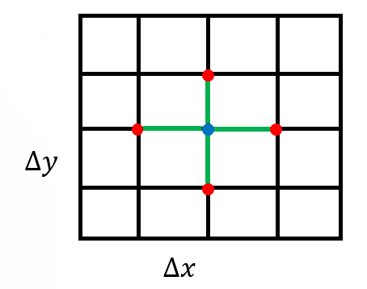
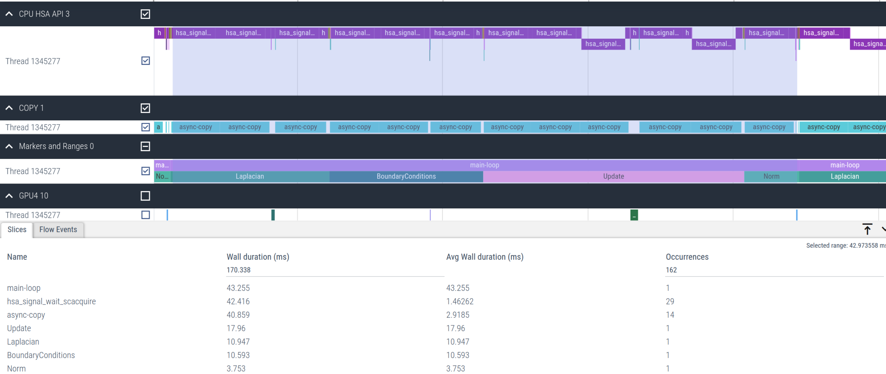
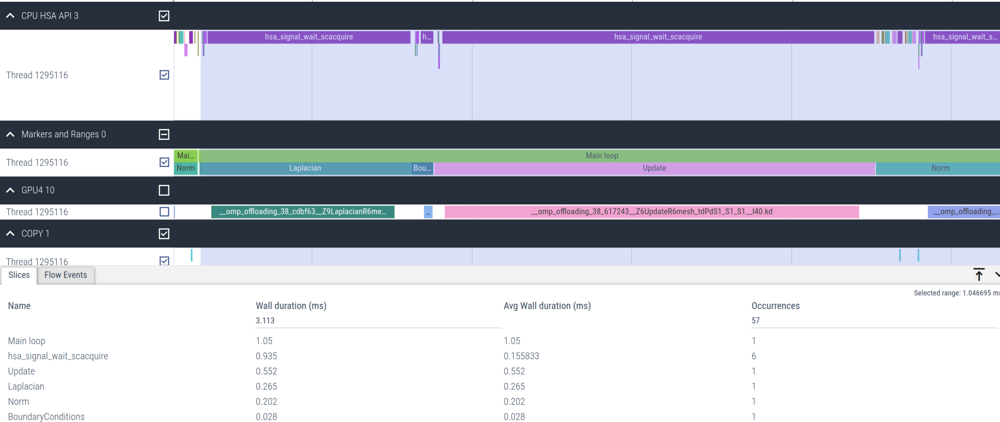
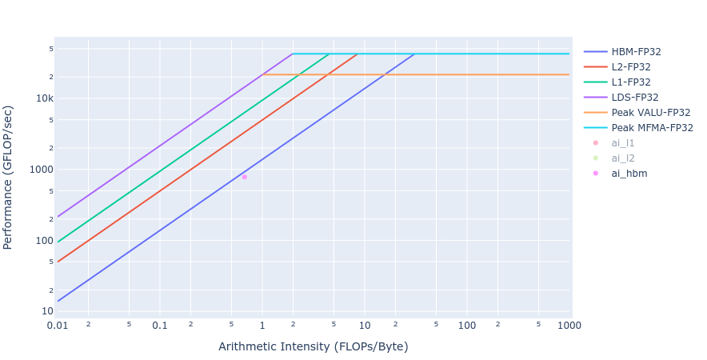

# Jacobi Solver with HIP and OpenMP offloading

<!--- Introduction -->
The Jacobi method serves as a fundamental iterative linear solver for Partial
Differential Equations (PDE) governing a wide variety of physics of interest in
high performance computing (HPC) applications. Discretization of a PDE by a
numerical method, e.g. finite difference, finite volume, finite element, or any
other methods, leads to a large sparse systems of equations. A stationary
iterative method, such as the Jacobi, can take advantage of modern heterogeneous
hierarchical systems with CPU and GPUs as it is more amenable to parallelization
and require less memory compared to traditional direct methods. Jacobi
iteration involves a lot of repeated matrix-vector product operations, and to a
great extent limits communication between all components at every iteration.
This makes Jacobi methods more favorable for GPU offloading.

In this blog, we explore GPU offloading using HIP and OpenMP target directives
and discuss their relative merits in terms of implementation efforts and 
performance.

Note: While most HPC applications today use Message Passing Interface (MPI) for
distributed memory parallelism,
in this blog post we consider only a single process implementation of the Jacobi
method for a demonstration purpose.


## Jacobi Iterative Methods
To discuss the Jacobi iterative method, we consider a PDE with 
Dirichlet boundary conditions on a two dimensional domain, 
with spatial coordinates $x$ and $y$, to solve Poisson's equation: 
$-\nabla^2 u(x,y) = f$, which is a generalized Laplacian. 
Here, $u(x,y)$ is a smooth function in the domain.
The equations are discretized using finite difference method[^1] in a Cartesian
coordinates with a 5-point stencil:

$$
\frac{-u_{i-1,j  } + 2u_{i,j} - u_{i+1,j  }}{\Delta x^2} + 
\frac{-u_{i,  j-1} + 2u_{i,j} - u_{i,  j+1}}{\Delta y^2} = f_{i,j}
$$

[^1]: See the [Finite Difference](../finite-difference/docs/Laplacian_Part1.md) blogpost.

The above finite difference Laplacian operator leads to a sparse matrix
operator, $A$ on the vector of unknown $\bf u$: $A {\bf u} = f$. Here:

$$
{\bf u} = [u_{1,1}, u_{1,2}, \cdots, u_{2,1}, \cdots,
   u_{i,j}, \cdots u_{n_i,n_j}].
$$

If the matrix is decomposed into the diagonal ($D$), lower ($L$) and upper ($U$)
parts ($A = [D + L + U]$), the Jacobi iterative method can be represented as:

$$
{\bf u}^{k+1} = {\bf u}^{k} + D^{-1} \left( {\bf f} - A {\bf u}^k \right)
$$

Here, $k$ refers to the iteration number. The values of ${\bf u}^{(k=0)}$ are the Initial Conditions.

## Jacobi Code structure

The main components of the serial (CPU) Jacobi solver are:

- Setup Jacobi object
  - `CreateMesh()`
  - `InitializeData()`
- Execute Jacobi method
  - `Laplacian()`
  - `BoundaryConditions()`
  - `Update()`
  - `Norm()`

The following code shows the Jacobi solver program. 
In the code, `Jacobi_t Jacobi(mesh);` does the Jacobi object setup and
`Jacobi.Run()` does the Jacobi solver execution.

```c++
int main(int argc, char ** argv)
{
  mesh_t mesh;

  // Extract topology and domain dimensions from the command-line arguments
  ParseCommandLineArguments(argc, argv, mesh);

  Jacobi_t Jacobi(mesh);
  Jacobi.Run();

  return STATUS_OK;
}
```

### Setup Jacobi Object

The Jacobi object consists of two main components:

- Setup Jacobi object
  - `CreateMesh()`
  - `InitializeData()`

The routine `CreateMesh()` creates a two-dimensional Cartesian mesh with uniform
mesh spacing -- see Figure 1. The routine `InitializeData()` initializes host variables $\bf u$ (`h_U` in the
code), the matrix-vector product $A{\bf u}$ (`h_AU`), the right-hand side vector
$f$ (`h_RHS`), and the residual vector $f-A{\bf u}$ (`h_RES`). It also applies
boundary conditions for these variables.


<p style="text-align:center">
Figure 1: A uniform rectangular grid to discretize the computational domain
</p>

### Execute Jacobi Method

The main Jacobi solver execution includes the following functions:

- Execute Jacobi method
  - `Laplacian()`
  - `BoundaryConditions()`
  - `Update()`
  - `Norm()`

The following code shows the order of the function calls in each Jacobi iteration

```c++
  // Scalar factor used in Jacobi method
  const dfloat factor = 1/(2.0/(mesh.dx*mesh.dx) + 2.0/(mesh.dy*mesh.dy));
  const dfloat _1bydx2 = 1.0/(mesh.dx*mesh.dx);
  const dfloat _1bydy2 = 1.0/(mesh.dy*mesh.dy);

  while ((iterations < JACOBI_MAX_LOOPS) && (residual > JACOBI_TOLERANCE))
  {
    // Compute Laplacian
    Laplacian(mesh, _1bydx2, _1bydy2, h_U, h_AU);

    // Apply Boundary Conditions
    BoundaryConditions(mesh, _1bydx2, _1bydy2, h_U, h_AU);

    // Update the solution
    Update(mesh, factor, h_RHS, h_AU, h_RES, h_U);

    // Compute residual = ||U||
    residual = Norm(mesh, h_RES);

    ++iterations;
  }
```

The function `Laplacian()` performs the main Laplacian operation discussed
earlier and is shown below:

```c++
// AU_i,j = (-U_i+1,j + 2U_i,j - U_i-1,j)/dx^2 +
//          (-U_i,j+1 + 2U_i,j - U_i,j-1)/dy^2
void Laplacian(mesh_t& mesh,
               const dfloat _1bydx2,
               const dfloat _1bydx2,
               const dfloat * U,
               dfloat * AU) {
  int stride = mesh.Nx;
  int localNx = mesh.Nx - 2;
  int localNy = mesh.Ny - 2;

  for (int j=0;j<localNy;j++) {
    for (int i=0;i<localNx;i++) {

      const int id = (i+1) + (j+1)*stride;

      const int id_l = id - 1;
      const int id_r = id + 1;
      const int id_d = id - stride;
      const int id_u = id + stride;

      AU[id] = (-U[id_l] + 2*U[id] - U[id_r])/(dx*dx) +
               (-U[id_d] + 2*U[id] - U[id_u])/(dy*dy);
    }
  }
}
```

The `BoundaryConditions()` is a function to apply boundary conditions to 
$A{\bf u}$ term. It applies only to the boundary nodes:

```c++
void BoundaryConditions(mesh_t& mesh,
                        const dfloat _1bydx2,
                        const dfloat _1bydy2,
                        dfloat* U,
                        dfloat* AU) {

  const int Nx = mesh.Nx;
  const int Ny = mesh.Ny;

  for (int id=0;id<2*Nx+2*Ny-2;id++) {

    //get the (i,j) coordinates of node based on how large id is
    int i, j;
    if (id < Nx) { //bottom
      i = id;
      j = 0;
    } else if (id<2*Nx) { //top
      i = id - Nx;
      j = Ny-1;
    } else if (id < 2*Nx + Ny-1) { //left
      i = 0;
      j = id - 2*Nx + 1;
    } else { //right
      i = Nx-1;
      j = id - 2*Nx - Ny + 2;
    }

    const int iid = i+j*Nx;

    const dfloat U_d = (j==0)    ?  0.0 : U[iid - Nx];
    const dfloat U_u = (j==Ny-1) ?  0.0 : U[iid + Nx];
    const dfloat U_l = (i==0)    ?  0.0 : U[iid - 1];
    const dfloat U_r = (i==Nx-1) ?  0.0 : U[iid + 1];

     AU[iid] = (-U_l + 2*U[iid] - U_r)*_1bydx2 +
               (-U_d + 2*U[iid] - U_u)*_1bydy2;
  }
}
```

The essence of Jacobi solver is in the `Update()` function which performs
the Jacobi iteration:

```c++
//Jacobi iterative method
// U = U + D^{-1}*(RHS - AU)

void Update(mesh_t& mesh,
            const dfloat factor,
            dfloat* RHS,
            dfloat* AU,
            dfloat* RES,
            dfloat* U) 
{
  const int N = mesh.N;

  for (int id=0;id<N;id++) 
  {
    const dfloat r_res = RHS[id] - AU[id];
    RES[id] = r_res;
    U[id] += r_res*factor;
  }
}
```

The function `Norm()` is the main function that performs a reduction operation and returns a scalar residual used to check
for solver convergence:

```C++
dfloat Norm(mesh_t& mesh, dfloat *U) {

  dfloat norm = 0;
  const int N = mesh.N;
  const dfloat dx = mesh.dx;
  const dfloat dy = mesh.dy;

  for (int id=0; id < N; id++) {
    *norm2 += U[id] * U[id] * dx * dy;
  }
  return sqrt(norm)/N;
}
```

The next two sections describe two possible ways to port this solver onto GPUs.

## GPU offload using HIP

First, we considered HIP porting for offloading the Jacobi solver to GPU. We wrote HIP kernels to
port the four major code regions discussed above. Note that, for the most optimized performance, 
we used a launch bound of 256 (`BLOCK_SIZE`) for all kernels. The following code snippet shows the 
function calls in each Jacobi iteration, which is same as the serial code:

```c++
  // Scalar factor used in Jacobi method
  const dfloat factor = 1/(2.0/(mesh.dx*mesh.dx) + 2.0/(mesh.dy*mesh.dy));
  const dfloat _1bydx2 = 1.0/(mesh.dx*mesh.dx);
  const dfloat _1bydy2 = 1.0/(mesh.dy*mesh.dy);

  auto timerStart = std::chrono::high_resolution_clock::now();

  while ((iterations < JACOBI_MAX_LOOPS) && (residual > JACOBI_TOLERANCE)) 
  {
    // Compute Laplacian
    Laplacian(mesh, _1bydx2, _1bydy2, HD_U, HD_AU);

    // Apply Boundary Conditions
    BoundaryConditions(mesh, _1bydx2, _1bydy2, HD_U, HD_AU);

    // Update the solution
    Update(mesh, factor, HD_RHS, HD_AU, HD_RES, HD_U);

    // Compute residual = ||U||
    residual = Norm(mesh, HD_RES);
    
    ++iterations;
  }
```

Some of the kernel launch configurations are set up in
`InitializeData()`, as shown in the following code snippet:

```C++
  // ...
  // Kernel launch configurations
  mesh.block.x = BLOCK_SIZE;
  mesh.grid.x = std::ceil(static_cast<double>(mesh.Nx * mesh.Ny) / mesh.block.x);
  mesh.grid2.x = std::ceil((2.0*mesh.Nx+2.0*mesh.Ny-2.0)/mesh.block.x);
  // ...
```

The code for `LaplacianKernel()` and `Laplacian()` routine that launches this
kernel are shown below:

```c++
__global__
__launch_bounds__(BLOCK_SIZE)
void LaplacianKernel(const int localNx,
                     const int localNy,
                     const int stride,
                     const dfloat fac_dx2,
                     const dfloat fac_dy2,
                     const dfloat * U,
                     dfloat * AU) 
{
    int tid = GET_GLOBAL_ID_0;

    if (tid > localNx + localNy * stride || tid < stride + 1)
        return;

    const int tid_l = tid - 1;
    const int tid_r = tid + 1;
    const int tid_d = tid - stride;
    const int tid_u = tid + stride;

    __builtin_nontemporal_store((-U[tid_l] + 2*U[tid] - U[tid_r])*fac_dx2 + 
                                (-U[tid_d] + 2*U[tid] - U[tid_u])*fac_dy2, &(AU[tid]));
}

void Laplacian(mesh_t& mesh,
               const dfloat _1bydx2,
               const dfloat _1bydy2,
               dfloat* U,
               dfloat* AU) 
{
  int stride = mesh.Nx;
  int localNx = mesh.Nx-2;
  int localNy = mesh.Ny-2;

  LaplacianKernel<<<mesh.grid,mesh.block>>>(localNx, localNy, stride, _1bydx2, _1bydy2, U, AU);
}
```

The kernel `BoundaryConditionsKernel()`, and its launching function are
shown below:

```c++
__global__
__launch_bounds__(BLOCK_SIZE)
void BoundaryConditionsKernel(const int Nx,
                              const int Ny,
                              const int stride,
                              const dfloat fac_dx2,
                              const dfloat fac_dy2,
                              const dfloat * U,
                              dfloat * AU) 
{
    const int id = GET_GLOBAL_ID_0;

    if (id < 2*Nx+2*Ny-2)
    {
	//get the (i,j) coordinates of node based on how large id is
	int i = Nx-1;
	int j = id - 2*Nx - Ny + 2;

	if (id < Nx) 
	{ //bottom
	    i = id; j = 0;
	}
	else if (id<2*Nx) 
	{ //top
	    i = id - Nx; j = Ny-1;
	}
	else if (id < 2*Nx + Ny-1) 
	{ //left
	    i = 0; j = id - 2*Nx + 1;
	}

	const int iid = i+j*stride;

	const dfloat U_d = (j==0)    ?  0.0 : U[iid - stride];
	const dfloat U_u = (j==Ny-1) ?  0.0 : U[iid + stride];
	const dfloat U_l = (i==0)    ?  0.0 : U[iid - 1];
	const dfloat U_r = (i==Nx-1) ?  0.0 : U[iid + 1];

	__builtin_nontemporal_store((-U_l + 2*U[iid] - U_r)*fac_dx2 +
                                    (-U_d + 2*U[iid] - U_u)*fac_dy2, &(AU[iid]));
    }
}

void BoundaryConditions(mesh_t& mesh,
                        const dfloat _1bydx2,
                        const dfloat _1bydy2,
                        dfloat* U,
                        dfloat* AU) {

  const int Nx = mesh.Nx;
  const int Ny = mesh.Ny;
  BoundaryConditionsKernel<<<mesh.grid2,mesh.block>>>(Nx, Ny, Nx, _1bydx2, _1bydy2, U, AU);
}
```

The following code shows the HIP implementation of `UpdateKernel()`:

```C++
__global__
__launch_bounds__(BLOCK_SIZE)
void UpdateKernel(const int N,
                  const dfloat factor,
                  const dfloat *__restrict__ RHS,
                  const dfloat *__restrict__ AU,
                  dfloat *__restrict__ RES,
                  dfloat *__restrict__ U)
{
    int tid = GET_GLOBAL_ID_0;
    dfloat r_res;
    for (int i = tid; i < N; i += gridDim.x * blockDim.x)
    {
        r_res = RHS[i] - AU[i];
        RES[i] = r_res;
        U[i] += r_res*factor;
    }
}

void Update(mesh_t& mesh,
            const dfloat factor,
            dfloat* RHS,
            dfloat* AU,
            dfloat* RES,
            dfloat* U) 
{
  UpdateKernel<<<mesh.grid,mesh.block>>>(mesh.N, factor, RHS, AU, RES, U);
}
```

The following code shows the HIP implementation of `NormKernel()` 
which is loosely based off the HIP dot implementation in 
[BabelStream](https://github.com/UoB-HPC/BabelStream/blob/develop/src/hip/HIPStream.cpp):

```c++
#define NORM_BLOCK_SIZE 512
#define NORM_NUM_BLOCKS 256
__global__
__launch_bounds__(NORM_BLOCK_SIZE)
void NormKernel(const dfloat * a, dfloat * sum, int N)
{
  __shared__ dfloat smem[NORM_BLOCK_SIZE];

  int i = GET_GLOBAL_ID_0;
  const size_t si = GET_LOCAL_ID_0;

  smem[si] = 0.0;
  for (; i < N; i += NORM_BLOCK_SIZE * NORM_NUM_BLOCKS)
    smem[si] += a[i] * a[i];

  for (int offset = NORM_BLOCK_SIZE >> 1; offset > 0; offset >>= 1)
  {
    __syncthreads();
    if (si < offset) smem[si] += smem[si+offset];
  }

  if (si == 0)
    sum[GET_BLOCK_ID_0] = smem[si];
}

void NormSumMalloc(mesh_t &mesh)
{
  hipHostMalloc(&mesh.norm_sum, NORM_NUM_BLOCKS*sizeof(dfloat), hipHostMallocNonCoherent);
}

dfloat Norm(mesh_t& mesh, dfloat *U) 
{
  dfloat norm = 0.0;
  const int N = mesh.N;
  const dfloat dx = mesh.dx;
  const dfloat dy = mesh.dy;
  NormKernel<<<NORM_NUM_BLOCKS,NORM_BLOCK_SIZE>>>(U, mesh.norm_sum, N);
  hipDeviceSynchronize();
  for (int id=0; id < NORM_NUM_BLOCKS; id++)
    norm += mesh.norm_sum[id];
  return sqrt(norm*dx*dy)*mesh.invNtotal;
}
```

Note that the buffer `mesh.norm_sum` is non-coherent pinned memory, meaning that it
is mapped into the address space of the GPU. We defer all interested readers to
[this article](../mi200-memory-space/Overview.md#non-pageable-pinned-memory) for a more thorough
discussion. The parameters `NORM_BLOCK_SIZE` and `NORM_NUM_BLOCKS` can and should be tuned
to optimize the performance on your hardware.

The Table summarizes time per iteration spent in the major kernels of the Jacobi
solver with HIP porting. The grid size is $4096\times 4096$. The total wall
clock time over a $1000$ iterations is $858$ ms
and achieves a compute performance of $332$ GFLOP/s on one GCD of a MI250 GPU.
The most expensive code region is the Jacobi `Update()` routine.

|Kernels                    | Avg Time (ms) | Percentage |
|:------------------------- |:-------------:|:----------:|
| Update                    | 0.51          | 60.9       |
| Laplacian                 | 0.22          | 25.7       |
| Norm                      | 0.10          | 12.3       |
| BoundaryConditions        | 0.01          |  0.9       |

<!--- 
  =====================
  OpenMP Target Offload 
  =====================
-->
## GPU offload using OpenMP

In this section, we explore OpenMP offloading. We consider both structured and
unstructured target data mapping approaches. The `clang++` compiler with
`-fopenmp` flag is used to build the openmp target offload regions. More details
can be found in `codes/Makefile`. For example, the following command shows how
to compile the `Jacobi.cpp` file:

```bash
/opt/rocm/llvm/bin/clang++ -Ofast -g -fopenmp --offload-arch=gfx90a -c Jacobi.cpp -o Jacobi.o
```

### Structured Target Data Map
Let's consider the most expensive code region observed in the HIP ported Jacobi solver,
`Update()`. A simple OpenMP target offload approach would be as
follows:

```C++

void Update(mesh_t& mesh,
            const dfloat factor,
            dfloat* RHS,
            dfloat* AU,
            dfloat* RES,
            dfloat* U) 
{
  const int N = mesh.N;
  #pragma omp target data map(to:RHS[0:N],AU[0:N]) map(from:RES[0:N]) map(tofrom:U[0:N])
  #pragma omp target teams distribute parallel for
  for (int id=0;id<N;id++) 
  {
    const dfloat r_res = RHS[id] - AU[id];
    RES[id] = r_res;
    U[id] += r_res*factor;
  }
}
```

The state variables are mapped onto device region and Jacobi update is
invoked in the target region. This is an example of structured target mapping
construct.
Similar stuctured target mapping is done for Laplacian and Norm routines.

```C++
void Laplacian(mesh_t& mesh,
               const dfloat _1bydx2,
               const dfloat _1bydy2,
               dfloat* U,
               dfloat* AU) 
{
  int stride = mesh.Nx;
  int localNx = mesh.Nx-2;
  int localNy = mesh.Ny-2;

  #pragma omp target data map(to:U[0:mesh.N]) map(tofrom:AU[0:mesh.N])
  #pragma omp target teams distribute parallel for collapse(2)
  for (int j=0;j<localNy;j++) {
    for (int i=0;i<localNx;i++) {

      const int id = (i+1) + (j+1)*stride;

      const int id_l = id - 1;
      const int id_r = id + 1;
      const int id_d = id - stride;
      const int id_u = id + stride;

       AU[id] = (-U[id_l] + 2*U[id] - U[id_r])*_1bydx2 +
                (-U[id_d] + 2*U[id] - U[id_u])*_1bydy2;
    }
  }
}
```

```C++
dfloat Norm(mesh_t& mesh, dfloat *U) 
{
  dfloat norm = 0.0;
  const int N = mesh.N;
  const dfloat dx = mesh.dx;
  const dfloat dy = mesh.dy;
  #pragma omp target data map(to: U[0:mesh.N])
  #pragma omp target teams distribute parallel for reduction(+:norm)
  for (int id=0; id < N; id++) {
    norm += U[id] * U[id] * dx * dy;
  }
  return sqrt(norm)/N;
}
```

However, this implementation results in a very poor performance of the solver which takes 51.4 ms
per main-loop iteration instead of 1.1 ms using HIP. This is about more than 46x slower.
Looking at Figure 2, we observe that significant time spent on
`hsa_signal_wait_scacquire` and especially `async-copy` kernels due to the
mapping required in every iteration.


<p style="text-align:center">
Figure 2: Timeline of Jacobi offload kernels using structured target data map
</p>

### Unstructured Target Data Map

We note that most of the state variables that Jacobi solver requires can reside
on the device. The data needs to be mapped to the host (CPU) only for the final residual
output and the state solution data if required. Therefore, we can switch to
__unstructured__ target data mapping constructs which ensure data resides on the
device between `target enter data` and `target exit data` map constructs. We
perform the host to device copy before the Jacobi iterations and release the
device data after the loops end, as shown below:

```C++
void Jacobi_t::Run()
{
  const int N = mesh.N;
  #pragma omp target enter data map(to: mesh,h_U[0:N],h_AU[0:N],h_RES[0:N],h_RHS[0:N])

  ...
  while ((iterations < JACOBI_MAX_LOOPS) && (residual > JACOBI_TOLERANCE)) 
  {
    Laplacian(mesh, _1bydx2, _1bydy2, HD_U, HD_AU);
    BoundaryConditions(mesh, _1bydx2, _1bydy2, HD_U, HD_AU);
    Update(mesh, factor, HD_RHS, HD_AU, HD_RES, HD_U);
    residual = Norm(mesh, HD_RES);
    
    ++iterations;
  }
  ...

  #pragma omp target exit data map(release: h_U[0:N],h_AU[0:N],h_RES[0:N],h_RHS[0:N])
}
```

This avoids repetitive data mapping from host-to-device and device-to-host in
every iteration that was needed by the __structured__ target data map constructs
for all the routines: Laplacian, BoundaryConditions, Update, and Norm. 
This essentially means removing the `#pragma omp target data map()` constructs
in these routines.

For example, the code below shows now
the updated Norm function has no structured map constructs in the
target region any more.
Here, the state vector $U$ is already mapped onto the device using the
unstructured data map constructs at the very beginning of the Jacobi solver.

```C++
dfloat Norm(mesh_t& mesh, dfloat *U) 
{
  dfloat norm = 0.0;
  const int N = mesh.N;
  const dfloat dx = mesh.dx;
  const dfloat dy = mesh.dy;
  #pragma omp target teams distribute parallel for reduction(+:norm)
  for (int id=0; id < N; id++) {
    norm += U[id] * U[id] * dx * dy;
  }
  return sqrt(norm)/N;
}
```

Figure 3 below shows the timeline of the major Jacobi solver kernels. The figure
clearly shows that the total number of `hsa_signal_wait_scacquire` kernel calls
are reduced by a significant amount compared to what was observed in the first naive offload
implementation in Figure 2.


<p style="text-align:center">
Figure 3: Timeline of the optimized Jacobi offload kernels using unstructured mapping
</p>

The following Table summarizes the timings of the main kernels of the Jacobi 
solver with OpenMP offload implementation using Clang compiler. The grid size is $4096 \times 4096$, 
consistent with the HIP version. The total wall clock time over a thousand 
iterations is 999 ms[^2] and is very comparable to the HIP implementation value observed earlier
on one GCD of a MI250 GPU.
A compute performance of 285 GFLOPs compares well with the value observed with the HIP implementation as well.
Overall, the timings of the major code regions with the OpenMP offload are 
very close to the values obtained with HIP porting.

|Kernels             | Avg Time (ms) | Percentage |
|:------------------:|:-------------:|:----------:|
| Update             | 0.51          | 57.9       |
| Laplacian          | 0.25          | 27.6       |
| Norm               | 0.11          | 12.2       |
| BoundaryConditions | 0.02          |  2.2       |

[^2]: The results are obtained with ROCM v.5.6.0-67. These numbers are
not validated performance numbers, and are provided only to demonstrate relative
performance gains with the code modifications. Actual performance results will
depend on several factors including system configuration and environment settings.

## HIP vs OpenMP Offload

The Jacobi Solver with sparse matrix operations, whose
Arithmetic Intensity (AI = FLOPs/Band Width) is  about 0.17, lies in the memory bound
regime. Therefore we compare the achieved memory Band Width (BW) of the kernels
from HIP and OpenMP offload implementations.
The following Table compares the HBM BW (GB/s) values from HIP and OpenMP offload
implementations.

|Kernels             | HIP HBM BW (GB/s)| OpenMP Offload HBM BW (GB/s) |
|:-------------------|:----------------:|:----------------------------:|
| Update             | 1306             | 1297                         |
| Laplacian          | 1240             | 1091                         |
| Norm               | 1325             | 1239                         |
| BoundaryConditions |  151             |   50                         |

Most of the kernels achieve BW values very close to the achievable peak BW of
MI250 of about [1300-1400] GB/s. The work done in
BoundaryConditions is too small to saturate GPU, and therefore the values are small.
Below in Figure 4 we show rooflines[^3] from both HIP and OpenMP offload implementations of the
Update kernel. As observed from the roofline figures, the Update kernel from both 
the implementations lie very close to the roofline in the memory bound regime.
This agrees well with the observations made from the HBM table above.

<p align="center">
  
  &nbsp; &nbsp; &nbsp; &nbsp;
  
</p>

<p style="text-align:center">
Figure 4: Roofline of Update kernel using HIP (left) and OpenMP offload (right)
</p>

[^3]: The rooflines are obtained using AMD [Omniperf](https://amdresearch.github.io/omniperf/) tool.

Similar observations about achieved BW for the Laplacian kernels are made 
from the rooflines below in Figure 5 from both the
GPU offload implementations.

<p align="center">
  
  &nbsp; &nbsp; &nbsp; &nbsp;
  
</p>

<p style="text-align:center">
Figure 5: Roofline of Laplacian kernel using HIP (left) and OpenMP offload (right)
</p>

## Conclusion

In this blog post, we have presented GPU offloading of a finite difference Jacobi
Solver using HIP and OpenMP target offloading.
The HIP implementation required replacing host codes with new HIP kernels,
and optimizing on the kernel launch parameters including thread block and grid
sizes as well as the launch bounds. 
On the other hand, the OpenMP offload implementation, being
directive based, required less instrusive modifications to the existing host
code base. For the problem sizes considered, the OpenMP offload could achieve
compute performance and bandwidth metrics comparable, or even better at times, to the HIP
GPU porting with significantly less coding effort. This illustrates the advantages
that a directive based GPU porting such as OpenMP offload can offer compared to
the approaches involving code rewrites such as HIP porting.
Having said that, it is worth mentioning that for more complex applications, 
OpenMP may offer only limited options for tuning of the target offload constructs 
and its parameters for additional performance gains.

In the future, we will follow up this blog post with a Fortran OpenMP offload version of the
Jacobi Solver.
