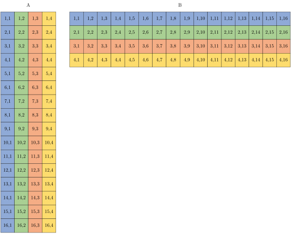
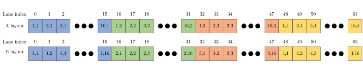
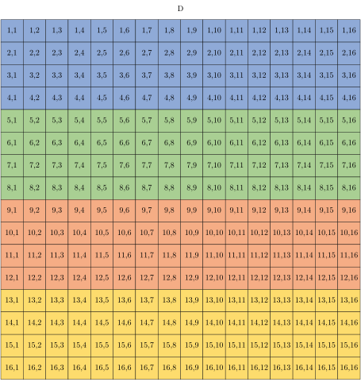
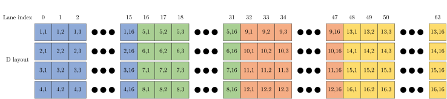
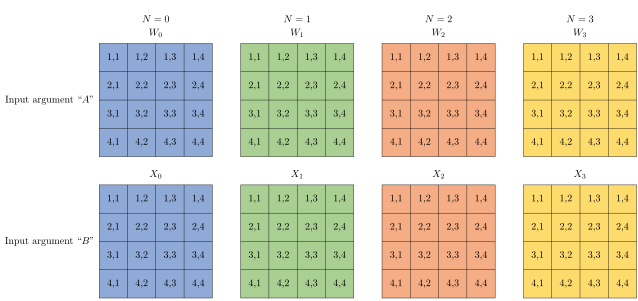
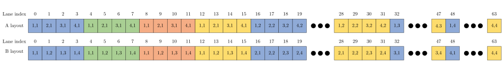

# AMD matrix cores

Matrix multiplication is a fundamental aspect of Linear Algebra and it is an ubiquitous computation within High Performance Computing (HPC) Applications. Since the introduction of AMD's CDNA Architecture, Generalized Matrix Multiplication (GEMM) computations are now hardware-accelerated through Matrix Core Processing Units. Matrix Core accelerated GEMM kernels lie at the heart of BLAS libraries like rocBLAS but they can also be programmed directly by developers. Applications that are throughput bound by GEMM computation can achieve additional speedups by utilizing Matrix Cores. 

AMD’s Matrix Core technology supports a full range of mixed precision operations bringing us the ability to work with large models and enhance memory-bound operation performance for any combination of AI and machine learning workloads. The various numerical formats have uses in different applications. Examples include use of 8-bit integers (INT8) for ML inference, 32-bit floating point (FP32) data for ML Training and HPC applications, 16-bit floating point (FP16) data for graphics workloads and 16-bit brain float (BF16) data for ML training with fewer convergence issues.

To learn more about the theoretical speedups achievable by using matrix cores compared to SIMD Vector Units, please refer to the tables below. The tables list the performance of the Vector (i.e. Fused Multiply-Add or FMA) and Matrix core units of the previous generation (MI100) and current generation (MI250X) of CDNA Accelerators.


Matrix Core Performance for MI100 and MI250X:
|Data format|MI100 Flops/Clock/CU| MI250X Flops/Clock/CU|
|-----------|--------------|--------------|
|FP64       |N/A           |256           |
|FP32       |256           |256           |
|FP16       |1024          |1024          |
|BF16       |512           |1024          |
|INT8       |1024          |1024          |


Vector (FMA) Unit Performance for MI100 and MI250X:
|Data format|MI100 Flops/Clock/CU|MI250X Flops/Clock/CU|
|-----------|--------------------|---------------------|
|FP64       |64                  |128                  |
|FP32       |128                 |128                  |


Matrix Core speedup compared to Vector Unit Performance for MI100 and MI250X. *Note, MI250X also supports packed FP32 instructions which also double the FP32 throughput*:
|Data format|MI100 Matrix/Vector Speedup|MI250X Matrix/Vector Speedup|
|-----------|---------------------------|----------------------------|
|FP64       |N/A                        |2x                          |
|FP32       |2x                         |2x                          |


## Using AMD matrix cores
The Matrix Fused Multiply Add (MFMA) instructions in AMD CDNA GPUs operate on a per-wavefront basis, rather than on a per-lane (thread) basis: entries of the input and output matrices are distributed over the lanes of the wavefront's vector registers.

AMD Matrix Cores can be leveraged in several ways. At a high level, one can use libraries such as rocBLAS or rocWMMA to do matrix operations on the GPU. For instance, rocBLAS may choose to use MFMA instructions if this is advantageous for the computations at hand. For a closer-to-the-metal approach, one can choose to

- write GPU kernels entirely in assembly (which can be somewhat challenging and impractical)
- sprinkle HIP kernels with inline assembly (not recommended, since the compiler does not look at the semantics of the inlined instructions, and may not take care of data hazards such as the mandatory number of cycles before using the results of the MFMA instructions)
- use compiler intrinsics: these represent the assembly instructions in such a way that the compiler knows about the semantics and requirements.

The coding examples in this post use some of the available compiler intrinsics for the MFMA instructions and show how to map entries of the input and output matrices to lanes of vector registers of the wavefront. All the examples use a single wavefront to compute a small matrix multiplication. The examples are not intended to show how to achieve high performance out of the MFMA operations.

## MFMA compiler intrinsic syntax
Consider the following multiplication MFMA operation where all the operands $A$, $B$, $C$, and $D$ are matrices:
$$D = A B + C$$

To perform the MFMA operation on AMD GPUs, LLVM has builtin intrinsic functions. Recall that these intrinsic functions are executed on a wavefront-wide basis and pieces of the input and output matrices are loaded into registers of each lane in the wavefront. The syntax of a MFMA compiler intrinsic is shown below.

`d = __builtin_amdgcn_mfma_CDFmt_MxNxKABFmt (a, b, c, cbsz, abid, blgp)`

where,
- `CDfmt` is the data format of the $C$ & $D$ matrices
- `ABfmt` is the data format of the $A$ & $B$ matrices
- `M`, `N` and `K` are matrix dimensions:
  - `mA[M][K]` Source $A$ matrix
  - `mB[K][N]` Source $B$ matrix
  - `mC[M][N]` Accumulation input matrix $C$
  - `mD[M][N]` Accumulation result matrix $D$
- `a` is the set of vector registers storing values from source matrix $A$
- `b` is the set of vector registers storing values from source matrix $B$
- `c` is the set of vector registers storing values from accumulation input matrix $C$
- `d` is the set of vector registers storing values of accumulation result matrix $D$
- `cbsz`, the Control Broadcast Size modifier, is used to change which input values are fed to the matrix cores and is supported only by instructions that have multiple input blocks for the $A$ matrix. Setting `cbsz` informs the instruction to broadcast values of one chosen input block to $2^{cbsz}$ other neighboring blocks in $A$. The input block picked for broadcasting is determined by the `abid` parameter. The default value of 0 results in no broadcast of values. As an example, for a 16-block $A$ matrix, setting `cbsz=1` would result in blocks 0 and 1 receiving the same input values, blocks 2 and 3 receiving the same input values, blocks 4 and 5 receiving the same input values, etc.
- `abid`, the A-matrix Broadcast Identifier, is supported by instructions that have multiple input blocks for the $A$ matrix. It is used with `cbsz` and indicates which input block is selected for broadcast to other neighboring blocks in the $A$ matrix. As an example, for a 16-block $A$ matrix, setting `cbsz=2` and `abid=1` will result in the values from block 1 to be broadcast to blocks 0-3, values from block 5 to be broadcast to blocks 4-7, values from block 9 to be broadcast to blocks 8-11, etc.
- `blgp`, the B-matrix Lane Group Pattern modifier, allows a constrained set of swizzling operations on $B$ matrix data between lanes. For the instructions that support this modifier, the following values are supported:
  - `blgp=0` normal matrix layout for $B$
  - `blgp=1` the $B$ matrix data from lanes 0-31 is also broadcast into lanes 32-63
  - `blgp=2` the $B$ matrix data from lanes 32-63 is broadcast into lanes 0-31
  - `blgp=3` the $B$ matrix data from all lanes is rotated down by 16 (e.g., lane 0's data is put into lane 48, lane 16's data is put into lane 0)
  - `blgp=4` the $B$ matrix data from lanes 0-15 is broadcast into lanes 16-31, 32-47, and 48-63
  - `blgp=5` the $B$ matrix data from lanes 16-31 is broadcast into lanes 0-15, 32-47, and 48-63
  - `blgp=6` the $B$ matrix data from lanes 32-47 is broadcast into lanes 0-15, 16-31, and 48-63
  - `blgp=7` the $B$ matrix data from lanes 48-63 is broadcast into lanes 0-15, 16-31, and 32-47

The matrix dimensions and number of blocks supported on CDNA2 GPUs are listed in the table below.

|A/B Data Format|C/D Data Format|M  |N  |K  |Blocks|Cycles|Flops/cycle/CU|
|---------------|---------------|---|---|---|------|------|-----------|
|FP32           |FP32           |   |   |   |      |      |           |
|               |               |32 |32 |2  |1     |64    |256        |
|               |               |32 |32 |1  |2     |64    |256        |
|               |               |16 |16 |4  |1     |32    |256        |
|               |               |16 |16 |1  |4     |32    |256        |
|               |               |4  |4  |1  |16    |8     |256        |
|FP16           |FP32           |   |   |   |      |      |           |
|               |               |32 |32 |8  |1     |64    |1024       |
|               |               |32 |32 |4  |2     |64    |1024       |
|               |               |16 |16 |16 |1     |32    |1024       |
|               |               |16 |16 |4  |4     |32    |1024       |
|               |               |4  |4  |4  |16    |8     |1024       |
|INT8           |INT32          |   |   |   |      |      |           |
|               |               |32 |32 |8  |1     |64    |1024       |
|               |               |32 |32 |4  |2     |64    |1024       |
|               |               |16 |16 |16 |1     |32    |1024       |
|               |               |16 |16 |4  |4     |32    |1024       |
|               |               |4  |4  |4  |16    |8     |1024       |
|BF16           |FP32           |   |   |   |      |      |           |
|               |               |32 |32 |8  |1     |64    |1024       |
|               |               |32 |32 |4  |2     |64    |1024       |
|               |               |16 |16 |16 |1     |32    |1024       |
|               |               |16 |16 |4  |4     |32    |1024       |
|               |               |4  |4  |4  |16    |8     |1024       |
|               |               |   |   |   |      |      |           |
|               |               |32 |32 |4  |1     |64    |512        |
|               |               |32 |32 |2  |2     |64    |512        |
|               |               |16 |16 |8  |1     |32    |512        |
|               |               |16 |16 |2  |4     |32    |512        |
|               |               |4  |4  |2  |16    |8     |512        |
|FP64           |FP64           |   |   |   |      |      |           |
|               |               |16 |16 |4  |1     |32    |256        |
|               |               |4  |4  |4  |4     |16    |128        |

A complete list of all instructions supported by the CDNA2 Architecture can be found in the [AMD Instinct MI200 Instruction Set Architecture Reference Guide][cdna_isa_mai].
AMD's [Matrix Instruction Calculator][matrix_instruction_calculator] tool allows generating more information such as
computational throughput and register usage of MFMA instructions on AMD Radeon™ and
AMD Instinct™ accelerators.

## Example 1 - V_MFMA_F32_16x16x4F32 
Consider the matrix multiplication operation $D = A B$ where $M=N=16$ and $K=4$ and the elements are of type FP32. Assume that the input $C$ matrix contains zeroes for simplicity sake. We will demonstrate the use of the intrinsic function `__builtin_amdgcn_mfma_f32_16x16x4f32` that computes the sum of four outer products in one invocation. This function operates on a single block of matrices.

The input matrices, $A$ and $B$, have dimensions $16\times4$ and $4\times16$ respectively and the matrices $C$ and $D$ have $16\times16$ elements. It is convenient to map a $16\times4$ thread block to the elements of both input matrices. Here, the thread block has one wavefront with 16 threads in the $x$ dimension and 4 threads in the $y$ dimension. We represent the matrices in row major format: `A[i][j] = j + i*N` where `i` is the row and `j` is the column. Using this representation, a thread at position `x, y` in the block would load entry `A[x][y]` and `B[y][x]`. The output matrix has $16\times16$ elements, so each thread would have 4 elements to store as illustrated in the figure and code snippet below.

The following two figures show 1) the shape and size of the $A$ and $B$ inputs; and
2) how the elements of $A$ and $B$ map to lanes in the register owned by the
wavefront.





The following two figures show 1) the shape and size of the output matrix $D$; and
2) how the elements of $D$ map to lanes in the registers owned by the
wavefront:





An example kernel performing this MFMA operation is given below.
```cuda
#define M 16
#define N 16
#define K 4
 
using float4 = __attribute__( (__vector_size__(K * sizeof(float)) )) float;
 
__global__ void sgemm_16x16x4(const float *A, const float *B, float *D)
{
  float4 dmn = {0};
 
  int mk = threadIdx.y + K * threadIdx.x;
  int kn = threadIdx.x + N * threadIdx.y;
 
  float amk = A[mk];
  float bkn = B[kn];
  dmn = __builtin_amdgcn_mfma_f32_16x16x4f32(amk, bkn, dmn, 0, 0, 0);
 
  for (int i = 0; i < 4; ++i) {
    const int idx = threadIdx.x + i * N + threadIdx.y * 4 * N;
    D[idx] = dmn[i];
  }
}
```

This kernel is launched as follows.
```cuda
dim3 grid (1, 1, 1);
dim3 block(16, 4, 1);
 
sgemm_16x16x4 <<< grid, block >>> (d_A, d_B, d_D);
```

As previously noted, the input $C$ matrix is assumed to contain zeroes.

## Example 2 - V_MFMA_F32_16x16x1F32
Consider the case of multiplying matrices of dimensions $M=N=16$ and $K=1$ using the compiler intrinsic `__builtin_amdgcn_mfma_f32_16x16x1f32`. In this case, the input values could be held just by 16 lanes of the wavefront. In fact, this instruction could simultaneously multiply 4 such matrices thereby having each lane hold values from one of those 4 matrices.

We can re-use the figure from the previous example to illustrate the data
layout for this operation too. The input $A$ is not a $16 \times 4$ matrix in
this case but four $16 \times 1$ matrices. But the way they are laid out, and
the elements that are owned by each lane in the wavefront is the same. The
"columns" of $A$ are distinct $16 \times 1$ matrices. The input $B$ is
similar.


The output of a given matrix multiplication has exactly the same data layout
as in the previous example. The difference is that now there are four
separate outputs, one for each multiplication.

The kernel below shows an example of this multiplication for a packed batch of 4 matrices of size $M=N=16$ and $K=1$.
```cuda
#define M 16
#define N 16
#define K 1
 
using float16 = __attribute__( (__vector_size__(16 * sizeof(float)) )) float;
 
__global__ void sgemm_16x16x1(const float *A, const float *B, float *D)
{
  float16 dmnl = {0};
 
  int mkl = K * threadIdx.x + M * K * threadIdx.y;
  int knl = threadIdx.x + N * K * threadIdx.y;
 
  float amkl = A[mkl];
  float bknl = B[knl];
 
  dmnl = __builtin_amdgcn_mfma_f32_16x16x1f32(amkl, bknl, dnml, 0, 0, 0);
 
  for (int l = 0; l < 4; ++l) {
    for (int i = 0; i < 4; ++i) {
      const int idx = threadIdx.x + i * N  + threadIdx.y * 4 * N + l * M * N;
      D[idx] = dmnl[i];
    }
  }
}
```

This kernel is launched using:
```cuda
dim3 grid (1, 1, 1);
dim3 block(16, 4, 1);
 
sgemm_16x16x1 <<< grid, block >>> (d_A, d_B, d_D);
```

## Example 3 - V_MFMA_F64_4x4x4F64
Consider the `V_MFMA_F64_4x4x4F64` instruction, which computes the MFMA of four independent blocks of matrices of size $4\times4$. The operation performed is $Z_N = W_N X_N + Y_N$ where,
$W_N$, $X_N$, $Y_N$ and $Z_N$ are all matrices of size $4\times4$ elements and $N = 0,1,2,3$. 

The two figures below show 1) the size and shapes of the four components of the
input arguments $A$ and $B$ and 2) how those components map to lanes in the
register owned by the wavefront. The arguments of this instruction include $A$,
$B$, $C$ and returns $D$, so we understand that each argument and the output
holds 4 matrices.





The layout for output $D$ and input $C$ is the same as the layout for input $B$.

## A note on rocWMMA
We have presented only three examples of leveraging AMD Matrix cores using
compiler intrinsics. [More examples can be found here](https://github.com/amd/amd-lab-notes/tree/release/matrix-cores). 
Note that the builtin functions may change in the future, so it may be better
to use AMD's rocWMMA C++ library instead for accelerating mixed precision MFMA 
operations. The rocWMMA API facilitates breaking down matrix 
multiply-accumulate problems into fragments and using them in block-wise operations 
that are distributed in parallel across wavefronts. The API is a header library 
of GPU device code allowing matrix core acceleration may be compiled directly 
into your kernel device code. This can benefit from compiler optimization in the 
generation of kernel assembly. More details are available in the [rocWMMA repo][rocwmma_repo_link].

## A note on the AMD Matrix Instruction Calculator tool
For those curious about how various MFMA instructions perform on AMD Radeon™ and
AMD Instinct™ accelerators and would like to understand the mapping between matrix
elements and hardware registers, we direct you to the [AMD Matrix
Instruction Calculator][matrix_instruction_calculator] tool. This powerful tool can
be used to describe WMMA instructions as well as MFMA ISA-level instructions for a
given architecture.
We welcome [issues](https://github.com/RadeonOpenCompute/amd_matrix_instruction_calculator/issues) and feedback from the community.

## References
- [AMD Instinct MI200 Instruction Set Architecture Reference Guide](https://developer.amd.com/wp-content/resources/CDNA2_Shader_ISA_18November2021.pdf)
- [AMD CDNA Architecture Whitepaper](https://www.amd.com/system/files/documents/amd-cdna-whitepaper.pdf)
- [AMD CDNA™ 2 Architecture Whitepaper](https://www.amd.com/system/files/documents/amd-cdna2-white-paper.pdf)
- [AMD Matrix Instruction Calculator Tool][matrix_instruction_calculator]

If you have any questions or comments, please reach out to us on GitHub [Discussions](https://github.com/amd/amd-lab-notes/discussions)

<!--List of URLs referenced in text above-->
[cdna_isa_mai]: https://developer.amd.com/wp-content/resources/CDNA2_Shader_ISA_18November2021.pdf#%5B%7B%22num%22%3A219%2C%22gen%22%3A0%7D%2C%7B%22name%22%3A%22XYZ%22%7D%2C0%2C792%2Cnull%5D "MFMA Operations in CDNA2"
[rocwmma_repo_link]: https://github.com/ROCmSoftwarePlatform/rocWMMA "rocWMMA repo"
[matrix_instruction_calculator]: https://github.com/RadeonOpenCompute/amd_matrix_instruction_calculator "AMD Matrix Instruction Calculator Tool"


