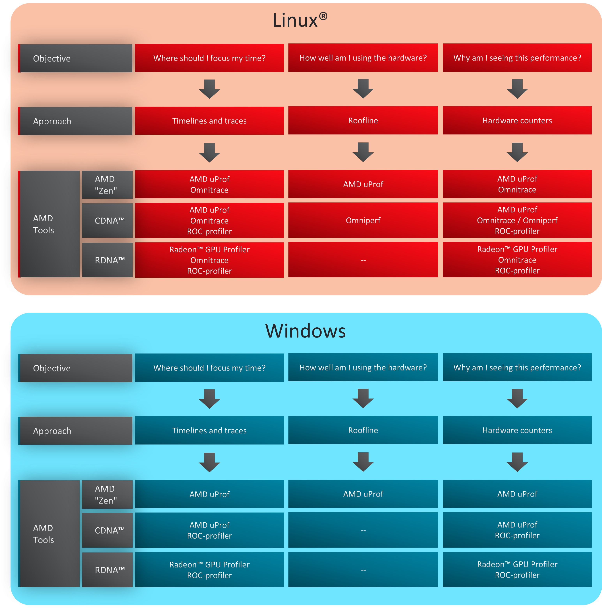
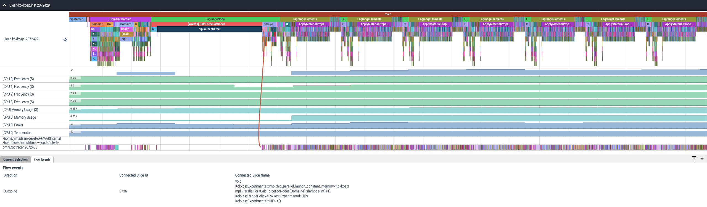
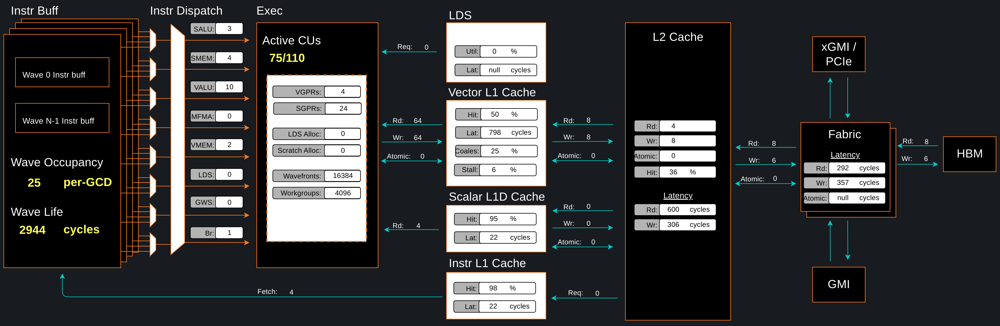

<!---
Copyright (c) 2023 Advanced Micro Devices, Inc. (AMD)

Permission is hereby granted, free of charge, to any person obtaining a copy
of this software and associated documentation files (the "Software"), to deal
in the Software without restriction, including without limitation the rights
to use, copy, modify, merge, publish, distribute, sublicense, and/or sell
copies of the Software, and to permit persons to whom the Software is
furnished to do so, subject to the following conditions:

The above copyright notice and this permission notice shall be included in all
copies or substantial portions of the Software.

THE SOFTWARE IS PROVIDED "AS IS", WITHOUT WARRANTY OF ANY KIND, EXPRESS OR
IMPLIED, INCLUDING BUT NOT LIMITED TO THE WARRANTIES OF MERCHANTABILITY,
FITNESS FOR A PARTICULAR PURPOSE AND NONINFRINGEMENT. IN NO EVENT SHALL THE
AUTHORS OR COPYRIGHT HOLDERS BE LIABLE FOR ANY CLAIM, DAMAGES OR OTHER
LIABILITY, WHETHER IN AN ACTION OF CONTRACT, TORT OR OTHERWISE, ARISING FROM,
OUT OF OR IN CONNECTION WITH THE SOFTWARE OR THE USE OR OTHER DEALINGS IN THE
SOFTWARE.
--->
# Introduction to profiling tools for AMD hardware

Getting a code to be functionally correct is not always enough. In many industries, it is also required that
applications and their complex software stack run as efficiently as possible to meet operational demands.
This is particularly challenging as hardware continues to evolve over time, and as a result codes may require
further tuning. In practice, many application developers construct benchmarks, which are carefully designed to
measure the performance, such as execution time, of a particular code within an operational-like setting. In other words: a good benchmark
should be representative of the real work that needs to be done. These benchmarks are useful in that they provide insight into
the characteristics of the application, and enables one to discover potential bottlenecks that could result in performance
degradation during operational settings.

At face value, benchmarking sounds simple enough and is often interpreted as simply a comparison of execution time
on a variety of difference machines. However, in order to extract the most performance from emerging hardware, the program must be tuned
many times and requires more than measuring raw execution time: one needs to know where the program is spending most of its
time and whether further improvements can be made. Heterogenous systems, where programs run on both CPUs and GPUs,
introduce additional complexities. Understanding the critical path and kernel execution is all the more important. Thus, performance tuning is a
necessary component in the benchmarking process.

With AMD's profiling tools, developers are able to gain important insight into how efficiently their application is utilizing
hardware and effectively diagnose potential bottlenecks contributing to poor performance. Developers targeting AMD
GPUs have multiple tools available depending on their specific profiling needs. This post serves as an
introduction to the various profiling tools offered by AMD and why a developer might leverage one over the other. This 
post covers everything from low level profiling tools to extensive profiling suites.

In this introductory blog, we briefly describe the following tools that can aid in application analysis:
1. [ROC-profiler](#roc-profiler)
2. [Omniperf](#omniperf)
3. [Omnitrace](#omnitrace)
4. [Radeon™ GPU Profiler](#radeon-gpu-profiler)
5. [AMD uProf](#amd-uprof)
6. [Other Third Party Tools](#other-third-party-tools)

## Terminology

The following terms are used in this blog post:
| Term        | Description |
| ----------- | ----------- |
| [AMD "Zen" Core](https://www.amd.com/en/technologies/zen-core)| AMD's x86-64 processor core architecture design. Used by the AMD EPYC&trade;, AMD Ryzen&trade;, AMD Ryzen&trade; PRO, and AMD Threadripper&trade; PRO processor series.|
| [RDNA&trade;](https://www.amd.com/en/technologies/rdna) | AMD's Traditional GPU architecture optimized for graphically demanding workloads like gaming and visualization. Includes the RX 5000, 6000 and 7000 GPUs. |
| [CDNA&trade;](https://www.amd.com/en/technologies/cdna) | AMD's Compute dedicated GPU architecture optimized for accelerating HPC, ML/AI, and data center type workloads. Includes the AMD Instinct™ MI50/60, MI100, and MI200 series accelerators.|
| [GCN](https://www.amd.com/en/technologies/gcn)   | AMD's pre-CDNA&trade;/RDNA&trade; GPU architecture |
| [HIP](https://docs.amd.com/bundle/HIP-Programming-Guide-v5.3/page/Introduction_to_HIP_Programming_Guide.html) | A C++ Runtime API and kernel language that allows developers to create portable compute kernels/applications for AMD and NVIDIA GPUs from a single source code |
| Timeline Trace | A profiling approach where durations of compute kernels and data transfers between devices are collected and visualized |
| [Roofline Analysis](https://enccs.github.io/AMD-ROCm-development/hierarchical_roofline/) | Hardware agnostic methodology for quantifying a workload's ability to saturate the given compute architecture in terms of floating-point compute and memory bandwidth |
| Hardware Counters | Individual metrics which track how many times a certain event occurs in the hardware, such as bytes moved from L2 cache or a 32 bit floating point add performed |

## What tools to use?

The first step in profiling is determining the right tool for the job. Whether one wants to collect
traces on the CPU, GPU, or both, understand kernel behavior, or assess memory access patterns, performing such an analysis might
appear daunting for new users of AMD hardware.
We begin by identifying the architecture and operating systems supported by each of the profiling tools
provided by AMD. Almost all the tools in Table 1 support Linux&reg; distros and with the gaining popularity of
Instinct&trade; GPUs, every tool has some capability to profile codes running on CDNA&trade; architecture. However,
those who prefer Windows will be limited to using [AMD <greek>u</greek>Prof](#amd-uprof)
to profile CPU and GPU codes targeting AMD "Zen"-based processors and AMD Instinct&trade; GPUs, and
[Radeon&trade; GPU Profiler](#radeon-gpu-profiler) that can provide great insights to optimize applications'
use of the graphics pipeline (rasterization, shaders, etc.) on RDNA&trade;-based GPUs.

<!-- 
================
 ### Table 1
================ -->
| AMD Profiling Tools | AMD "Zen" Core | RDNA&trade; | CDNA&trade; | Windows | Linux&reg; |
| :------------------ | :------------: | :---------: | :---------: | :-----: | :---: | 
| ROC-profiler               |Not supported|    &star;                         |    &starf;  |Not supported|&starf;|
| Omniperf                   |Not supported|Not supported|    &starf;  |Not supported|&starf;|
| Omnitrace                  |     &starf;                       |    &star;                         |    &starf;  |Not supported|&starf;|
| Radeon&trade; GPU Profiler |Not supported|    &starf;                        |    &star;   |   &starf;                         |&star; |
| AMD <greek>u<greek>Prof    |     &starf;                       |Not supported|    &star;   |   &starf;                         |&star; |

&starf; Full support | &star; Partial support

 Table 1: Profiler/architecture support and operating system needs.
 

The final choice of the tool on any platform depends on the profiling objective and the kind of analysis required. 
To make it simpler, we encourage the users to think of their objectives in terms of three questions as depicted in the 
flow diagram in Figure 1:

1. _Where should I focus my time_? : Whether benchmarking a new application, or getting started with a new software package
that has not yet been profiled, it is recommended to first identify hotspots in the application that may
benefit from quick optimization. In such a scenario, it is best if users start by collecting
timelines and traces of their application. On Linux&reg; platforms, [Omnitrace](#omnitrace) enables the collection of CPU and GPU traces,
and call stack samples to help identify major hotspots. However, on Windows, one may have to choose
between [AMD <greek>u</greek>Prof](#amd-uprof) and [Radeon&trade; GPU
Profiler](#radeon-gpu-profiler) depending on the targeted architecture.
2. _How well am I using the hardware_?: The first step is to obtain a characterization of workloads that can provide a glimpse into how
well the hardware is being utilized. For example, identifying what parts of your application are memory or compute bound.
This can be accomplished through roofline profiling. Typically, hotspots are well understood and
interest is usually in identifying the performance of a few key kernels or subroutines. At present, roofline profiling is
only available through [Omniperf](#omniperf) on AMD Instinct&trade; GPUs and [AMD <greek>u</greek>Prof](#amd-uprof) on AMD "Zen"-based processors.
3. _Why am I seeing this performance_?: Once hotspots are identified and the initial assessment of performance
on a particular hardware is completed, the next phase likely involves profiling and collecting the hardware metrics to 
understand where the observed performance is coming from. On AMD GPUs, tools such as [Omnitrace](#omnitrace), [Omniperf](#omniperf)
and [AMD <greek>u</greek>Prof](#amd-uprof) interface with the low-level  [ROC-profiler](#roc-profiler) API and/or uses
`rocprof` under-the-hood to gather GPU metrics. We do not recommend using rocprof directly because of the extra overhead in
dealing with text/CSV files and hardware-specific metrics unless there is a specific need. On Windows systems, one will have to rely
on using either [AMD <greek>u</greek>Prof](#amd-uprof) or [Radeon&trade; GPU Profiler](#radeon-gpu-profiler).

> **Quick Tip**:  The relatively new Omni\* suite of tools ([Omniperf](#omniperf) and [Omnitrace](#omnitrace)), available 
on Linux&reg; platforms, provide an easy-to-use interface for studying performance of the code across AMD hardware and
should be treated as "go-to" profiling tools for performance tuning and benchmarking.

<!-- 
================
 ### Figure 1
================ -->

Figure 1: Use cases for a variety of AMD profiling tools.

---

## Overview of profiling tools

In this section, we provide a brief overview of the above-mentioned AMD tools and some third-party toolkits.

### Omnitrace

[Omnitrace](https://amdresearch.github.io/omnitrace/) is a comprehensive profiling and tracing tool for parallel
applications, including HPC and ML packages, written in C, C++, Fortran, HIP, OpenCL&trade;, and Python&trade; which execute
on the CPU or CPU+GPU. It is capable of gathering the performance information
of functions through any combination of binary instrumentation, call-stack
sampling, user-defined regions, and Python&trade; interpreter hooks. Omnitrace
supports interactive visualization of comprehensive traces in the web browser
in addition to high-level summary profiles with mean/min/max/stddev statistics.
Beyond runtime information, Omnitrace supports the collection of system-level
metrics such as CPU frequency, GPU temperature, and GPU utilization.
Process and thread level metrics such as memory usage, page faults,
context switches, and numerous other hardware counters are also included.

When analyzing the performance of an application, it is always best to NOT
assume you know where the performance bottlenecks are and why they are
happening. Omnitrace is the ideal tool for characterizing where optimization would
have the greatest impact on the end-to-end execution of the application and/or
viewing what else is happening on the system during a performance bottleneck.

<!--
================
 ### Figure 2
================ -->

Figure 2: Omnitrace timeline trace example.

Omnitrace is an AMD open source research project that is not distributed with the ROCm&trade; software stack so
please see the [official Omnitrace documentation](https://amdresearch.github.io/omnitrace/) for the latest information.
Users are encouraged to submit [issues](https://github.com/AMDResearch/omnitrace/issues), feature requests, and provide
any additional feedback.

### Omniperf

[Omniperf](https://amdresearch.github.io/omniperf/) is a system performance profiler
for High-Performance Computing (HPC) and Machine-Learning (ML) workloads using AMD Instinct&trade; GPUs.
Omniperf utilizes [AMD ROC-profiler](#roc-profiler) to collect hardware
performance counters. The Omniperf tool performs system profiling based on all approved hardware
counters for AMD Instinct&trade; MI200 and MI100 architectures. It provides high level performance analysis features
including System Speed-of-Light, IP block Speed-of-Light, Memory Chart
Analysis, Roofline Analysis, Baseline Comparisons, and more.

Omniperf takes the guess work out of profiling by removing the need to provide
text input files with lists of counters to collect and analyze raw CSV output
files as is the case with ROC-profiler. Instead, Omniperf automates the
collection of all available hardware counters in one command and provides a
graphical interface to help users understand and analyze bottlenecks
and stressors for their computational workloads on AMD Instinct&trade; GPUs.
Note that Omniperf collects hardware counters in multiple passes,
and will therefore re-run the application during each pass to collect different sets of metrics.

<!-- 
================
 ### Figure 3
================ -->

Figure 3: Omniperf memory chart analysis panel.

In a nutshell, Omniperf provides details about hardware activity for a particular GPU kernel.
It also supports both a web-based GUI or command-line analyzer, depending on the user's preference.
For up-to-date information on available Omniperf features, we highly encourage readers to view
the [official Omniperf documentation](https://amdresearch.github.io/omniperf/introduction.html#features).
Omniperf is also an AMD open source research project and is not distributed as part of
the ROCm&trade; software stack. Users are encouraged to submit [issues](https://github.com/AMDResearch/omniperf/issues),
feature requests and we welcome contributions and feedback from the community.

### ROC-profiler

The [ROC-profiler](https://github.com/ROCm-Developer-Tools/rocprofiler)
primarily serves as the low level API for accessing and extracting GPU hardware
performance metrics, also typically called performance counters. These counters
quantify the performance of the underlying architecture showcasing which
pieces of the computational pipeline and memory hierarchy are being utilized.
A script/executable command called `rocprof` is packaged with the ROCm™ installation and provides the
functionality for listing all available hardware counters for your specific GPU as well as running applications
and collecting counters during the execution.

The `rocprof` utility also depends on the
[ROC-tracer](https://github.com/ROCm-Developer-Tools/roctracer) and
[ROC-TX](https://docs.amd.com/en-US/bundle/ROCTracer-User-Guide-v5.0-/page/ROCTX_Application_Code_Annotation.html)
libraries, giving it the ability to collect timeline traces of the GPU software stack
as well as user anotated code regions. Note that `rocprof` is a command-line only
utility so input and output takes the format of txt and CSV files. These formats
provide a raw view of the data and puts the onus on the user to parse and
analyze. Therefore, `rocprof` gives the user full access and control of raw performance profiling data,
but requires extra effort to analyze the collected data.

### Radeon&trade; GPU Profiler

The [Radeon&trade; GPU Profiler](https://radeon-gpuprofiler.readthedocs.io/en/latest/) is a performance tool that can be used by traditional
gaming and visualization developers to optimize DirectX 12 (DX12), Vulkan&trade; for AMD
RDNA&trade; and GCN hardware. The Radeon&trade; GPU Profiler (RGP) is a ground-breaking
low-level optimization tool from AMD. It provides detailed timing information
on Radeon&trade; Graphics using custom, built-in, hardware thread-tracing, allowing
the developer deep inspection of GPU workloads.  This unique tool generates
easy to understand visualizations of how your DX12 and Vulkan&trade; games
interact with the GPU at the hardware level. Profiling a game is both a quick
and simple process using the Radeon&trade; Developer Panel together with the public display
driver.

Note Radeon&trade; GPU Profiler does have support for OpenCL&trade; and HIP applications but
it requires running on AMD RDNA&trade; GPUs in the Windows environment. Running
HIP and OpenCL&trade; in the Windows environment is a whole blog series in itself and
outside the current recommendation for HPC applications. For HPC workloads, we
recommend programming with HIP in a Linux&reg; environment on AMD Instinct&trade; GPUs and
using [Omniperf](#omniperf), [Omnitrace](#omnitrace) or [ROC-profiler](#roc-profiler) profiling tools on them.

### AMD uProf

[AMD <greek>u</greek>Prof](https://www.amd.com/en/developer/uprof.html) (AMD MICRO-prof) is a software profiling analysis tool for x86
applications running on Windows, Linux&reg; and FreeBSD operating systems and provides event information unique to 
the AMD "Zen"-based processors and AMD Instinct&trade; MI Series accelerators. AMD <greek>u<greek>Prof enables the developer to better
understand the limiters of application performance and evaluate improvements.

AMD <greek>u</greek>Prof offers:

* Performance Analysis to identify runtime performance bottlenecks of the application
* System Analysis to monitor system performance metrics
* Roofline analysis
* Power Profiling to monitor thermal and power characteristics of the system
* Energy Analysis to identify energy hotspots in the application (Windows only)
* Remote Profiling to connect to remote Linux&reg; systems (from a Windows host system), trigger 
collection/translation of data on the remote system and report it in local GUI
* Initial support for AMD CDNA&trade; accelerators is provided in AMD uProf 3.6 for AMD Instinct&trade; MI100 and MI200 Series devices and new features are under development

### Other third-party tools

In the High Performance Computing space, a number of third-party profiling tools have enabled support for ROCm&trade; and AMD Instinct&trade; 
GPUs. This provides a platform for users to maintain a vendor independent approach to profiling, providing an easy-to-use and 
high level suite of functionality, that can potentially provide a unified profiling experience across numerous architectures. 
For users already familiar with these tools, it makes for another easy entry point into understanding performance of their 
workloads on AMD hardware.

Currently available third party profiling tools include:

* [HPCToolkit](http://hpctoolkit.org/)
* [TAU](http://www.cs.uoregon.edu/research/tau/home.php)
* [Vampir](https://vampir.eu/)
* [CrayPat](https://support.hpe.com/hpesc/public/docDisplay?docLocale=en_US&docId=a00114165en_us) (_only for CrayOS platforms_)

## Next time
Stay tuned as we release further posts in this series diving into the details of setting up and utilizing these 
available tools. Complete with examples!

If you have any questions or comments, please reach out to us on GitHub [Discussions](https://github.com/amd/amd-lab-notes/discussions)
