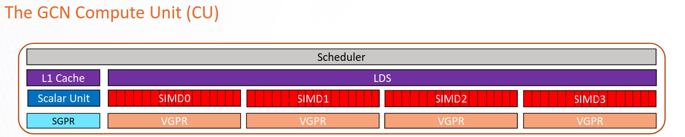
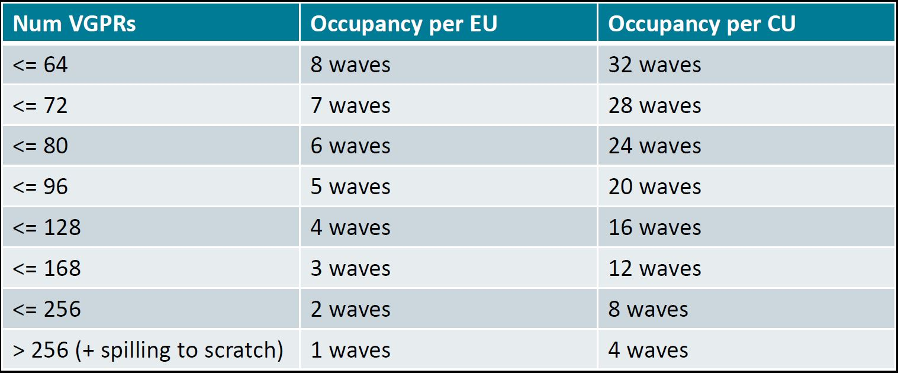

# Register pressure in AMD CDNA™2 GPUs #

Register pressure in GPU kernels has a tremendous impact on the overall performance of your HPC application. 
Understanding and controlling register usage allows developers to carefully design codes capable of maximizing hardware resources.
The following blog post is focused on a practical demo showing how to apply the recommendations explained in this 
[OLCF training talk](https://vimeo.com/742349001) presented on August 23rd 2022. Here is the 
[training archive](https://docs.olcf.ornl.gov/training/training_archive.html) where you can also find the slides.
We focus solely on the AMD CDNA™2 architecture (MI200 series GPUs) using ROCm 5.4.

## Registers and occupancy ##

General purpose registers are the fastest type of memory available in traditional processors. In most cases, the ALUs (Arithmetic Logic Units) in traditional processors and accelerators are the only components that can directly access registers.
Unfortunately, registers are a scarce and expensive resource and compilers try their best to *optimize* the way local variables are assigned to hardware registers to be manipulated by the ALU.

When we use the word *optimize* we should always clarify the objective of the optimization process. 
In fact, regular CPUs and accelerators, such as GPUs, because of their very nature, have different ways of executing programs and achieving high performance.
One one hand, traditional CPUs are latency-oriented and are designed to execute as many instructions from a single serial 
thread as possible. On the other hand, GPUs are throughput-oriented and are designed to take advantage
of parallelism between independent threads as much as possible.

In AMD GPUs, a high number of concurrent wavefronts running on the same Compute Unit (CU) enables the GPU to hide the time spent in accessing global memory, which is higher than the time needed to perform a compute operation, with operations performed by other wavefronts.

The term *occupancy* represents the maximum number of wavefronts that can potentially run on the same CU at the same time. In general, having higher occupancy helps achieve better performance by hiding costly memory accesses with other operations, but this is not always the case.

In Figure 1 we show a schematic representation of a CU in the CDNA™2 architecture. The Vector General Purpose Registers (VGPRs) are used to store data that is not uniform across the wavefront, that is, data that is different for each work item in the wavefront.
They are the most general purpose registers available in the CU and they are directly manipulated by the Vector ALU (VALU). The VALU is responsible for executing most of the work in the CU, including floating-point operations (FLOPs), loads from memory, integer and logical operations, among others.

The Scalar General Purpose Registers (SGPRs) represent a set of registers used to store data that is known to be uniform across the wavefront at compile-time. SGPRs are manipulated by the Scalar ALU (SALU), and the SALU, unlike the VALU, can only be used for a limited set of operations, like integer and logical.

The Local Data Share (LDS) is a fast on-CU software managed memory that can be used to efficiently share data between all work items in a block.


<p style="text-align:center">
Figure 1: Schematic representation of a CU in the CDNA™2 architecture
</p>

Ideally, we would like to have as much occupancy as possible, all the time. In reality, occupancy is limited by hardware design choices and resource limitations dictated by the kernel (HIP, OpenCL, etc.) running on the card.
For example, each CU of the AMD CDNA™2 based GPUs has four sets of wavefront buffers, one wavefront buffer per Execution Unit (EU, also called SIMD Unit in Figure 1), with four EUs per CU. Each EU can manage at the most **eight** wavefronts. This means that the physical limit to occupancy in CDNA™2 is 32 wavefronts per CU.

The number of registers needed by a kernel is one of the most common occupancy limiters. Another common limiter is LDS.
The following table summarizes the maximum level of occupancy achievable on CDNA™2 based GPUs as a function of the number of VGPRs used by a kernel.


<p style="text-align:center">
Table 1: Occupancy related to VGPRs usage in MI200
</p>

## Register spilling ##

Register allocation is the process of assigning local variables and expression results of a GPU kernel to the registers available on the hardware. It is performed by the compiler at compilation time, and it is influenced by other stages like instruction scheduling.
Finding an optimal solution to this problem is NP-Hard, and heuristic techniques must be adopted to find close-to-optimal solutions in a reasonable amount of time.

The compiler tries to apply heuristic techniques to maximize occupancy by reducing the need for registers following Table 1. When the number of registers requested becomes too high, performance is penalized by "register pressure" which leads to low occupancy and scratch memory usage.

Sometimes, the compiler may decide that it is fruitful to reach a better level of occupancy even though the request for registers is higher
than the limit reported in Table 1, e.g., the application needs 134 registers but the compiler allocates only 128 and the rest in scratch memory. This higher level of occupancy can be achieved by saving some variables in [scratch memory](https://llvm.org/docs/AMDGPUUsage.html#amdgpu-address-spaces): a portion of local memory, private to the thread, backed by global memory and much slower than register memory. This technique is called "register spilling".

Although observing variables being allocated to scratch memory could be a prelude to high register pressure, it should be considered in a broader performance context. In fact, achieving higher occupancy by saving a few registers can provide a substantial performance benefit as opposed to a lower
occupancy without any scratch memory usage.

In cases when the register pressure (request for registers) is way higher than the number of hardware registers available,
the performance will suffer from low occupancy (1 wave per CU in the worst case) and high cost of accessing the register variables that needed to be "spilled" to scratch memory.

## How to reduce register pressure ##

As mentioned before, the compiler applies heuristic techniques to maximize occupancy by minimizing the number of registers needed by a certain GPU kernels. These heuristic techniques sometimes fail to be close enough to an optimal solution and the programmer is required to restructure the code
in order to reduce register pressure and increase performance.

In this section, we will go through the steps of how to recognize a register pressure problem and how to mitigate it.

First of all, the number of registers used by GPU kernels can be detected in two ways: 1) compiling the file containing the kernels with the `-Rpass-analyze=kernel-resource-usage` flag, which will print to screen the resource usage of each kernel in the file at compile time;
some of this information include SGPRs, VGPRs, ScratchSize, VGPR/SGPR spills, Occupancy, and LDS usage. 2) Compiling with `--save-temps` and looking in the `hip-amdgcn-amd-amdhsa-gfx90a.s` file for `.vgpr_spill_count`. All the information reported by the `-Rpass-analyze=kernel-resource-usage` flag
are also in this file.

Once the register pressure situation has been assessed/confirmed, there are a few techniques that can be applied to the code to reduce register pressure.

1. **Set the `__launch_bounds__` qualifier for each kernel**. By default, the compiler assumes that the block size of each kernel is 1024 work items. When `__launch_bounds__` is defined, the compiler can allocate registers appropriately, thus potentially lowering the register pressure.

2. **Move variable definition/assignment close to where they are used**. Defining one or multiple variables at the top of a GPU kernel and using them at the very bottom forces the compiler those variables stored in register or scratch until they are used, thus impacting
the possibility of using those registers for more performance critical variables. Moving the definition/assignment close to their first use will help the heuristic techniques make more efficient choices for the rest of the code.

3. **Avoid allocating data on the stack**. Memory allocated on the stack, e.g., `double array[10]`, lives in scratch memory by default and it may be stored into registers by the compiler as an optimization step.
If your application makes use of memory allocated on the stack, seeing scratch memory usage should not be a big surprise.

4. **Avoid passing big objects as kernel arguments**. Function arguments are allocated on the stack and may be saved into registers as an optimization. Sometimes, storing these arguments as `constant` may help.

5. **Avoid writing large kernels with many function calls (including math functions and assertions)**. Currently, the compiler always inlines device functions, including math functions and assertions. Having many of these function calls introduces extra code and potentially higher register pressure.
As an example, replacing `pow(var,2.0)` with a simple `var*var` can significantly reduce register pressure.

6. **Keep loop unrolling under control**. Loop unrolling can be obtained by adding a `#pragma unroll` command on a loop where the number of iterations is known at compile time. By doing so, all the iterations are completely unrolled, thus reducing the cost of checking the exit condition of the loop.
However, unrolling increases register pressure because more variables need to be stored in registers at the same time. In cases where register pressure is a concern, the use of loop unrolling should be limited. Note that the Clang compiler tends to be much more literal in unrolling loops than other compilers.

7. **Manually spill to LDS**. As a last resort, it can be beneficial to use some LDS memory to manually store variables, possibly the ones with the longest liveness, and save a few registers per thread.

## Example ##

For the rest of our discussion, we will focus on the following code:


```c++
__global__ void kernel (double *phi, double *laplacian_phi,
			double *grad_phi_x, double *grad_phi_y, double *grad_phi_z,
			double *f0, double *f1, double *f2, double *f3, double *f4,
			double *f5, double *f6,
			double *g0, double *g1, double *g2, double *g3, double *g4,
			double *g5, double *g6, double* g7, double *g8, double *g9,
			double *g10, double *g11, double *g12, double *g13, double *g14,
			double *g15, double *g16, double *g17, double *g18,
			int nx, int ny, int nz, int ldx, int ldy, int current, int next,
			double k, double alpha, double phi2, double gamma,
			double itauphi, double itauphi1, double ieta,
			double itaurho, double grav,
			double eg1, double eg2, double eg0, double egc0, double egc1, double egc2)
{
  int i = (threadIdx.x + blockIdx.x * blockDim.x);
  int j = (threadIdx.y + blockIdx.y * blockDim.y);
  int z = (threadIdx.z + blockIdx.z * blockDim.z);
    
  int m, current_pos;

  double mu_phi, current_phi, current_phi_2;
  double rho;
  double fx, fy, fz;
  double uf, ux, uy, uz, v;
  double af, ag, cf;
  double eg1ag, eg2ag, eg1rho, eg2rho;
  double tmp1, tmp2;

  if(i <= nx && j <= ny && z <= nz)
    {
      m = i + ldx * (j + ldy * z);
      current_pos = m + current;
      
      current_phi = phi[m];
      current_phi_2 = pow(current_phi,2.0);
      
      rho = g0[m] + g1[current_pos] + g2[current_pos] + g3[current_pos] + g4[current_pos] +
	g5[current_pos] + g6[current_pos] + g7[current_pos] + g8[current_pos]  + g9[current_pos] +
	g10[current_pos] + g11[current_pos] + g12[current_pos] + g13[current_pos] + g14[current_pos] +
	g15[current_pos] + g16[current_pos] + g17[current_pos] + g18[current_pos];
      
      mu_phi = alpha * current_phi * ( current_phi_2 - phi2 ) - k * laplacian_phi[m];

      fx = mu_phi * grad_phi_x[m];
      fy = mu_phi * grad_phi_y[m];
      fz = mu_phi * grad_phi_z[m];

      ux = ( g1[current_pos] - g2[current_pos] + g7[current_pos] - g8[current_pos] + g9[current_pos] -
	     g10[current_pos] + g11[current_pos] - g12[current_pos] + g13[current_pos] - g14[current_pos] +
	     0.50 * fx ) * 1.0/rho;
      uy = ( g3[current_pos] - g4[current_pos] + g7[current_pos] - g8[current_pos] - g9[current_pos] +
	     g10[current_pos] + g15[current_pos] - g16[current_pos] + g17[current_pos] - g18[current_pos] +
	     0.50 * fy ) * 1.0/rho;
      uz = ( g5[current_pos] - g6[current_pos] + g11[current_pos] - g12[current_pos] - g13[current_pos] +
	     g14[current_pos] + g15[current_pos] - g16[current_pos] - g17[current_pos] + g18[current_pos] +
	     0.50 * fz ) * 1.0/rho;
      
      af = 0.50 * gamma * mu_phi * itauphi;
      cf = itauphi * ieta * current_phi;
      
      f0[m] = itauphi1 * f0[m] + -3.0 * gamma * mu_phi * itauphi + itauphi * current_phi;
      
      f1[current_pos] = itauphi1 * f1[current_pos] + af + cf * ux;
      f2[current_pos] = itauphi1 * f2[current_pos] + af - cf * ux;
      f3[current_pos] = itauphi1 * f3[current_pos] + af + cf * uy;
      f4[current_pos] = itauphi1 * f4[current_pos] + af - cf * uy;
      f5[current_pos] = itauphi1 * f5[current_pos] + af + cf * uz;
      f6[current_pos] = itauphi1 * f6[current_pos] + af - cf * uz;

      ag  = 3.0 * current_phi * mu_phi + rho;
      eg1ag = eg1 * ag;
      eg2ag = eg2 * ag;
      eg1rho = eg1 * rho;
      eg2rho = eg2 * rho;
      v  = 1.50 * ( ux*ux + uy*uy + uz*uz );
      uf = ux * fx + uy * fy + uz * fz;

      g0[m] = itaurho * g0[m] + eg0 * ( (rho - 6.0 * current_phi * mu_phi) - rho*v ) - egc0*uf;
      
      tmp1 = eg1ag + eg1rho*( 0.50*ux*ux - v ) + egc1*( ux*fx - uf );
      tmp2 = eg1rho*ux + egc1*fx;
      
      g1[m+next + 1] = itaurho * g1[current_pos] + tmp1 + tmp2;
      g2[m+next - 1] = itaurho * g2[current_pos] + tmp1 - tmp2;
      
      tmp1 = eg1ag + eg1rho*( 0.50 * uy * uy - v ) + egc1 * ( uy * fy - uf );
      tmp2 = eg1rho * uy + egc1 * fy;
      
      g3[m+next + ldx] = itaurho * g3[current_pos] + tmp1 + tmp2;
      g4[m+next - ldx] = itaurho * g4[current_pos] + tmp1 - tmp2;
      
      tmp1 = eg1ag + eg1rho*( 0.50 * uz * uz - v ) + egc1 * ( uz * fz - uf );
      tmp2 = eg1rho * uz + egc1 * fz;
      
      g5[m+next + ldx*ldy] = itaurho * g5[current_pos] + tmp1 + tmp2;
      g6[m+next - ldx*ldy] = itaurho * g6[current_pos] + tmp1 - tmp2;
      
      tmp1 = eg2ag + eg2rho * ( 0.50 * ( ux + uy ) * ( ux + uy ) - v ) +
	egc2 * ( ( ux + uy ) * ( fx + fy ) - uf );
      
      tmp2 = eg2rho * ( ux + uy ) + egc2 * ( fx + fy );
      
      g7[m+next + 1 + ldx] = itaurho * g7[current_pos] + tmp1 + tmp2;
      g8[m+next - 1 - ldx] = itaurho * g8[current_pos] + tmp1 - tmp2;
      
      tmp1 = eg2ag + eg2rho * ( 0.50 * ( ux - uy ) * ( ux - uy ) - v ) +
	egc2 * ( ( ux - uy )*( fx - fy ) - uf );
      tmp2 = eg2rho * ( ux - uy ) + egc2 * ( fx - fy );
      
      g9[m+next + 1 - ldx]  = itaurho * g9[current_pos]  + tmp1 + tmp2;
      g10[m+next - 1 + ldx] = itaurho * g10[current_pos] + tmp1 - tmp2;
      
      tmp1 = eg2ag + eg2rho * ( 0.50 * ( ux + uz ) * ( ux + uz ) - v ) +
	egc2 * ( ( ux + uz ) * ( fx + fz ) - uf );
      tmp2 = eg2rho * ( ux + uz ) + egc2 * ( fx + fz );
      
      g11[m+next + 1 + ldx*ldy] = itaurho * g11[current_pos] + tmp1 + tmp2;
      g12[m+next - 1 - ldx*ldy] = itaurho * g12[current_pos] + tmp1 - tmp2;
      
      tmp1 = eg2ag + eg2rho * ( 0.50 * ( ux - uz ) * ( ux - uz ) - v ) +
	egc2 * ( ( ux - uz ) * ( fx - fz ) - uf );
      tmp2 = eg2rho * ( ux - uz ) + egc2 * ( fx - fz );
      
      g13[m+next + 1 - ldx*ldy] = itaurho * g13[current_pos] + tmp1 + tmp2;
      g14[m+next - 1 + ldx*ldy] = itaurho * g14[current_pos] + tmp1 - tmp2;
      
      tmp1 = eg2ag + eg2rho * ( 0.50 * ( uy + uz ) * ( uy + uz ) - v ) +
	egc2 * ( ( uy + uz ) * ( fy + fz ) - uf );
      tmp2 = eg2rho * ( uy + uz ) + egc2 * ( fy + fz );
      
      g15[m+next + ldx + ldx*ldy] = itaurho * g15[current_pos] + tmp1 + tmp2;
      g16[m+next - ldx - ldx*ldy] = itaurho * g16[current_pos] + tmp1 - tmp2;

      tmp1 = eg2ag + eg2rho * ( 0.50 * ( uy - uz ) * ( uy - uz ) - v ) +
	egc2 * ( ( uy - uz ) * ( fy - fz ) - uf );
      tmp2 = eg2rho * ( uy - uz ) + egc2 * ( fy - fz );
      
      g17[m+next + ldx - ldx*ldy] = itaurho * g17[current_pos] + tmp1 + tmp2;
      g18[m+next - ldx + ldx*ldy] = itaurho * g18[current_pos] + tmp1 - tmp2;
      
    }
}
```

The use of many double precision variables needed to store both temporary result of mathematical operations and meaningful physical quantities suggest that the performance of this kernel
may be impacted by register pressure. In order to assess this hypothesis, we can compile the kernel as follows to obtain the kernel resource usage:

```
hipcc --offload-arch=gfx90a lbm.cpp -Rpass-analysis=kernel-resource-usage -c
lbm.cpp:16:1: remark: Function Name: _Z6kernelPdS_S_S_S_S_S_S_S_S_S_S_S_S_S_S_S_S_S_S_S_S_S_S_S_S_S_S_S_S_S_iiiiiiiddddddddddddddd [-Rpass-analysis=kernel-resource-usage]
{
^
lbm.cpp:16:1: remark:     SGPRs: 98 [-Rpass-analysis=kernel-resource-usage]
lbm.cpp:16:1: remark:     VGPRs: 102 [-Rpass-analysis=kernel-resource-usage]
lbm.cpp:16:1: remark:     AGPRs: 0 [-Rpass-analysis=kernel-resource-usage]
lbm.cpp:16:1: remark:     ScratchSize [bytes/lane]: 0 [-Rpass-analysis=kernel-resource-usage]
lbm.cpp:16:1: remark:     Occupancy [waves/SIMD]: 4 [-Rpass-analysis=kernel-resource-usage]
lbm.cpp:16:1: remark:     SGPRs Spill: 0 [-Rpass-analysis=kernel-resource-usage]
lbm.cpp:16:1: remark:     VGPRs Spill: 0 [-Rpass-analysis=kernel-resource-usage]
lbm.cpp:16:1: remark:     LDS Size [bytes/block]: 0 [-Rpass-analysis=kernel-resource-usage]
```

Although there is no register spilling, we notice that the occupancy is just four waves per SIMD unit; about half of the best achievable case.
By looking at the occupancy table in Table 1 shown earlier, we see that we would need to reduce the number of used VGPRS from 102 to 96 or below in order to reach an occupancy of 5 waves/SIMD.

### Optimization n.1: remove unnecessary math function invocations ###

Looking at the following code, we notice the use of the `pow` function needed to square the variable `current_phi`.

```c++
 if(i <= nx && j <= ny && z <= nz)
    {
      m = i + ldx * (j + ldy * z);
      current_pos = m + current;

      current_phi = phi[m];
      current_phi_2 = pow(current_phi,2.0);
```

As we mentioned before, the compiler will currently inline all the invocations to device functions, including math functions.
A possible optimization is to replace the general purpose function `pow` with a specific code for squaring the variable as follows:

```c++
 if(i <= nx && j <= ny && z <= nz)
    {
      m = i + ldx * (j + ldy * z);
      current_pos = m + current;

      current_phi = phi[m];
      current_phi_2 = current_phi * current_phi;
```

Recompiling the new code we observe that our change decreased VGPRs usage from 102 to 100:

```
hipcc --offload-arch=gfx90a lbm_nopow_1.cpp -Rpass-analysis=kernel-resource-usage -c
lbm_nopow_1.cpp:16:1: remark: Function Name: _Z6kernelPdS_S_S_S_S_S_S_S_S_S_S_S_S_S_S_S_S_S_S_S_S_S_S_S_S_S_S_S_S_S_iiiiiiiddddddddddddddd [-Rpass-analysis=kernel-resource-usage]
{
^
lbm_nopow_1.cpp:16:1: remark:     SGPRs: 98 [-Rpass-analysis=kernel-resource-usage]
lbm_nopow_1.cpp:16:1: remark:     VGPRs: 100 [-Rpass-analysis=kernel-resource-usage]
lbm_nopow_1.cpp:16:1: remark:     AGPRs: 0 [-Rpass-analysis=kernel-resource-usage]
lbm_nopow_1.cpp:16:1: remark:     ScratchSize [bytes/lane]: 0 [-Rpass-analysis=kernel-resource-usage]
lbm_nopow_1.cpp:16:1: remark:     Occupancy [waves/SIMD]: 4 [-Rpass-analysis=kernel-resource-usage]
lbm_nopow_1.cpp:16:1: remark:     SGPRs Spill: 0 [-Rpass-analysis=kernel-resource-usage]
lbm_nopow_1.cpp:16:1: remark:     VGPRs Spill: 0 [-Rpass-analysis=kernel-resource-usage]
lbm_nopow_1.cpp:16:1: remark:     LDS Size [bytes/block]: 0 [-Rpass-analysis=kernel-resource-usage]

```

Although the reduction may not seem significant, this will allow for more room for improvement in later optimizations.

### Optimization n.2: move variable definition close to its first use ###

Once a variable is defined, its value is stored in a register for future use. Defining variables at the beginning of the kernel and using them at the end will dramatically increase register usage.
A second optimization that may provide significant benefit is to look for cases where variables are defined "far away" from their first use and manually rearrange the code.

After a quick visual inspections we can see that the definition of array location  `f[m]` does not depend on `ux`, `uy`, or `uz` as opposed to
the other arrays `f1` to `f6`.

```c++
      mu_phi = alpha * current_phi * ( current_phi_2 - phi2 ) - k * laplacian_phi[m];
      
      fx = mu_phi * grad_phi_x[m];
      fy = mu_phi * grad_phi_y[m];
      fz = mu_phi * grad_phi_z[m];

      ux = ( g1[current_pos] - g2[current_pos] + g7[current_pos] - g8[current_pos] + g9[current_pos] -
	     g10[current_pos] + g11[current_pos] - g12[current_pos] + g13[current_pos] - g14[current_pos] +
	     0.50 * fx ) * 1.0/rho;
      uy = ( g3[current_pos] - g4[current_pos] + g7[current_pos] - g8[current_pos] - g9[current_pos] +
	     g10[current_pos] + g15[current_pos] - g16[current_pos] + g17[current_pos] - g18[current_pos] +
	     0.50 * fy ) * 1.0/rho;
      uz = ( g5[current_pos] - g6[current_pos] + g11[current_pos] - g12[current_pos] - g13[current_pos] +
	     g14[current_pos] + g15[current_pos] - g16[current_pos] - g17[current_pos] + g18[current_pos] +
	     0.50 * fz ) * 1.0/rho;
      
      af = 0.50 * gamma * mu_phi * itauphi;
      cf = itauphi * ieta * current_phi;

      f0[m] = itauphi1 * f0[m] + -3.0 * gamma * mu_phi * itauphi + itauphi * current_phi;
      
      f1[current_pos] = itauphi1 * f1[current_pos] + af + cf * ux;
      f2[current_pos] = itauphi1 * f2[current_pos] + af - cf * ux;
      f3[current_pos] = itauphi1 * f3[current_pos] + af + cf * uy;
      f4[current_pos] = itauphi1 * f4[current_pos] + af - cf * uy;
      f5[current_pos] = itauphi1 * f5[current_pos] + af + cf * uz;
      f6[current_pos] = itauphi1 * f6[current_pos] + af - cf * uz;
```

After moving the definition of `f[m]` right before the definition of `ux` 

```c++
      mu_phi = alpha * current_phi * ( current_phi_2 - phi2 ) - k * laplacian_phi[m];
      
      f0[m] = itauphi1 * f0[m] + -3.0 * gamma * mu_phi * itauphi + itauphi * current_phi;
	  
      fx = mu_phi * grad_phi_x[m];
      fy = mu_phi * grad_phi_y[m];
      fz = mu_phi * grad_phi_z[m];

      ux = ( g1[current_pos] - g2[current_pos] + g7[current_pos] - g8[current_pos] + g9[current_pos] -
	     g10[current_pos] + g11[current_pos] - g12[current_pos] + g13[current_pos] - g14[current_pos] +
	     0.50 * fx ) * 1.0/rho;
      uy = ( g3[current_pos] - g4[current_pos] + g7[current_pos] - g8[current_pos] - g9[current_pos] +
	     g10[current_pos] + g15[current_pos] - g16[current_pos] + g17[current_pos] - g18[current_pos] +
	     0.50 * fy ) * 1.0/rho;
      uz = ( g5[current_pos] - g6[current_pos] + g11[current_pos] - g12[current_pos] - g13[current_pos] +
	     g14[current_pos] + g15[current_pos] - g16[current_pos] - g17[current_pos] + g18[current_pos] +
	     0.50 * fz ) * 1.0/rho;
      
      af = 0.50 * gamma * mu_phi * itauphi;
      cf = itauphi * ieta * current_phi;
      
      f1[current_pos] = itauphi1 * f1[current_pos] + af + cf * ux;
      f2[current_pos] = itauphi1 * f2[current_pos] + af - cf * ux;
      f3[current_pos] = itauphi1 * f3[current_pos] + af + cf * uy;
      f4[current_pos] = itauphi1 * f4[current_pos] + af - cf * uy;
      f5[current_pos] = itauphi1 * f5[current_pos] + af + cf * uz;
      f6[current_pos] = itauphi1 * f6[current_pos] + af - cf * uz;
```

we notice a new VGPRs usage of 96 that brings us to a better level of occupancy of five waves/SIMD:

```
hipcc --offload-arch=gfx90a lbm_rearrage_2.cpp -Rpass-analysis=kernel-resource-usage -c
lbm_rearrage_2.cpp:16:1: remark: Function Name: _Z6kernelPdS_S_S_S_S_S_S_S_S_S_S_S_S_S_S_S_S_S_S_S_S_S_S_S_S_S_S_S_S_S_iiiiiiiddddddddddddddd [-Rpass-analysis=kernel-resource-usage]
{
^
lbm_rearrage_2.cpp:16:1: remark:     SGPRs: 94 [-Rpass-analysis=kernel-resource-usage]
lbm_rearrage_2.cpp:16:1: remark:     VGPRs: 96 [-Rpass-analysis=kernel-resource-usage]
lbm_rearrage_2.cpp:16:1: remark:     AGPRs: 0 [-Rpass-analysis=kernel-resource-usage]
lbm_rearrage_2.cpp:16:1: remark:     ScratchSize [bytes/lane]: 0 [-Rpass-analysis=kernel-resource-usage]
lbm_rearrage_2.cpp:16:1: remark:     Occupancy [waves/SIMD]: 5 [-Rpass-analysis=kernel-resource-usage]
lbm_rearrage_2.cpp:16:1: remark:     SGPRs Spill: 0 [-Rpass-analysis=kernel-resource-usage]
lbm_rearrage_2.cpp:16:1: remark:     VGPRs Spill: 0 [-Rpass-analysis=kernel-resource-usage]
lbm_rearrage_2.cpp:16:1: remark:     LDS Size [bytes/block]: 0 [-Rpass-analysis=kernel-resource-usage]
```

## On the use of the *restrict* keyword ##

In the C-type languages like C++, aliasing is one of the main limitations to achieve high performance. To avoid this problem, the standard C99 introduced "restricted pointers": a way for the user to tell the compiler that different object pointer types and function parameter
arrays do not point to overlapping memory regions. This allows the compiler to perform aggressive optimizations that may be otherwise prevented because of aliasing.
The use of restricted pointers *may* increase register pressure because the compiler will try to reuse more data by storing it in registers.
On AMD hardware, this is not always the case and sometimes using `restrict` is beneficial to reduce both SGPRs and VGPRs pressure.
As a rule of thumb, the use of `restrict` on function arguments will tend to reduce SGPRs usage with a chance of increasing VGPRs usage.

As an example, let us add the `restrict` keyword to the `g14` array because it gets reused several times in the rest of the code and we may achieve higher performance from the reuse.


```c++
__global__ void kernel (double *  phi, double *  laplacian_phi,
						  double *  grad_phi_x, double * grad_phi_y, double *  grad_phi_z,
						  double *  f0, double *  f1, double *  f2, double *  f3, double *  f4,
						  double *  f5, double *  f6,
						  double *  g0, double *  g1, double *  g2, double *  g3, double *  g4,
						  double *  g5, double *  g6, double*  g7, double *  g8, double *  g9,
						  double *  g10, double *  g11, double *  g12, double *  g13, double * __restrict__ g14,
						  double *  g15, double *  g16, double *  g17, double *  g18,
						  int nx, int ny, int nz, int ldx, int ldy, int current, int next,
						  double k, double alpha, double phi2, double gamma,
						  double itauphi, double itauphi1, double ieta,
						  double itaurho, double grav,
						  double eg1, double eg2, double eg0, double egc0, double egc1, double egc2)

```

the result is a reduction in register pressure for both SGPRs and VGPRs:

```
lbm_2_restrict.cpp:16:1: remark: Function Name: _Z6kernelPdS_S_S_S_S_S_S_S_S_S_S_S_S_S_S_S_S_S_S_S_S_S_S_S_S_S_S_S_S_S_iiiiiiiddddddddddddddd [-Rpass-analysis=kernel-resource-usage]
{
^
lbm_2_restrict.cpp:16:1: remark:     SGPRs: 86 [-Rpass-analysis=kernel-resource-usage]
lbm_2_restrict.cpp:16:1: remark:     VGPRs: 94 [-Rpass-analysis=kernel-resource-usage]
lbm_2_restrict.cpp:16:1: remark:     AGPRs: 0 [-Rpass-analysis=kernel-resource-usage]
lbm_2_restrict.cpp:16:1: remark:     ScratchSize [bytes/lane]: 0 [-Rpass-analysis=kernel-resource-usage]
lbm_2_restrict.cpp:16:1: remark:     Occupancy [waves/SIMD]: 5 [-Rpass-analysis=kernel-resource-usage]
lbm_2_restrict.cpp:16:1: remark:     SGPRs Spill: 0 [-Rpass-analysis=kernel-resource-usage]
lbm_2_restrict.cpp:16:1: remark:     VGPRs Spill: 0 [-Rpass-analysis=kernel-resource-usage]
lbm_2_restrict.cpp:16:1: remark:     LDS Size [bytes/block]: 0 [-Rpass-analysis=kernel-resource-usage]
```

By adding `restrict` to the variable `g7` we observe a further reduction in SGPRs usage and slight increase in VGPRs that still keeps occupancy at 5 waves/SIMD

```
lbm_2_restrict.cpp:16:1: remark: Function Name: _Z6kernelPdS_S_S_S_S_S_S_S_S_S_S_S_S_S_S_S_S_S_S_S_S_S_S_S_S_S_S_S_S_S_iiiiiiiddddddddddddddd [-Rpass-analysis=kernel-resource-usage]
{
^
lbm_2_restrict.cpp:16:1: remark:     SGPRs: 78 [-Rpass-analysis=kernel-resource-usage]
lbm_2_restrict.cpp:16:1: remark:     VGPRs: 96 [-Rpass-analysis=kernel-resource-usage]
lbm_2_restrict.cpp:16:1: remark:     AGPRs: 0 [-Rpass-analysis=kernel-resource-usage]
lbm_2_restrict.cpp:16:1: remark:     ScratchSize [bytes/lane]: 0 [-Rpass-analysis=kernel-resource-usage]
lbm_2_restrict.cpp:16:1: remark:     Occupancy [waves/SIMD]: 5 [-Rpass-analysis=kernel-resource-usage]
lbm_2_restrict.cpp:16:1: remark:     SGPRs Spill: 0 [-Rpass-analysis=kernel-resource-usage]
lbm_2_restrict.cpp:16:1: remark:     VGPRs Spill: 0 [-Rpass-analysis=kernel-resource-usage]
lbm_2_restrict.cpp:16:1: remark:     LDS Size [bytes/block]: 0 [-Rpass-analysis=kernel-resource-usage]
```

## Conclusion ##

In this post, we described, at a high level, the nature and consequences of register pressure for HPC applications and algorithms running on AMD's CDNA™2 architecture. We also provided a set of rules that have been found effective in reducing register pressure and increasing occupancy.
It is important to highlight that the results shown in this blog post can be entirely replicated only on CDNA™2 based GPUs when ROCm 5.4 is used. The ever changing nature of the compiler and its heuristics may alter the outcome of the code examples shown in this post when a ROCm version different from 5.4 is used.
We encourage readers to experiment with the code examples and evaluate performance with each change against different ROCm versions.

[Accompanying code examples](https://github.com/amd/amd-lab-notes/tree/release/register-pressure/codes)

If you have any questions or comments, please reach out to us on GitHub [Discussions](https://github.com/amd/amd-lab-notes/discussions)
