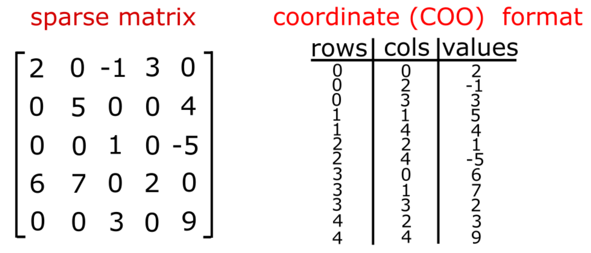
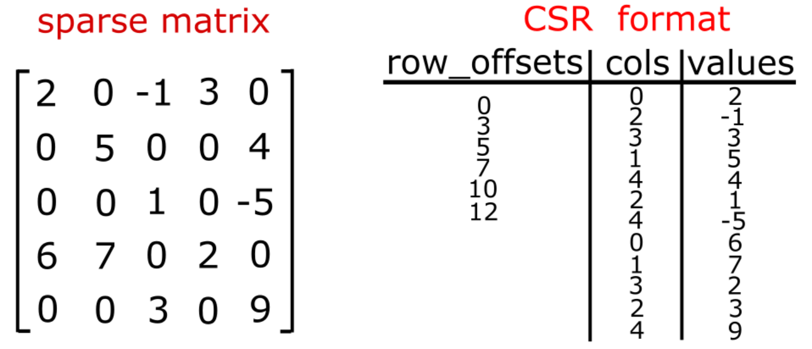
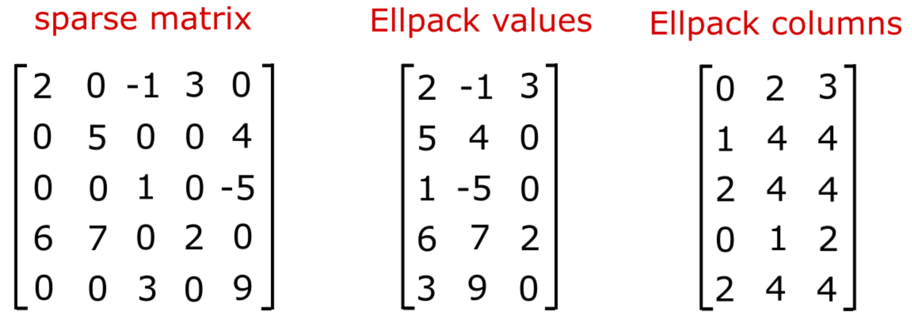
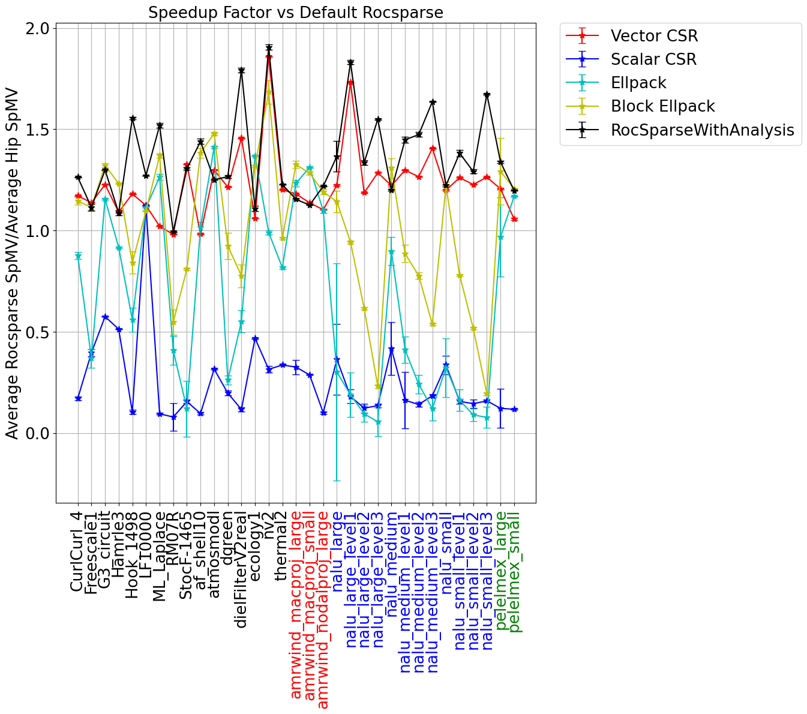
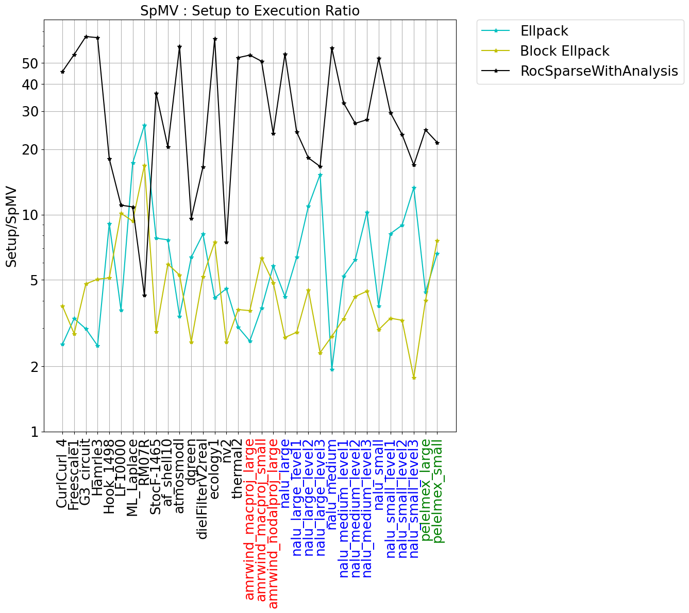
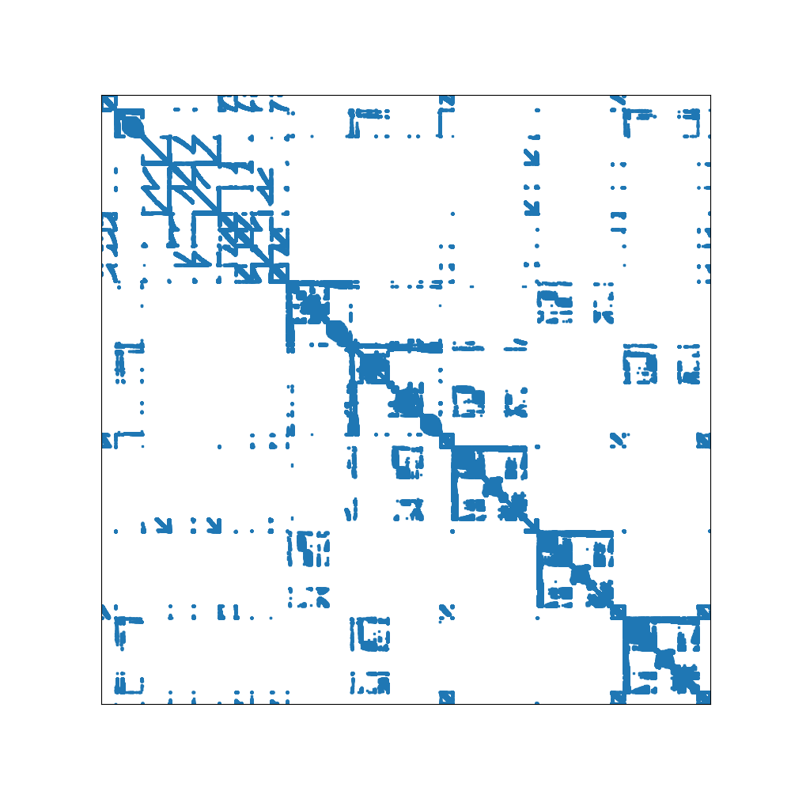
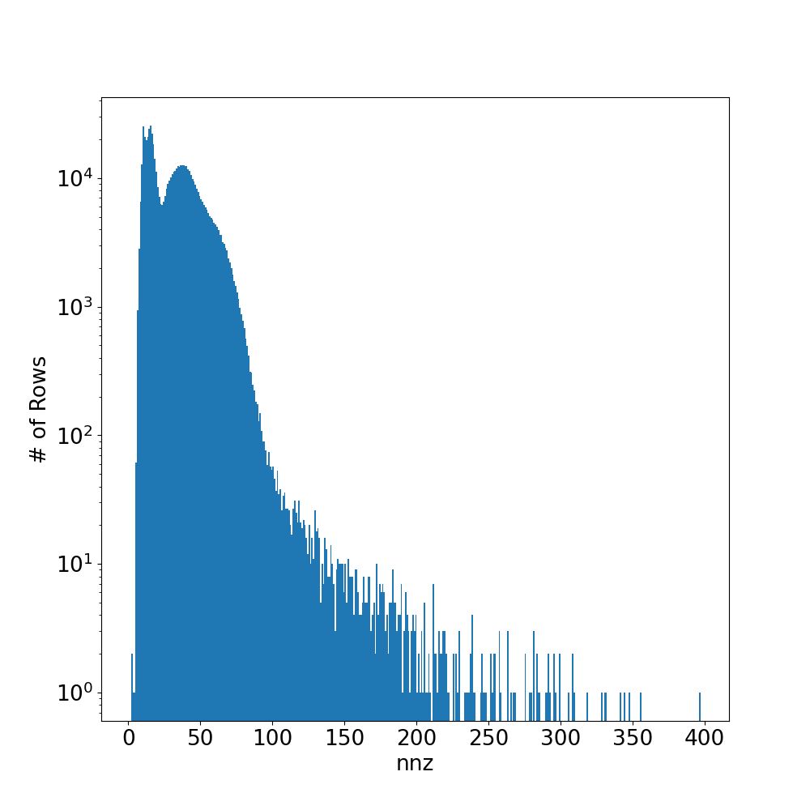

<!---
Copyright (c) 2022 Advanced Micro Devices, Inc. (AMD)

Permission is hereby granted, free of charge, to any person obtaining a copy
of this software and associated documentation files (the "Software"), to deal
in the Software without restriction, including without limitation the rights
to use, copy, modify, merge, publish, distribute, sublicense, and/or sell
copies of the Software, and to permit persons to whom the Software is
furnished to do so, subject to the following conditions:

The above copyright notice and this permission notice shall be included in all
copies or substantial portions of the Software.

THE SOFTWARE IS PROVIDED "AS IS", WITHOUT WARRANTY OF ANY KIND, EXPRESS OR
IMPLIED, INCLUDING BUT NOT LIMITED TO THE WARRANTIES OF MERCHANTABILITY,
FITNESS FOR A PARTICULAR PURPOSE AND NONINFRINGEMENT. IN NO EVENT SHALL THE
AUTHORS OR COPYRIGHT HOLDERS BE LIABLE FOR ANY CLAIM, DAMAGES OR OTHER
LIABILITY, WHETHER IN AN ACTION OF CONTRACT, TORT OR OTHERWISE, ARISING FROM,
OUT OF OR IN CONNECTION WITH THE SOFTWARE OR THE USE OR OTHER DEALINGS IN THE
SOFTWARE.
--->
# Sparse matrix vector multiplication - part 1

Sparse matrix vector multiplication (SpMV) is a core computational kernel of nearly every implicit [sparse linear algebra solver](https://epubs.siam.org/doi/book/10.1137/1.9780898718003). The performance of algorithms ranging from simple Krylov algorithms to multigrid methods is dependent, in large part, on the speed of the SpMV implementation. Because SpMVs have very low arithmatic intensity, defined as the number of floating point operations per memory access, the speed of the implementation is limited by the memory bandwidth. Implementations that maximize the memory bandwidth will achieve superior performance compared to simple approaches. Alternatively, implementations that exploit any structure inherent in a sparse matrix, and thus minimize the number of memory accesses required, will also achieve superior performance. In this blog post, we will develop HIP implementations of the generalized SpMV operation
$$y = \alpha A x + \beta y$$
of several standard SpMV implementations including:
* Scalar Compressed Sparse Row (CSR),
* Vector CSR,
* Ellpack, and
* Blocked Ellpack.

Many common SpMV APIs, such as [rocSparse](https://rocsparse.readthedocs.io/en/latest/usermanual.html#rocsparse-csrmv), use this generalized interface. We want to provide a fair comparison between our implementations and those provided in ROCm. In the SpMV formulation, $\alpha$ and $\beta$ are scalar values, $A$ is sparse matrix of size $m\times n$, $y$ is a dense vector of size $m\times 1$, and $x$ is a dense vector of size $n\times 1$. A key statistic of the matrix, to be used throughout this post, is the average number of nonzeros per row, $nnz_{avg}$. Distribution of work to different GPU compute resources will often be based on this measure.

First, we'll review the widely-used CSR and Ellpack formats for sparse matrices. After describing the implementations, we will compare their relative performance on AMD MI250X architectures for a variety of sparse matrices. Conversion algorithms from one matrix storage format to another can be a costly endeavor. Our code [samples](https://github.com/amd/amd-lab-notes/tree/release/spmv/examples/) will provide non-optimized device implementations of conversion algorithms between CSR and Ellpack however we will not discuss them in detail in this post.

## Storage formats

Our review of different sparse matrix storage types is best motivated with a simple example. In the diagram below, we show a $5\times5$ matrix that has 12 nonzeros. The coordinate (COO) format of this sparse matrix is formed with 3 arrays, of the same length, for the rows, columns and values. We use 0-based indexing for the rows and columns. The data is sorted in row-major order so that all the data for row 0 is listed first. This is followed by row 1, row 2, ... 

<p align="center">

</p>

### Compressed sparse row (CSR) format

The CSR format for storing sparse matrices arises from a simple compression of the rows data structure shown above. One simply does a count of the number of nonzero entries in each row. Then, a cumulative sum algorithm of the row counts completes the calculation. The compressed row data structure, here after referred to as the row offsets, has a size of $m+1$. The first value is 0 and the remaining values are the result of the cumulative sum. This data structure is highly useful as it provides, through adjacent reads, the starting and ending indices for each sparse matrix row times dense vector (i.e. sparse dot product) calculation.

<p align="center">

</p>

### Ellpack format

The Ellpack format is an effective data structure for SpMV when the variation in the number of nonzeros per row is small. The format reverses the ordering of the storage to column major, compared to CSR, and uses zero padding to achieve uniformity in the data structure. The number of entries per row is determined by the maximum across all rows. Any rows that have fewer nonzeros than the maximum have 0 padded values and "sensible" values for the column indices. For example, one can pad with the last valid column index in the row in order to guaranteed that one rereads an index and value pair that was previously loaded. 

One can visualize this data structure as shifting all values (and column indices) to the left in the array. 

<p align="center">

</p>

The Ellpack format can be further optimized by forming the Ellpack data structre in chunks of rows. This minimizes the amount of zero padding while achieving uniformity across the data. We will refer to this as Blocked Ellpack.

## GPU kernel implementations

### Scalar CSR kernel

One of the simplest implementations of GPU-accelerated SpMV is the scalar kernel approach. The scalar kernel assigns a single thread to handle each sparse dot product in the SpMV. The sparse dot product is handled in a sequential manner by each thread thus negating the need for more advanced techniques requiring shared memory and/or warp-level reductions. A straightforward implementation of the scalar CSR kernel is shown in the following code snippet. 

```c++
__global__ void scalar_csr_kernel(const int m,
                                  const int *__restrict__ row_offsets,
                                  const int *__restrict__ cols,
                                  const double *__restrict__ vals,
                                  const double *__restrict__ x,
                                  double *__restrict__ y,
                                  const double alpha,
                                  const double beta)
{
  const int row = threadIdx.x + blockDim.x * blockIdx.x;
  if (row < m) {
    // determine the start and ends of each row
    int p = row_offsets[row];
    int q = row_offsets[row+1];
    
    // execute the full sparse row * vector dot product operation
    double sum = 0;
    for (int i = p; i < q; i++) {
      sum += vals[i] * x[cols[i]];
    }
    
    // write to memory
    if (beta == 0) {
      y[row] = alpha * sum;
    } else {
      y[row] = alpha * sum + beta * y[row];
    }
  }
}

void scalar_csr(int m,
                int threads_per_block,
                int * row_offsets,
                int * cols,
                double * vals, 
                double * x,
                double * y,
                double alpha,
                double beta)
{
  int num_blocks = (m + threads_per_block - 1) / threads_per_block;
  dim3 grid(num_blocks, 1, 1);
  dim3 block(threads_per_block, 1, 1);
  scalar_csr_kernel<<<grid, block>>>(m, row_offsets, cols, vals, x, y, alpha, beta);
}
```

As noted above, the computation is parallelized across the rows only. Let $n_{threads}$ be the number threads in each block, then the number of independent blocks needed to complete the computation is computed via ceiling function as:
$$n_{blocks}=\lceil m/n_{threads}\rceil .$$ In this context, $n_{threads}$ is a tuneable parameter that we can use to maximize performance of this implementation. Within the kernel definition, we then
* compute our row based on simple mapping of threads and blocks,
* ensure that we do NOT read beyond any array bounds in the row offsets array,
* we determine the column (and thus vector) indices and matrix values to load via adjacent reads of the row offsets array,
* we do a scalar computation of the sparse dot product, and finally
* we write the result to memory.
  
In the last step, we can save some memory bandwidth by testing on whether $y$ vector is overwritten or updated.

The scalar CSR implementation will achieve mediocre performance for the broadest range of sparse matrices. However, there are likely cases where this kernel is modestly effective, i.e. when the average number of nonzeros per row is small. Indeed, when the average number of nonzeros per row is high, multiple requests will be required to service the memory transactions and coalescence will be minimal. In contrast, when the average number of nonzeros per row is very low, high memory bandwidth can be coupled to simplistic nature of this kernel to achieve good performance.  

See the following [sample](https://github.com/amd/amd-lab-notes/tree/release/spmv/examples/scalar_csr.cpp) for how to run the Scalar CSR kernel from a matrix market file input.

### Vector CSR kernel

The most versatile high-performance implementation of a GPU-accelerated SpMV is the vector kernel approach. Unlike the scalar kernel, the vector kernel uses multiple threads in a warp to reduce each sparse dot product. It requires either shared memory or warp shuffle operations to reduce the partially reduced values computed across threads. Heuristics for choosing the number of threads per warp that are assigned to each sparse row-vector product are based of $nnz_{avg}$. Typically, we found the best performance by finding the smallest power of 2 less than or equal to $nnz_{avg}$.
At this point, it is helpful to investigate a code example in order to examine the finer details of the implementation. Here we focus on the case where only warp shuffle operations are used to complete the sparse dot product. It should be noted that each output result can be computed by no more than wavefront size threads, which is 64 on MI200 architectures. This may limit performance when the average number of nonzeros per row is much larger than the wavefront size.

```c++
template <int THREADS_PER_ROW>
__global__ void vector_csr_kernel(const int m,
                                  const int *__restrict__ row_offsets,
                                  const int *__restrict__ cols,
                                  const double *__restrict__ vals,
                                  const double *__restrict__ x,
                                  double *__restrict__ y,
                                  const double alpha,
                                  const double beta)
{
  const int row = threadIdx.y + blockDim.y * blockIdx.x;
  if (row < m) {
    // determine the start and ends of each row
    int p = row_offsets[row];
    int q = row_offsets[row+1];

    // start the sparse row * vector dot product operation
    double sum = 0;
    for (int i = p + threadIdx.x; i < q; i += THREADS_PER_ROW) {
      sum += vals[i] * x[cols[i]];
    }

    // finish the sparse row * vector dot product operation
#pragma unroll
    for (int i = THREADS_PER_ROW >> 1; i > 0; i >>= 1)
      sum += __shfl_down(sum, i, THREADS_PER_ROW);

    // write to memory
    if (!threadIdx.x) {
      if (beta == 0) {
        y[row] = alpha * sum;
      } else {
        y[row] = alpha * sum + beta * y[row];
      }
    }
  }
}

void vector_csr(int m,
                int threads_per_block,
                int warpSize,
                int * row_offsets,
                int * cols,
                double * vals, 
                double * x,
                double * y,
                double alpha,
                double beta)
{
  int nnz_per_row = nnz / m;
  int threads_per_row = prevPowerOf2(nnz_per_row);
  // limit the number of threads per row to be no larger than the wavefront (warp) size
  threads_per_row = threads_per_row > warpSize ? warpSize : threads_per_row;
  int rows_per_block = threads_per_block / threads_per_row;
  int num_blocks = (m + rows_per_block - 1) / rows_per_block;
  
  dim3 grid(num_blocks, 1, 1);
  dim3 block(threads_per_row, rows_per_block, 1);
  if (threads_per_row <= 2)
      vector_csr_kernel<2><<<grid, block>>>(m, row_offsets, cols, vals, x, y, alpha, beta);
  else if (threads_per_row <= 4)
      vector_csr_kernel<4><<<grid, block>>>(m, row_offsets, cols, vals, x, y, alpha, beta);
  ...
  else if (threads_per_row <= 32)
      vector_csr_kernel<32><<<grid, block>>>(m, row_offsets, cols, vals, x, y, alpha, beta);
  else
      vector_csr_kernel<64><<<grid, block>>>(m, row_offsets, cols, vals, x, y, alpha, beta);
}     
```

This implementation has a couple of key differences with scalar implementation. We use $nnz_{avg}$ to build a two-dimensional thread block. 
* The x-dimension of the thread denotes the number of threads assigned to each row. This is computed from a function, [prevPowerOf2](https://github.com/amd/amd-lab-notes/tree/release/spmv/examples/vector_csr.cpp#L310), which computes smallest power of 2 less than or equal to the input variable.
* the y-dimension denotes the number of rows per thread block.
* The total number of thread blocks is determined by the number of rows handled by each block. 

Templates are used to launch the kernel with the number of threads per row becoming a compile-time constant. This enables optimizations during loop unrolling of the reduction algorithms. 

The kernel begins in a similar manner to the scalar kernel, however one key distinction lies in how the row index is calculated from the block/grid launch heuristics. Indeed, note that we use y component of the thread index and block size to compute this value. Then, the sparse dot product is then broken up into two steps. 

* Each thread loops over the row in multiples of template parameter computing a partial result of the sparse dot product.
* Once completed, the subwarp then uses the shuffle down operation to accumulate the value to thread 0 in each wavefront.

Here we note the lack of synchronization steps in either part of the sparse dot products steps. This is due to our limiting ourselves to reductions that are at least as small as the wavefront size.

See the following [sample](https://github.com/amd/amd-lab-notes/tree/release/spmv/examples/vector_csr.cpp) for how to run the Vector CSR kernel from a matrix market file input.

### Ellpack kernel

The Ellpack SpMV implementation parallelizes the computation along the rows. Because the data has been reordered to be stored column major, memory accesses along contiguous lines of Ellpack data are coalesced. In the implementation shown below, we assume that the input *cols* and *vals* arrays have already been converted to the ellpack format. A key piece of this format is the meta data parameter, the maximum number of nonzeros per row, which is also passed in as a parameter.

```c++
__global__ void ellpack_kernel(const int m,
                               const int max_nnz_per_row,
                               const int *__restrict__ cols,
                               const double *__restrict__ vals,
                               const double *__restrict__ x,
                               double *__restrict__ y,
                               const double alpha,
                               const double beta)
{
  const int row = threadIdx.x + blockDim.x * blockIdx.x;
  if (row < m) {
    double sum = 0;
    for (int i=row; i < max_nnz_per_row*m; i+=m)
    {
      sum += vals[i] * x[cols[i]];
    }

    // write to memory
    if (beta == 0) {
      y[row] = alpha * sum;
    } else {
      y[row] = alpha * sum + beta * y[row];
    }
  }
}

void ellpack(int m,
             int threads_per_block,
             int max_nnz_per_row,
             int * cols, 
             double * vals,
             double * x,
             double * y,
             double alpha,
             double beta)
{
  int num_blocks = (m + threads_per_block - 1) / threads_per_block;
  dim3 grid(num_blocks, 1, 1);
  dim3 block(threads_per_block, 1, 1);
  ellpack_kernel<<<grid, block>>>(m, max_nnz_per_row, cols, vals, x, y, alpha, beta);
}
```

The decomposition of work across thread blocks is identical to the scalar csr format. Moreover, the sparse dot products are also performed in scalar fashion. The key distinction between this kernel and the scalar CSR kernel is that the matrix is accessed in a coalesced manner. The padding in the data stucture enables us to write code without costly conditionals in the sparse dot product implementation.

See the following [sample](https://github.com/amd/amd-lab-notes/tree/release/spmv/examples/ellpack.cpp) for how to run the Ellpack kernel from a matrix market file input. This example includes a device conversion to Ellpack from the CSR format.

### Blocked ellpack kernel

The blocked ellpack data structure is designed to minimize the extra memory reads introduced in the ellpack structure. The maxima number of entries per row is computed within a set of rows that is a multiple of the wavefront size. Then, a localized ellpack structure is computed in each chunk. Each chunk is then
concatenated to form the global data structure. This requires an additional small array, akin to the CSR row offsets, that indicates the start and end of each block in terms of maximum number of columns per row.

An implementation is shown in the following code snippet. The first thing to note is that the code is templated over log base 2 of the wavefront size in order to avoid the integer division used for calculating the global wave index. The global wave index is used to immediately return from the kernel those trailing waves that play no part in the computation.

```c++
template<int LOG2WFSIZE>
__global__ void blocked_ellpack_kernel(const int m,
                                       const int tw,
                                       const int *__restrict__ max_nnz_per_row_per_warp,
                                       const int *__restrict__ cols,
                                       const double *__restrict__ vals,
                                       const double *__restrict__ x,
                                       double *__restrict__ y,
                                       const double alpha,
                                       const double beta)
{
  const int row = threadIdx.x + blockDim.x * blockIdx.x;
  const int warp = row>>LOG2WFSIZE;
  if (warp>=tw) return;

  const int lane = row&(warpSize-1);

  int p = max_nnz_per_row_per_warp[warp];
  int q = max_nnz_per_row_per_warp[warp+1];

  p<<=LOG2WFSIZE;
  q<<=LOG2WFSIZE;

  if (row < m) {
    // sparse dot product implementation
    double sum = 0;
    for (p+=lane; p<q; p+=warpSize)
    {
       sum += vals[p] * x[cols[p]];
    }

    // write to memory
    if (beta == 0) {
      y[row] = alpha * sum;
    } else {
      y[row] = alpha * sum + beta * y[row];
    }
  }
}
```

See the following [sample](https://github.com/amd/amd-lab-notes/tree/release/spmv/examples/block_ellpack.cpp) for how to run the Block Ellpack kernel from a matrix market file input. This example includes a device conversion to Block Ellpack from the CSR format.

## Performance

### Data

In order to measure the performance of our various implementations, we choose matrices from a variety of sources. First, we gather some classic examples from the [SuiteSparse](https://sparse.tamu.edu/) matrix collection. These matrices have black labels in the figures below. Some of the the authors of this blog post work closely with several [Exascale Computing Projects (ECP)](https://www.exascaleproject.org/) teams. They have particular interest in accelerating some of the matrix computations associated with these codes. These include matrices from the the [ExaWind](https://www.exascaleproject.org/research-project/exawind/) and [Pele](https://amrex-combustion.github.io/) ECP projects. All of the data have been made public and are hosted at the SuiteSparse collection.

We've gathered several types of matrices from the ExaWind project. The ExaWind project aims to model the complex fluid motions of entire wind farms in an atmospheric boundary layer. The solver is composed of "background" ([AMR-Wind](https://arc.aiaa.org/doi/10.2514/6.2021-0454)) and "blade-resolved" solvers ([Nalu-Wind](https://iopscience.iop.org/article/10.1088/1742-6596/1452/1/012071)) that attempt to capture the large and small scale behaviour respectively. The background solver has several "Poisson-like" solvers that give rise to structured matrices from 7- and 27-point stencils. These matrices have labels colored in red in the figures below. The blade-resolved solver uses unstructured meshes to model fluid motion around wind-turbine blades and towers. We use matrices from meshes of various size from the background-solver's pressure-Poisson solve (see also [SC21](https://ieeexplore.ieee.org/document/9910096)). Nalu-Wind makes use of the [Hypre](https://computing.llnl.gov/projects/hypre-scalable-linear-solvers-multigrid-methods) Boomer AMG (Algrebraic Multigrid) algorithms for solving the pressure-Poisson equation. The AMG solver hierarchy gives rise to sparse matrices with interesting structuring that is worth exploring as a part of this post. The unstructured matrices form Nalu-Wind and Hypre have labels that are colored in blue in the figures below.

The Pele ECP project aims to model [combustion processes within complex geometric structures at ultra-high resolution](https://doi.org/10.1103/APS.DFD.2022.GFM.V0076). Pele makes uses of [adaptive mesh refinement techniques](https://github.com/AMReX-Codes/amrex) coupled to embedded boundaries algorithms to achieve this unprecedented computational scale. Similar to AMR-Wind, the application needs to solve Poisson-like matrices in order to advance the underlying physics equation solvers. We have extracted several matrices from these Poisson-like problems from both small and large problems. These matrices have interesting structure worthy of further investigation and are labeled in green in the figures below.

### Results

The performance results are shown in the figure below for a single MI250X GCD[^1]. In addition to the code samples provided above, we also provide a [sample](https://github.com/amd/amd-lab-notes/tree/release/spmv/examples/rocsparse_csr.cpp) for how to run the Rocsparse CSR kernel from a matrix market file input.

For each kernel, we use 256 threads per block. Results were also generated for 128 and 512 threads per block--these were typically slightly less optimal than 256. In the left figure, we show the average time per SpMV execution scaled by the default RocSparse performance. In the right figure, we show the setup costs scaled by the average SpMV timing for the three formats where either a conversion from CSR format is required (Ellpack and Block Ellpack), or an analysis of the CSR matrix is needed (RocSparseWithAnalysis).
<p float="left">


</p>
The data shows significant variation across the set of matrices considered here. Using Rocsparse with analysis is typically the fastest, however it comes with the most significant setup cost. This algorithm is particularly effective for matrices with long tails in the nnz per row distribution. The Block Ellpack implementation is often quite good, especially when the variance in the nnz per row is small. The setup costs associated with Block Ellpack is often a lot smaller than RocsparseWithAnalysis costs and the gains are often quite good.

###

The matrices _nalu_large_level1_, _nalu_large_level2_, and _nalu_large_level3_ have nnz per row distributions with long tails. This is also the case for the medium and small versions of the nalu matrices. The distribution, and the sparsity pattern are shown for _nalu_large_level2_ in the figures below. Because of the scattered nature of sparsity pattern and the long tails in the nnz per row distribution, these matrices will typically lead to large amounts of 0-fill in both Ellpack storage formats. Ultimately, the simplicity of the Ellpack kernels will not be able to overcome the large increase in memory reads from the 0-filled values. This explains why the performance of these implementations degrades so significantly. In contrast, the RocSparse kernel with analysis is designed to handle these types of matrices well. Somewhat surprisingly, the simple Vector CSR kernel also handles these cases reasonably well.
<p float="left">


</p>


## Conclusions
This concludes the first part of developing and optimizing some basic SpMV kernels using HIP. We have demonstrated the performance of several different storage formats for a wide range of matrices. We have also shown the performance costs of converting from CSR formats to Ellpack and the internal Rocsparse format. In general, the Rocsparse with Analysis algorithm provides the best performance across the board however it comes with a more signficant setup cost than the other formats considered here. Since SpMV algorithms are typically embedded in larger algorithms, such as AMG, it is important to consider the full application profile when choosing the optimal format for your particular problem.

[Accompanying code examples](https://github.com/amd/amd-lab-notes/tree/release/spmv/examples/)

If you have any questions or comments, please reach out to us on GitHub [Discussions](https://github.com/amd/amd-lab-notes/discussions)

[^1]:Testing conducted using ROCm version 5.4.22804. Benchmark results are not validated performance numbers, and are provided only to demonstrate relative performance improvements of code modifications. Actual performance results depend on multiple factors including system configuration and environment settings, reproducibility of the results is not guaranteed.
